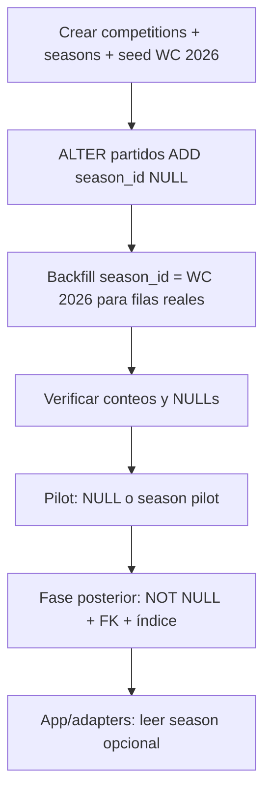
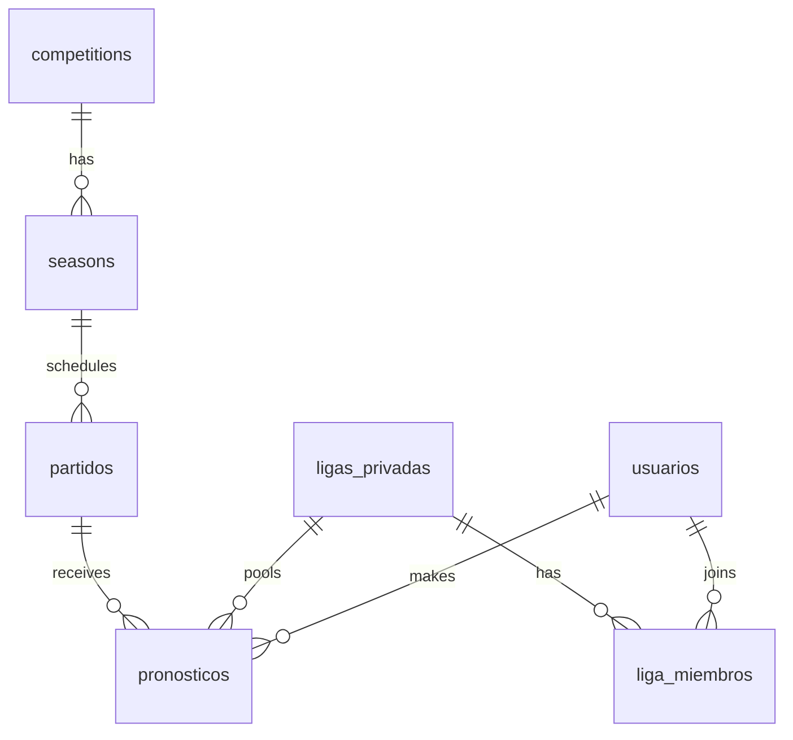

# MIGRATION-0-DESIGN

> **Objetivo:** Diseñar la migración **mínima** para sacar Mundial Compas de “solo Mundial” y acercarlo a Sports Core.  
> **Alcance de este documento:** diseño únicamente. Sin SQL, sin migraciones, sin cambios de código, sin tocar producción.

**Fuentes:** `supabase/migrations/*`, `MUNDIAL_COMPAS_SPORTS_CORE_ANALYSIS.md`, `SPORTS_CORE_MASTERPLAN.md`, `src/lib/sports-core/*/types.ts`.

---

## Resumen ejecutivo

Migration 0 introduce el **espinazo de competencia** (`competitions` + `seasons`) y un vínculo opcional en `partidos`, sin romper el modelo actual de quiniela, scoring ni live. Todo el comportamiento de la app sigue igual hasta que adapters y queries lean el nuevo scope de forma explícita (Migration 0.5 / SC-6).

Principio rector: **añadir, no reemplazar**. `fase`, `grupo`, `jornada` y nombres/códigos de equipos en `partidos` permanecen en Migration 0.

---

## 1. Estado actual del schema

### 1.1 Tablas de dominio (Postgres / Supabase)

| Tabla | Rol hoy | Acoplamiento Mundial |
|-------|---------|----------------------|
| `usuarios` | Perfil app + auth | Neutral |
| `ligas_privadas` | Pools de quiniela (global + grupos privados) | Seed UUID fijo `mundial-compas`; `configuracion` JSON |
| `liga_miembros` | Membresía y roles | Neutral |
| **`partidos`** | Calendario y live | **Centro del acoplamiento:** `fase_mundial`, `grupo`, `jornada`, equipos como strings, `api_football_fixture_id`, canales MX |
| **`pronosticos`** | Predicciones por `(liga_id, usuario_id, partido_id)` | Scoring 3/1/0; sin tipo de predicción |
| `datos_mamalones` | Contenido editorial | `mundial_anio` opcional |
| `mensajes_chat` | Chat por `(partido_id, liga_id)` | Scope partido |
| `webhook_eventos` | Ingesta API-Football | `partido_id` |
| `notificaciones` | Push in-app | `partido_id`, `liga_id` |
| `push_subscriptions` | Web Push | Neutral |
| `push_partidos_silenciados` | Mute por partido | `partido_id` |
| `liquidacion_pagos` | Honor / competencia pagada | Liga global hardcoded en lógica |
| `grupo_eliminacion_solicitudes` | Workflow admin | Neutral |

### 1.2 Tipos enumerados relevantes

| Enum | Uso | Generalizable en M0 |
|------|-----|---------------------|
| `estatus_partido` | Estado live | Sí (mapeo a `MatchStatus` en Sports Core) |
| `fase_mundial` | Fase del torneo | **No en M0** — sigue siendo contrato Mundial |
| `canal_transmision` | TV México | **No en M0** — producto MX |
| `tipo_notificacion`, `tipo_mensaje_chat`, … | Producto | Fuera de M0 |

### 1.3 Lógica en BD (zona congelada)

| Pieza | Dependencia de `partidos` |
|-------|---------------------------|
| `calcular_puntos_pronostico` | Solo marcadores — **no lee competencia** |
| `recalcular_puntos_partido` + trigger `partidos_after_update_puntos` | `partido_id` |
| `trg_bloquear_pronostico_kickoff` | `fecha_kickoff` del partido |
| `tabla_liderato_quiniela` | JOIN `pronosticos` ↔ `partidos`; filtros `jornada`, `fase`, fechas |
| `handle_new_user` | UUID liga global fijo |
| RLS en `partidos`, `pronosticos`, `liga_miembros`, … | Sin scope competencia |

### 1.4 Hardcodes fuera del schema

| Constante / env | Valor | Implicación |
|-----------------|-------|-------------|
| `LIGA_GLOBAL_ID` | `a0000000-0000-4000-8000-000000000001` | Pool global único |
| `APIFOOTBALL_LEAGUE_ID` | 28 | Mundial en apifootball.com |
| `API_SPORTS_LEAGUE_ID` + season | 1 / 2026 | api-sports.io |
| Pilot mode | league 3, metadata `competencia: pilot` | Partidos fuera del Mundial real |

### 1.5 Sports Core en código (sin schema)

Ya existen tipos genéricos en `src/lib/sports-core/` (`Match.competitionId`, `Match.seasonId`, `Match.round`, `Match.phase`). Migration 0 alinea **BD** con esos contratos de forma incremental; los adapters siguen mapeando columnas legacy hasta SC-6.

---

## 2. Qué tablas necesitan `competition_id`

### 2.1 Tablas nuevas (Migration 0)

| Tabla | `competition_id` |
|-------|------------------|
| **`competitions`** | Es la entidad raíz (PK propia, no FK) |
| **`seasons`** | **FK obligatoria** → `competitions.id` |

### 2.2 Tablas existentes — columna directa `competition_id`

| Tabla | ¿M0? | Justificación |
|-------|------|---------------|
| **`partidos`** | **Opcional / no recomendado en M0** | Basta `season_id`; competencia = `seasons.competition_id`. Evita denormalización y drift. |
| **`ligas_privadas`** | **Migration 1** | Cuando un pool deba limitarse a una competencia (ej. quiniela solo Liga MX). Hoy la global es implícitamente Mundial. |
| **`pronosticos`** | **No** | Scope vía `partido_id` → `partidos.season_id` → `seasons.competition_id`. Duplicar FK rompe invariantes. |
| **`datos_mamalones`** | **No en M0** | `mundial_anio` basta; `season_id` opcional en Migration 2+. |
| **`mensajes_chat`**, **`notificaciones`**, **`webhook_eventos`** | **No** | Heredan scope del `partido_id`. |
| **`push_partidos_silenciados`** | **No** | Idem. |

### 2.3 Regla de diseño

> **Un partido pertenece a una temporada; una temporada pertenece a una competencia.**  
> `competition_id` en filas hijas solo cuando el acceso por competencia sea frecuente sin JOIN (índices de leaderboard multi-torneo en Migration 1+).

---

## 3. Qué tablas necesitan `season_id`

### 3.1 Tablas nuevas

| Tabla | Campo |
|-------|-------|
| **`seasons`** | PK propia; contiene `competition_id` |

### 3.2 Tablas existentes — Migration 0

| Tabla | ¿Columna `season_id`? | Notas |
|-------|----------------------|-------|
| **`partidos`** | **Sí — única FK obligatoria en M0** | Nullable al crear columna; backfill WC 2026; NOT NULL en fase posterior |
| **`pronosticos`** | **No** | Derivado de `partido_id` |
| **`ligas_privadas`** | **Migration 1** (opcional) | `default_season_id` en `configuracion` o columna dedicada para pools multi-temporada |
| **`rounds`** (futura) | **Sí** | FK → `seasons.id` (tabla no existe en M0) |

### 3.3 Partidos pilot

Los partidos pilot (Champions, metadata pilot) deben:

- **Opción A (recomendada M0):** `season_id` NULL o season dedicada “pilot-demo” en seed — la app sigue filtrándolos por `metadata` como hoy.
- **Opción B (Migration 1):** competencia/season pilot explícita en seed para no mezclar con WC 2026 en queries futuras.

---

## 4. ¿`rounds` en Migration 0 o Migration 1?

**Recomendación: Migration 1**, no Migration 0.

| Criterio | Migration 0 | Migration 1 (`rounds`) |
|----------|-------------|------------------------|
| Minimidad | ✅ Solo spine competencia/temporada | ❌ Nueva entidad + backfill de jornada/fase |
| Datos actuales | `partidos.jornada`, `partidos.fase`, `partidos.grupo` ya modelan “ronda” Mundial | Requiere mapear cada combinación fase/grupo/jornada → fila `rounds` |
| Riesgo producción | Bajo | Medio (doble fuente de verdad si no se depreca bien) |
| Leaderboard segmentado | RPC ya filtra `jornada`/`fase` en `partidos` | Beneficio cuando existan jornadas recurrentes (Liga MX) |

**En Migration 0:** `round` sigue siendo concepto lógico mapeado desde `jornada` + `fase` + `grupo` en adapters (`Match.round`, `Match.phase`, `Match.groupKey`).

**En Migration 1:** tabla `rounds` con `season_id`, `round_number`, `phase`, `label`, opcional `group_key`; `partidos.round_id` nullable con backfill progresivo.

---

## 5. Valores seed necesarios — World Cup 2026

Seed lógico (sin SQL). UUIDs estables recomendados para backfill idempotente.

### 5.1 Fila `competitions`

| Campo | Valor propuesto |
|-------|-----------------|
| `id` | UUID fijo (ej. `b0000000-0000-4000-8000-000000000001`) |
| `slug` | `fifa-world-cup` |
| `name` | `Copa Mundial de la FIFA` |
| `short_name` | `Mundial 2026` |
| `sport` | `football` |
| `format` | `groups_knockout` |
| `country_scope` | `international` |
| `timezone_default` | `America/Mexico_City` |
| `provider_config` (JSON) | Ver abajo |
| `active` | `true` |
| `metadata` | `{ "hosts": ["USA", "MEX", "CAN"], "edition": 23 }` |

**`provider_config` sugerido:**

| Clave | Valor |
|-------|-------|
| `apifootball.league_id` | 28 |
| `apifootball.base` | apifootball.com |
| `api_sports.league_id` | 1 |
| `api_sports.season` | 2026 |
| `sync.date_from` | 2026-06-01 |
| `sync.date_to` | 2026-07-31 |
| `sync.timezone` | America/Mexico_City |

### 5.2 Fila `seasons`

| Campo | Valor propuesto |
|-------|-----------------|
| `id` | UUID fijo (ej. `b0000000-0000-4000-8000-000000000002`) |
| `competition_id` | FK → competencia anterior |
| `slug` | `fifa-world-cup-2026` |
| `year_label` | `2026` |
| `start_at` | 2026-06-01T00:00:00Z (ajustar a calendario oficial) |
| `end_at` | 2026-07-31T23:59:59Z |
| `status` | `scheduled` → `active` → `finished` (lifecycle) |
| `is_current` | `true` (única season current por competencia) |
| `external_ids` (JSON) | `{ "api_sports_season": 2026 }` |

### 5.3 Seed opcional pilot (no bloqueante M0)

| Entidad | Propósito |
|---------|-----------|
| `competitions` slug `pilot-demo` | Aislar fixtures de prueba |
| `seasons` slug `pilot-2026-05` | Partidos pilot con `season_id` distinto |

### 5.4 Relación con liga global existente

La fila `ligas_privadas` seed `mundial-compas` **no se modifica en M0**. Documentar en `configuracion` (Migration 1) o constante app:

- `default_competition_slug`: `fifa-world-cup`
- `default_season_slug`: `fifa-world-cup-2026`

---

## 6. Impacto esperado por área

### 6.1 Partidos

| Aspecto | Impacto M0 |
|---------|------------|
| Schema | Nueva columna `season_id` UUID NULL → backfill → NOT NULL (fase posterior) |
| Ingesta (admin, crons, webhooks) | **Sin cambio obligatorio en M0** si backfill cubre filas existentes; scripts futuros deberían setear `season_id` al upsert |
| Queries app | **Sin cambio** hasta adapters lean `season_id`; filtros actuales por `estatus`, `fase`, fechas siguen válidos |
| Pilot | Seguir excluyendo por `metadata`; opcionalmente asignar season pilot |
| Índices | Nuevo índice `(season_id, fecha_kickoff)` recomendado en fase post-backfill |
| Live / webhook | **Cero impacto** si no se tocan triggers ni `process.ts` |

### 6.2 Pronósticos

| Aspecto | Impacto M0 |
|---------|------------|
| Schema | **Ninguno** |
| Unicidad | Sigue `(liga_id, usuario_id, partido_id)` |
| Lock / scoring | Triggers intactos |
| Multi-competencia futura | Un mismo `partido_id` solo puede ser de una season; pools distintos comparten partidos solo si comparten calendario (comportamiento actual) |

### 6.3 Leaderboards

| Aspecto | Impacto M0 |
|---------|------------|
| RPC `tabla_liderato_quiniela` | **Sin cambio en M0** — sigue JOIN por `partido_id` y filtros `jornada`/`fase` |
| Migration 1+ | Parámetro opcional `p_season_id` para acotar partidos; default = season current de la liga |
| Riesgo | Leaderboard mezclaría competencias solo si existieran partidos de otra season sin filtro — **mitigado** manteniendo una season activa en producción hasta UI multi-torneo |

### 6.4 Standings (`/posiciones`)

| Aspecto | Impacto M0 |
|---------|------------|
| Cálculo | 100% en app (`calculate-group-standings`, knockout builders); lee `partidos` por `fase`/`grupo` |
| Cache API | `standings/cache.ts` usa league 28 hardcoded en snapshot |
| M0 | **Sin cambio funcional**; `PosicionesMundialData.leagueId: "28"` puede mapearse desde `competitions.provider_config` en SC-6 |
| Persistencia | Standings no están en BD; Migration 2+ podría persistir por `season_id` |

### 6.5 Perfiles (`fetchUserProfile`)

| Aspecto | Impacto M0 |
|---------|------------|
| Datos | Lee `pronosticos` + join `partidos` por scoring |
| M0 | **Sin cambio**; métricas siguen sobre todos los pronósticos del usuario en liga global |
| Futuro | Filtro `WHERE partidos.season_id = :current` para perfiles por torneo |

### 6.6 Pitoniso

| Capa | Impacto M0 |
|------|------------|
| Motor (`match-preview`, `signals`) | **Cero** — Sports Core puro |
| `pitoniso-queries.ts` | Carga partido + agregados; **sin cambio** si partido sigue siendo único por id |
| `team-competition-form.ts` | Queries `partidos` por equipo/códigos; **sin cambio** en M0 |
| Futuro | Contexto incluiría `competitionId`/`seasonId` en analytics; forma mini-tabla acotada a season |

---

## 7. Estrategia de backfill

### 7.1 Orden recomendado

### 7.2 Reglas de backfill

| Regla | Detalle |
|-------|---------|
| Alcance | Todas las filas en `partidos` que **no** sean pilot (`metadata` sin flag pilot) → `season_id` = WC 2026 |
| Pilot | Mantener exclusión app; opcional season pilot |
| Idempotencia | UPDATE … WHERE season_id IS NULL |
| Verificación | Conteo partidos backfilled = total − pilot; cero NULL en filas no-pilot antes de NOT NULL |
| Pronósticos | No requieren backfill |
| Rollback data | SET season_id = NULL (solo si no hay NOT NULL) |

### 7.3 Sincronización con scripts existentes

| Script | Acción post-M0 (fuera de M0 migration) |
|--------|----------------------------------------|
| `recargar-mundial.mjs` | Inyectar `season_id` WC 2026 en upsert |
| `sync-calendar-cron.mjs` | Idem |
| Admin `cargar-partidos` | Idem |
| Pilot loaders | Season pilot o NULL + metadata |

---

## 8. Riesgos

| Riesgo | Severidad | Mitigación |
|--------|-----------|------------|
| Desplegar NOT NULL antes de backfill completo | **Crítica** | Fases separadas; checks en CI |
| Mezclar partidos de competencias distintas en un pool | **Alta** | Una season activa; filtro en Migration 1 |
| Duplicar `competition_id` en `partidos` y `seasons` | **Media** | Solo `season_id` en partidos |
| Romper RPC/triggers al alterar `partidos` | **Alta** | M0 solo ADD nullable column; no tocar funciones |
| Drift seed UUID vs constantes app | **Media** | Documentar UUIDs en `constants` / env en fase adapter |
| Leaderboard segmentado ignora season | **Baja en M0** | Un solo torneo en prod |
| Ingesta olvida `season_id` en partidos nuevos | **Media** | Default season en trigger BEFORE INSERT (Migration 1) o constraint app |
| Confundir `ligas_privadas` con `competitions` | **Conceptual** | Documentar: liga = pool social; competencia = torneo deportivo |

---

## 9. Plan de ejecución reversible

### Fase 0 — Diseño (este documento)

- Aprobación de UUIDs seed y reglas pilot.
- Ventana de mantenimiento: **no requerida** (cambios aditivos).

### Fase 1 — DDL aditivo (Migration 0)

1. CREATE `competitions`, `seasons`.
2. INSERT seed WC 2026 (+ opcional pilot).
3. ALTER `partidos` ADD `season_id` UUID NULL REFERENCES `seasons(id)`.
4. **Sin** NOT NULL, **sin** cambios RLS, **sin** tocar triggers/RPC.

**Rollback Fase 1:** DROP COLUMN `partidos.season_id`; DROP TABLE `seasons`; DROP TABLE `competitions`. Cero impacto app si nadie lee la columna.

### Fase 2 — Backfill (Migration 0b o script one-shot)

1. UPDATE partidos no-pilot → WC 2026 season.
2. Queries de verificación (conteos, NULLs).

**Rollback Fase 2:** UPDATE season_id = NULL.

### Fase 3 — Endurecimiento (Migration 0c, post-validación)

1. NOT NULL en `partidos.season_id` (excepto pilot si se acordó).
2. Índice `(season_id, fecha_kickoff)`.
3. CHECK o FK DEFERRABLE según política pilot.

**Rollback Fase 3:** Revertir a nullable (requiere quitar NOT NULL); datos seed pueden permanecer.

### Fase 4 — Adapters (código, no BD)

1. Constantes `DEFAULT_SEASON_ID` / slug.
2. Mappers Sports Core incluyen `seasonId`.
3. Queries nuevas filtran por season; legacy sin filtro hasta cutover.

**Rollback Fase 4:** Revert deploy app; BD sigue válida.

### Fase 5 — Migration 1 (fuera de M0)

- `rounds`, `ligas_privadas.default_season_id`, RPC `p_season_id`, tabla `teams` opcional.

---

## 10. Qué NO tocar todavía

### Base de datos

- Funciones `calcular_puntos_pronostico`, `recalcular_puntos_partido`
- Triggers en `partidos` y `pronosticos`
- RPC `tabla_liderato_quiniela` (firma y cuerpo)
- RLS policies existentes
- Enum `fase_mundial`, `canal_transmision`, tipos notificación
- UUID y seed de `ligas_privadas` global
- `handle_new_user` y alta automática en liga global
- Tabla `pronosticos` (columnas, constraints, scoring)
- Webhook pipeline y `webhook_eventos`

### Código / producto

- Sports Core módulos puros (solo adapters nuevos después)
- `savePronostico` / server actions de quiniela
- Pitoniso motor y copy
- Scoring 3/1/0 en app y perfiles
- Live home refresh, webhook `process.ts`
- UI selector multi-competencia
- Tabla `teams` / normalización de equipos
- Tabla `rounds` (Migration 1)
- LigaPro / entidades amateur
- Renombrar `partidos` → `matches`
- Monorepo / package npm

### Operaciones

- Producción Supabase hasta Fase 1 aprobada explícitamente
- Variables env existentes (siguen siendo source of truth para ingest hasta Fase 4)

---

## Apéndice A — Modelo objetivo post-M0 (conceptual)

## Apéndice B — Criterios de éxito Migration 0

- [ ] Existe exactamente una competencia y una season seed para WC 2026.
- [ ] 100% partidos no-pilot tienen `season_id` asignado (post backfill).
- [ ] Cero regresión en quiniela, live, leaderboard, posiciones, Pitoniso (smoke tests manuales).
- [ ] Triggers y RPC sin modificar.
- [ ] App desplegada sin cambios obligatorios de código.
- [ ] Documento Migration 1 (`rounds`, pools por season) listo antes de segundo torneo.

---

*Documento generado para MIGRATION-0-DESIGN. No incluye SQL ni instrucciones de ejecución en producción.*
