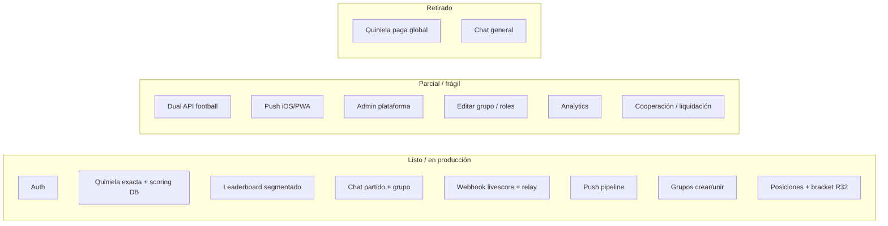
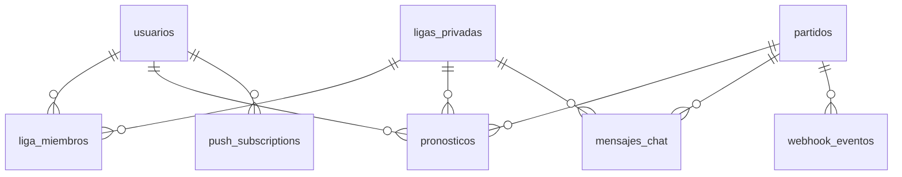
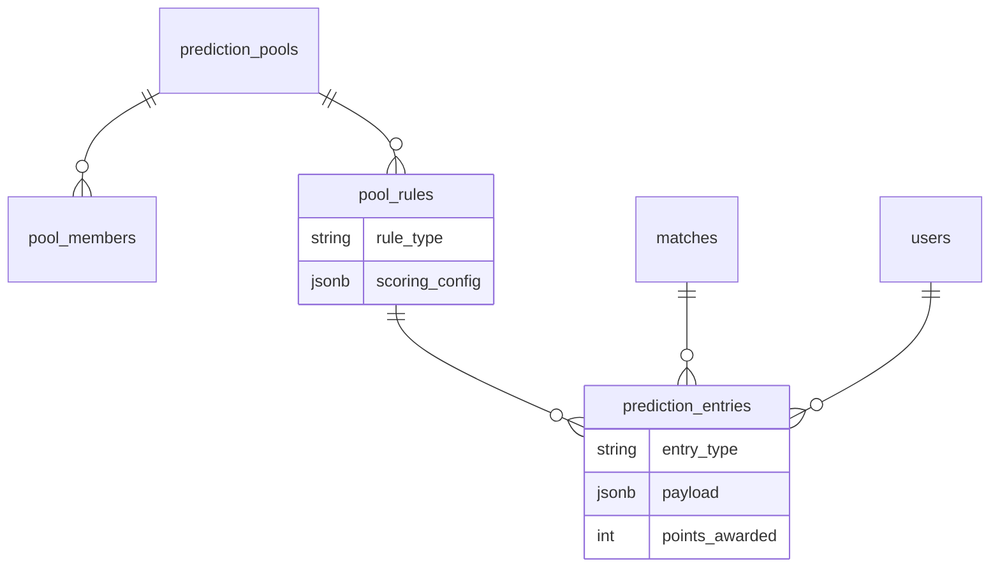
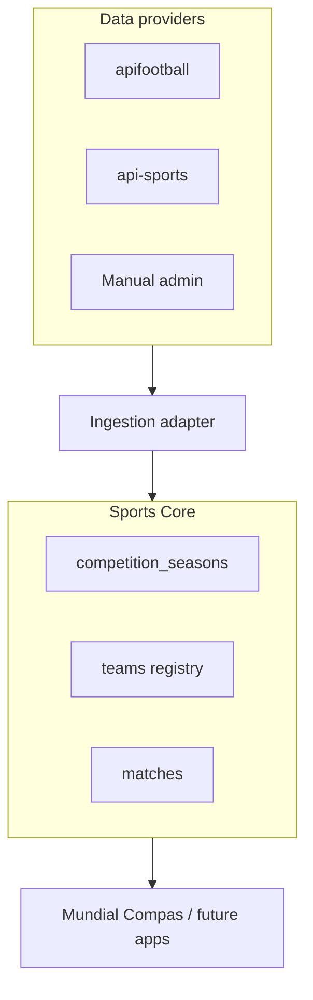
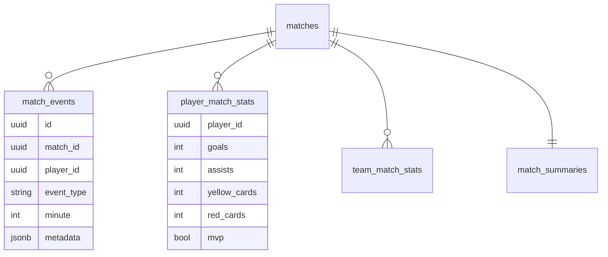
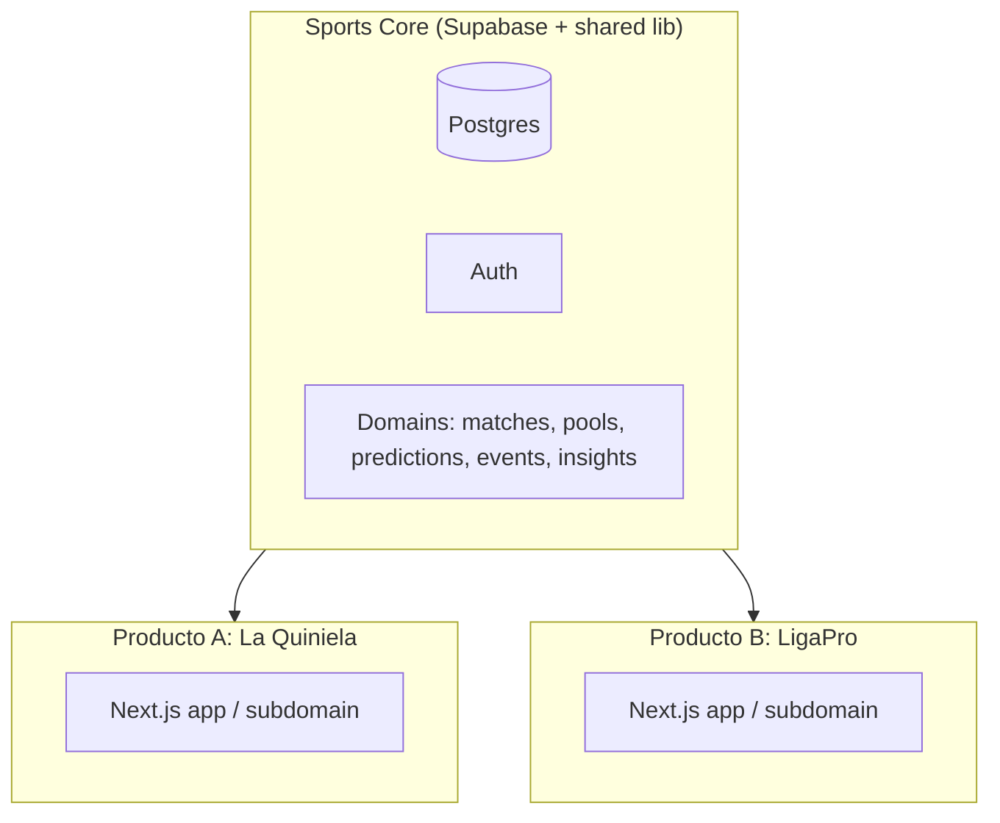
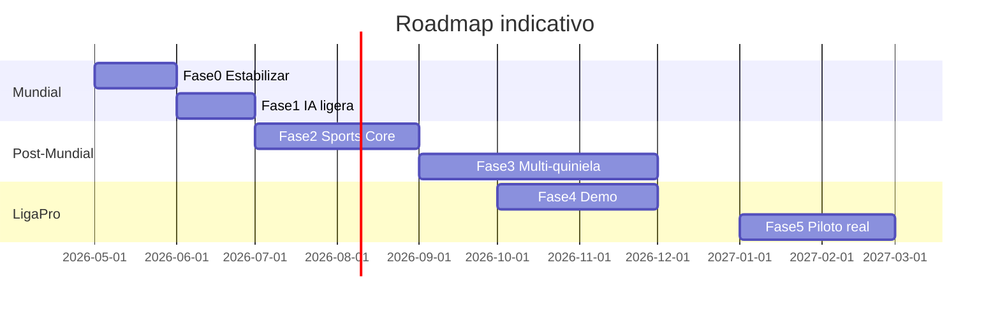

# Mundial Compas → Sports Core — Análisis técnico y de producto

> **Auditoría read-only** del repositorio `mundial-compas` (mayo 2026).  
> Objetivo: base para diseño estratégico de evolución hacia un **Sports Core** reutilizable (quinielas multi-competencia + ligas amateur).  
> **No se modificó código** para producir este documento.

---

## 1. Resumen ejecutivo del proyecto actual

### Qué hace Mundial Compas hoy

**Mundial Compas** es una **PWA** de quiniela social centrada en el **Mundial FIFA 2026**. Usuarios reales ya la usan para:

1. Registrarse e iniciar sesión (email u OAuth Google).
2. Entrar automáticamente a la **liga global** “Mundial Compas”.
3. Ver **home** con calendario, partidos en vivo, marcadores y “dato mamalón” (trivia).
4. Guardar **pronósticos de marcador exacto** (0–20 goles por equipo) en quiniela global o en **grupos privados**.
5. Competir en **leaderboard** (puntos acumulados, por jornada, fase o rango de fechas).
6. Consultar **posiciones** (tablas de grupo FIFA 2026, mejores terceros, ronda de 32 y cuadro eliminatorio provisional).
7. Entrar al **detalle de partido**: chat en vivo, alineaciones, pronósticos de otros (post-partido), silenciar push.
8. Chatear en **grupos privados** (scope separado del chat global de partido).
9. Recibir **notificaciones push** (goles, fases, alineaciones, VAR, etc.) vía PWA.
10. Crear/unirse a **grupos privados** con código de invitación, tipo de quiniela y modo competencia.

No es una casa de apuestas: el copy legal enfatiza recreación social entre conocidos.

### Stack

| Capa | Tecnología | Notas |
|------|------------|-------|
| **Frontend** | Next.js **16.2.6** (App Router), React **19**, Tailwind **v4** | PWA (`public/sw.js`, `manifest.webmanifest`) |
| **Backend** | Next.js Route Handlers + Server Actions | Sin backend separado |
| **Base de datos** | **Supabase Postgres** + RLS + Realtime | 14 tablas, 27 migraciones |
| **Auth** | Supabase Auth (`@supabase/ssr`) | Middleware en `src/middleware.ts` |
| **Push** | `web-push` + VAPID | Suscripciones en `push_subscriptions` |
| **Datos fútbol** | **Dual provider**: apifootball.com (primario) + api-sports.io (legacy/polling) | Env `FOOTBALL_DATA_PROVIDER` |
| **Hosting** | **Railway** (producción documentada: `https://mundial-compas.up.railway.app`) | App Next.js + workers Docker (relay, crons) |
| **CI/CD** | **No confirmado** en repo | Deploy vía Railway CLI según `docs/RAILWAY_DEPLOY.md` |
| **Analytics** | Scaffold en `src/lib/analytics/` | **Noop en prod** salvo `NEXT_PUBLIC_ANALYTICS_ENABLED=true` |

### Estructura general del repo

```
mundial-compas/
├── src/
│   ├── app/              # Rutas App Router (app, auth, api)
│   ├── components/       # UI por dominio (quiniela, grupos, partidos, push…)
│   ├── lib/              # Lógica de negocio, integraciones, server actions
│   ├── hooks/
│   ├── types/
│   └── middleware.ts
├── supabase/migrations/  # 27 migraciones SQL
├── supabase/seeds/       # datos_mamalones, sample partidos
├── scripts/              # Carga Mundial, relay WS, crons, pilots, backfills
├── public/               # PWA assets
├── docs/                 # Deploy, push, manual tests
└── railway.*.toml        # Workers (relay, sync-live, sync-calendar)
```

Documentación útil existente: `PROJECT_CONTEXT_PACK.md`, `DB_SCHEMA.md` (parcialmente desactualizado), `FILE_TREE.md`, `CURRENT_ERRORS.md`, `CHANGELOG_RECENT.md`.

### Rutas principales (`src/app`)

| Ruta | Propósito |
|------|-----------|
| `/` | Home autenticado: calendario, en vivo, onboarding |
| `/landing` | Landing pública (alias) |
| `/login`, `/callback`, `/recuperar-contrasena`, `/actualizar-contrasena` | Auth |
| `/quiniela` | Quiniela global |
| `/leaderboard` | Tabla de líderes global |
| `/posiciones` | Tablas FIFA + Ronda de 32 + cuadro |
| `/partidos/[id]` | Detalle partido, chat, pronósticos, push mute |
| `/grupos`, `/grupos/crear`, `/grupos/unirse` | Grupos privados |
| `/grupos/[slug]` | Dashboard grupo (tabs) |
| `/grupos/[slug]/quiniela`, `/leaderboard` | Quiniela y ranking por grupo |
| `/invitar/[codigo]` | Deep link invitación |
| `/legal` | Disclaimers |
| `/admin`, `/admin/solicitudes-eliminacion` | Superadmin (eliminación grupos) |
| `/chat-general` | **Retirado** → redirect a `/` |

### Pantallas / servicios principales

| Servicio | Archivos clave |
|----------|----------------|
| Quiniela | `src/lib/quiniela/actions.ts`, `queries.ts`, `lock.ts` |
| Leaderboard | `src/lib/leaderboard/queries.ts` → RPC `tabla_liderato_quiniela` |
| Partidos live | `src/lib/apifootball/webhook/process.ts`, `sync-live-scores.ts` |
| Standings | `src/lib/standings/*` |
| Grupos | `src/lib/liga/grupos-actions.ts`, RPCs Postgres |
| Chat | `src/lib/partidos/chat-actions.ts`, `src/lib/chat/grupo-actions.ts` |
| Push | `src/lib/push/send.ts`, `src/app/api/push/*` |
| Narración | `src/lib/narracion/comentaristas*.ts` (templates, no LLM) |

### Estado: terminado vs incompleto vs deuda



| Área | Estado |
|------|--------|
| Auth + sesión | **Listo** |
| Quiniela marcador exacto + puntos automáticos | **Listo** |
| Grupos privados (crear, unir, quiniela, chat) | **Listo** (edición/roles stub) |
| Leaderboard global y por grupo | **Listo** |
| Posiciones + bracket provisional | **Listo** (reciente) |
| Live scores (webhook + relay) | **Parcial/frágil** (ops compleja) |
| Push notifications | **Parcial** (depende VAPID + PWA) |
| Analytics comportamiento | **Pendiente** (scaffold only) |
| IA generativa | **No existe** (solo templates “VAR”) |
| Cooperacha / liquidación pagos | **Retirado** en UI (tablas/RPCs quedan) |
| Tests automatizados / CI lint clean | **No confirmado** (`CURRENT_ERRORS.md`: 19 errores ESLint) |

---

## 2. Mapa de funcionalidades actuales

### 2.1 Autenticación

| Aspecto | Detalle |
|---------|---------|
| **Qué hace** | Email/password, Google OAuth, reset password, callback Supabase |
| **Archivos** | `src/middleware.ts`, `src/lib/supabase/*`, `src/app/(auth)/*`, `src/lib/auth/*` |
| **Tablas** | `auth.users`, `usuarios` (trigger `handle_new_user`) |
| **APIs** | `GET /callback` (route handler) |
| **Madurez** | **Listo** |
| **Riesgos** | `NEXT_PUBLIC_APP_URL` mal configurado rompe redirects; middleware deprecado en Next 16 (warning build) |

### 2.2 Usuarios / perfiles

| Aspecto | Detalle |
|---------|---------|
| **Qué hace** | `username`, `nombre_visible`, `equipos_favoritos[]`, `push_habilitado`, `metadata` |
| **Archivos** | `src/types/database.ts`, queries que leen `usuarios` |
| **Tablas** | `usuarios` |
| **Madurez** | **Listo** (perfil básico) |
| **Riesgos** | Columnas legado `quiniela_paga`, `terminos_honor_*` sin flujo activo global |

### 2.3 Grupos privados

| Aspecto | Detalle |
|---------|---------|
| **Qué hace** | Crear grupo (RPC atómico), unir por código, preview invitación, dashboard con tabs |
| **Archivos** | `src/lib/liga/grupos-actions.ts`, `grupos-queries.ts`, `src/components/grupos/*` |
| **Tablas** | `ligas_privadas`, `liga_miembros`, `grupo_eliminacion_solicitudes` |
| **RPCs** | `crear_grupo_privado`, `unirse_grupo_por_codigo`, `preview_grupo_por_codigo`, `listar_miembros_grupo`, `solicitar_eliminacion_grupo` |
| **Config JSONB** | `tipo_quiniela`, `modo_competencia`, `estado_competencia`, ganadores honor |
| **Madurez** | **Parcial** — crear/unir/chat/quiniela OK; `actualizarGrupoPrivado` y `cambiarRolMiembroGrupo` son **stubs** |
| **Riesgos** | Tipo quiniela inmutable post-creación (by design); RLS en `liga_miembros` tuvo recursión (fix migración) |

### 2.4 Roles

| Rol | Capacidades |
|-----|-------------|
| `owner` | Creador; ve código invitación; solicitar eliminación |
| `admin` | Admin grupo (parcial); invitar |
| `miembro` | Quiniela + chat |

**Superadmin plataforma**: `APP_MODERATOR_USER_IDS` → `/admin` (solo solicitudes eliminación).

### 2.5 Quinielas

| Aspecto | Detalle |
|---------|---------|
| **Qué hace** | Un pronóstico por `(liga_id, usuario_id, partido_id)` con marcador exacto |
| **Tipos soportados** (filtro UI, no scoring distinto) | `mundial_completo`, `por_jornada`, `por_fase`, `express_dia` |
| **Archivos** | `src/lib/quiniela/*`, `src/lib/liga/partido-filters.ts`, `tipo-quiniela.ts` |
| **Tablas** | `pronosticos`, `partidos`, `ligas_privadas` |
| **Server actions** | `savePronostico`, `fetchPronosticosPartidoTodos` |
| **Madurez** | **Listo** para marcador exacto |
| **Riesgos** | Lock UI T-5 min vs trigger BD T-0 (ventana de inconsistencia); **no hay ProGol, survivor ni quiniela de torneo** |

**Scoring (Postgres, no TS):**

```sql
-- calcular_puntos_pronostico
3 pts = marcador exacto
1 pt  = tendencia (local/empate/visitante)
0 pts = incorrecto
```

Trigger `trg_partido_finalizado_puntos` recalcula al finalizar partido.

### 2.6 Predicciones

Cubierto en quiniela. Campos: `goles_local`, `goles_visitante`, `puntos`, `locked_at`.

### 2.7 Partidos

| Aspecto | Detalle |
|---------|---------|
| **Qué hace** | Carga fixtures, sync live, webhooks, alineaciones, reloj en metadata |
| **Archivos** | `src/lib/partidos/*`, `src/lib/apifootball/*`, `src/lib/api-football/*`, `src/app/api/admin/*`, `src/app/api/webhooks/*` |
| **Tablas** | `partidos`, `webhook_eventos` |
| **Madurez** | **Parcial/frágil** |
| **Riesgos** | Dos stacks webhook; relay WS externo obligatorio para apifootball live; `dieciseisavos` en enum mezcla R32 y R16 semánticamente |

### 2.8 Standings / tablas

| Aspecto | Detalle |
|---------|---------|
| **Qué hace** | Calcula tablas A–L desde partidos; ranking mejores 3.º; bracket R32–Final (495 escenarios Annex C) |
| **Archivos** | `src/lib/standings/*`, `src/app/(app)/posiciones/*` |
| **Tablas** | `partidos` (fase=grupos) |
| **Madurez** | **Listo** (provisional hasta cerrar grupos) |
| **Riesgos** | Hardcoded league 28; fallback API cache si no hay resultados |

### 2.9 Rankings / leaderboards

| Aspecto | Detalle |
|---------|---------|
| **Qué hace** | RPC segmentada: acumulado, jornada, fase, rango fechas |
| **Archivos** | `src/lib/leaderboard/*`, páginas leaderboard |
| **RPC** | `tabla_liderato_quiniela(p_liga_id, p_jornada, p_fase, p_date_from, p_date_to)` |
| **Madurez** | **Listo** |

### 2.10 Chats

| Scope | Estado | Archivos |
|-------|--------|----------|
| Chat partido (global) | **Listo** | `ChatPartido.tsx`, `chat-actions.ts`, scope `partido_global` |
| Chat grupo privado | **Listo** | `GrupoChat.tsx`, `grupo-actions.ts`, scope `grupo_privado` |
| Chat general liga | **Retirado** | redirect `/chat-general` |

Ventana chat partido: T-15 min → T+30 min post final. Moderación: palabras bloqueadas + reportes + moderadores env.

### 2.11 Admin / superadmin

| Aspecto | Detalle |
|---------|---------|
| **Qué hace** | Aprobar/rechazar eliminación de grupos privados |
| **API admin** (Bearer secret) | `cargar-partidos`, `sync-live`, `sync-lineups`, `backfill-grupos` |
| **Madurez** | **Parcial** — no hay panel de usuarios, contenido, métricas |

### 2.12 Legal / disclaimers

| Aspecto | Detalle |
|---------|---------|
| **Archivos** | `src/lib/legal/disclaimers.ts`, `src/app/(app)/legal/page.tsx` |
| **Incluye** | Disclaimer IA (anticipa contenido asistido; hoy es template) |
| **Madurez** | **Listo** |

### 2.13 Notificaciones push

| Aspecto | Detalle |
|---------|---------|
| **Qué hace** | Cola en `notificaciones` + dispatch Web Push; mute por partido |
| **Archivos** | `src/lib/push/*`, `src/lib/apifootball/webhook/notifications.ts` |
| **Tablas** | `notificaciones`, `push_subscriptions`, `push_partidos_silenciados` |
| **Alcance** | Miembros **liga global** principalmente |
| **Madurez** | **Parcial** |

### 2.14 Features experimentales / pilot

| Feature | Archivos | Notas |
|---------|----------|-------|
| Pilot mode (UCL, Concacaf, México-Serbia) | `pilot-config.ts`, scripts `cargar-pilot-*` | `metadata.competencia: pilot` |
| VAR bot + narración templates | `webhook/process.ts`, `narracion/*` | No LLM |
| Onboarding CTA | `OnboardingStartCard` | Analytics events definidos |
| Competencia honor / liquidación | RPCs + UI deshabilitada | DB legacy |
| Analytics | `track.ts` | Noop prod default |

---

## 3. Modelo de datos actual

> **Nota:** `DB_SCHEMA.md` lista 17 migraciones; el repo tiene **27** archivos en `supabase/migrations/`.

### 3.1 Tablas (14)

| Tabla | Propósito clave |
|-------|-----------------|
| `usuarios` | Perfil app (1:1 con auth.users) |
| `ligas_privadas` | Ligas/grupos (global seed + privados) |
| `liga_miembros` | Membresía + rol |
| `partidos` | Partidos Mundial (y pilots); `api_football_fixture_id` UNIQUE |
| `pronosticos` | Predicciones por liga/usuario/partido |
| `datos_mamalones` | Trivia curada |
| `mensajes_chat` | Chat partido/grupo/sistema |
| `webhook_eventos` | Idempotencia webhooks |
| `notificaciones` | Cola in-app + push |
| `push_subscriptions` | Endpoints Web Push |
| `push_partidos_silenciados` | Mute por partido |
| `liquidacion_pagos` | Cooperacha honor (legado) |
| `grupo_eliminacion_solicitudes` | Workflow eliminación |

### 3.2 Enums Postgres (7)

| Enum | Valores relevantes |
|------|-------------------|
| `fase_mundial` | `grupos`, `dieciseisavos`, `octavos`, `cuartos`, `semifinal`, `tercer_lugar`, `final` |
| `estatus_partido` | `programado`, `en_vivo`, `medio_tiempo`, `finalizado`, … |
| `canal_transmision` | `azteca_7`, `vix`, … (México Mundial) |
| `rol_liga` | `owner`, `admin`, `miembro` |
| `tipo_notificacion` | `gol`, `alineaciones`, `medio_tiempo`, … (15+ valores) |
| `tipo_mensaje_chat` | `usuario`, `sistema`, `dato_mamalón`, `evento_partido` |
| `tipo_dato_mamalón` | `trivia`, `hito`, `curiosidad`, … |

**Enums en app (JSONB/TS, no Postgres):** `tipo_quiniela`, `modo_competencia`.

### 3.3 Relaciones principales



### 3.4 RLS (resumen)

| Tabla | Lectura | Escritura |
|-------|---------|-----------|
| `partidos` | Todos autenticados | Service role / admin |
| `pronosticos` | Miembros liga | Propio usuario (trigger lock) |
| `mensajes_chat` | Scope-dependent | Insert con reglas scope + grupo activo |
| `webhook_eventos` | Sin policies | Service role only |
| `ligas_privadas` | Pública/sistema/miembro/creador | Insert creador |

Función crítica: `es_miembro_de_liga()` (SECURITY DEFINER) evita recursión RLS.

### 3.5 RPCs / funciones SQL notables

| Función | Uso |
|---------|-----|
| `calcular_puntos_pronostico` | Scoring 3/1/0 |
| `recalcular_puntos_partido` | Post-finalización |
| `tabla_liderato_quiniela` | Leaderboard segmentado |
| `evaluar_ganador_inalcanzable` | Cierre anticipado honor (solo liga global UUID) |
| `crear_grupo_privado` | Alta atómica grupo |
| `reportar/aprobar/eliminar_mensaje_chat` | Moderación |
| `limpiar_mensajes_chat_antiguos` | Purga 24h (service_role) |

### 3.6 Seeds / backfills

| Recurso | Ubicación |
|---------|-----------|
| Liga global seed | Migración inicial UUID fijo |
| Mamalones | `supabase/seeds/*.json`, `seed_datos_mamalones.sql` |
| Canales Azteca/ViX | Migración `20260530150000` (17 partidos hardcoded) |
| Carga Mundial | `scripts/recargar-mundial.mjs` |
| Backfill grupos A–L | `scripts/backfill-partidos-grupo.mjs` |

### 3.7 Preparación del modelo para visión futura

| Capacidad futura | Preparación actual | Gap |
|------------------|-------------------|-----|
| Múltiples competencias | **Baja** — `partidos` sin `competition_id`; league 28 hardcoded | Entidad `competitions` + FK |
| Múltiples tipos quiniela | **Baja** — solo marcador exacto en BD | Columna `prediction_type` + payload JSON |
| Múltiples torneos por usuario | **Media** — `ligas_privadas` + membresía | Falta `season_id`, scope competencia |
| Quinielas global + privada | **Alta** — `liga_id` en pronósticos | OK |
| Ligas amateur | **Muy baja** — no hay equipos/jugadores propios | Modelo separado |
| Equipos/jugadores reales (pro) | **Baja** — códigos/nombres en `partidos` | Entidades `teams`, `players` |
| Stats por jugador | **No existe** | `player_match_stats`, `match_events` |
| Calendario recurrente | **Baja** — jornada en partidos Mundial | `rounds`, `seasons` |
| Admin desde celular | **Media** — UI mobile-first PWA | Falta admin torneo amateur |
| Insights IA | **No existe** (templates sí) | Tablas de agregados + jobs |

**Hardcodes críticos:**

- `LIGA_GLOBAL_ID = a0000000-0000-4000-8000-000000000001`
- `fase_mundial` enum nombre y valores
- `APIFOOTBALL_LEAGUE_ID = 28`
- Trigger ganador inalcanzable solo liga global
- Canales TV México en enum y migración

---

## 4. Arquitectura actual vs Sports Core

### 4.1 Concepto Sports Core deseado

Entidades objetivo:

`competitions` · `seasons` · `tournaments` · `teams` · `matches` · `users` · `groups` · `predictions` · `standings` · `leaderboards` · `players` · `player_stats` · `match_events` · `insights` · `generated_posts` · `notifications`

### 4.2 Mapeo existente → objetivo

| Entidad Sports Core | Existe hoy | Equivalente / notas |
|---------------------|------------|---------------------|
| `users` | ✅ | `usuarios` + auth |
| `groups` | ✅ | `ligas_privadas` + `liga_miembros` |
| `predictions` | ✅ (solo exact score) | `pronosticos` |
| `matches` | ✅ (Mundial-centric) | `partidos` |
| `standings` | ⚠️ calculado en app | No persistido; `standings/*` TS |
| `leaderboards` | ✅ | RPC sobre `pronosticos` |
| `notifications` | ✅ | `notificaciones` + push |
| `competitions` | ❌ | Hardcoded league 28 |
| `seasons` | ❌ | Fechas en env |
| `tournaments` | ⚠️ | Confundido con `ligas_privadas` (pool social) |
| `teams` | ⚠️ | Strings en `partidos`, no entidad |
| `players` | ❌ | Solo alineaciones en metadata JSON |
| `player_stats` | ❌ | |
| `match_events` | ⚠️ | Eventos en webhook → chat, no tabla eventos |
| `insights` | ❌ | |
| `generated_posts` | ❌ | |

### 4.3 Qué generalizar vs qué no tocar durante el Mundial

| Reutilizable ya | Generalizar después | **No tocar ahora** |
|-----------------|---------------------|-------------------|
| Auth Supabase | `competition_id` en partidos | Scoring RPC / triggers pronósticos |
| Modelo `ligas_privadas` como “pool” | Enum `fase_mundial` → `phase` genérico | Webhook `process.ts` en partidos clave |
| Leaderboard RPC pattern | Provider abstraction football | Migraciones breaking en `pronosticos` |
| Chat scopes | Standings persistidos | RLS `liga_miembros` |
| Push pipeline | Tipos quiniela en schema | UUID liga global en triggers |
| UI PWA shell | Branding multi-producto | |

**Peligroso tocar ahora:** cambiar shape de `pronosticos`, UUID liga global, enum notificaciones, pipeline webhook live, scoring triggers.

---

## 5. Evolución de quinielas

### 5.1 Tipos deseados vs soporte actual

| Tipo | Descripción | Soporte actual |
|------|-------------|----------------|
| **A. Resultado exacto semanal** | Marcador por jornada | ✅ **Implementado** (toda la app) |
| **B. ProGol / 1X2** | Local / empate / visitante | ❌ No existe |
| **C. Quiniela por torneo** | Campeón, goleador, etc. | ❌ No existe |
| **D. Survivor** | Un ganador por jornada, sin repetir | ❌ No existe |
| **E. Mixta** | Combina tipos | ❌ No existe |

Los `tipo_quiniela` actuales (`por_jornada`, `por_fase`, …) son **filtros de partidos**, no tipos de predicción distintos.

### 5.2 Modelo conceptual propuesto (sin implementar)



**Tabla `prediction_entries` (conceptual):**

| Campo | Descripción |
|-------|-------------|
| `pool_id` | FK a pool (≈ `ligas_privadas` evolucionada) |
| `user_id` | Usuario |
| `match_id` | Nullable (para picks de torneo) |
| `entry_type` | `exact_score`, `1x2`, `survivor_pick`, `tournament_outright`, … |
| `payload` | JSON: `{home:2, away:1}` o `{pick:"1"}` o `{team_id, round:3}` |
| `locked_at` | |
| `points` | Calculado por regla |

**Scoring por tipo:**

| Tipo | Regla ejemplo |
|------|---------------|
| Exact score | 3/1/0 (actual) |
| 1X2 | 1 pt acierto, 0 fallo |
| Survivor | 1 pt si gana; eliminación si falla |
| Torneo | Puntos al cierre evento (campeón=10, etc.) |
| Mixta | Suma ponderada por `pool_rules` |

### 5.3 Cambios técnicos necesarios (sin romper lo actual)

1. **Fase 1 — compatibilidad:** Mantener `pronosticos` como vista/registro `entry_type=exact_score`.
2. **Fase 2 — abstracción:** `PredictionService` en TS + RPC genérico `calcular_puntos_entry(entry_id)`.
3. **Fase 3 — reglas por pool:** Mover scoring config a `ligas_privadas.configuracion.scoring_rules`.
4. **Fase 4 — survivor state:** Tabla `survivor_status(user_id, pool_id, eliminated_at, picks_used[])`.
5. **Fase 5 — outright picks:** Tabla `tournament_predictions` con resolución manual o por API al final.

**Riesgo:** Recalcular puntos históricos si se migra schema; usar feature flag por pool.

---

## 6. IA para potenciar Mundial Compas durante el Mundial

### 6.1 Ideas deseadas vs datos disponibles

| Feature IA deseada | Datos actuales suficientes | Datos faltantes |
|--------------------|---------------------------|-----------------|
| Perfil jugador (conservador/agresivo…) | ⚠️ Parcial — `pronosticos` + puntos | Histórico por jornada agregado, distribución picks |
| Resumen jornada | ⚠️ Parcial — partidos + leaderboard RPC | Snapshot jornada persistido |
| Frase personalizada post-jornada | ⚠️ Parcial | Ranking delta por jornada (calc on the fly OK) |
| Por qué subió/bajó ranking | ✅ Con RPC segmentada | |
| Picks raros / diferenciales | ⚠️ Parcial — pronósticos por partido | Agregado `% picks` por partido/liga |
| “Sólo X% eligió…” | ❌ | Vista/materialización `pick_distribution` |
| Logros automáticos | ❌ | Tabla `user_achievements` |
| Narrador deportivo | ✅ Templates (`narracion/*`) | LLM opcional para variación |
| Resumen compartible redes | ⚠️ Parcial | Templates + datos agregados |

### 6.2 Qué se puede hacer sin LLM

| Feature | Enfoque determinístico |
|---------|------------------------|
| % picks por resultado | SQL `GROUP BY` pronósticos normalizados a 1X2 o score bucket |
| Ranking delta | Diff RPC jornada N vs N-1 |
| Logros | Reglas (`racha_3_exactos`, `unico_acierto_partido_X`) |
| Pick diferencial | Usuario pick vs moda de liga |
| Resumen jornada | Template string con top 3 + sorpresa partido |

### 6.3 Qué conviene mandar a LLM (Claude/OpenAI)

| Caso | Por qué LLM |
|------|-------------|
| Frase personalizada rica | Tono, contexto social, múltiples variables |
| Crónica jornada narrativa | Prosa natural |
| Explicación ranking multi-factor | Síntesis no template |

**Guardrails:** Pasar solo stats agregados (sin PII); max tokens; cache por `(user_id, jornada)`.

### 6.4 Tablas nuevas sugeridas (conceptual)

| Tabla | Propósito |
|-------|-----------|
| `pick_aggregates` | `(partido_id, liga_id, pick_key, count, pct)` |
| `leaderboard_snapshots` | Posición por usuario/jornada |
| `user_insights` | `(user_id, liga_id, jornada, insight_type, content, source: rule|llm)` |
| `user_achievements` | Logros desbloqueados |
| `llm_generation_log` | Cost control + cache hash |

### 6.5 Dónde mostrar en UI

| Superficie | Insight |
|------------|---------|
| Leaderboard | Badge “subiste X puestos” |
| Post-jornada modal | Resumen personal |
| Detalle partido post-cierre | “Sólo 8% acertó empate” |
| Perfil (futuro) | Estilo + logros |
| Push (selectivo) | Milestone logros (cuidado spam) |

### 6.6 Control de costos IA

- Reglas primero; LLM solo para top N usuarios activos o opt-in.
- Batch nocturno post-jornada, no por request.
- Cache 24h por insight type.
- `NEXT_PUBLIC_ANALYTICS_ENABLED` ya existe; falta proveedor real.

---

## 7. Analítica de comportamiento de usuarios

### 7.1 Estado actual

| Aspecto | Estado |
|---------|--------|
| Infra analytics | `src/lib/analytics/track.ts`, `events.ts` |
| Producción | **Noop** unless `NEXT_PUBLIC_ANALYTICS_ENABLED=true` |
| Integración PostHog/etc. | **No encontrado** — comentario “Integración futura” |
| Eventos definidos | ~20 tipos (sign-in, pronóstico, grupo, chat, leaderboard, push) |

### 7.2 Eventos ya definidos (parcial)

`user_signed_in`, `pronostico_saved`, `quiniela_selected`, `grupo_created`, `grupo_joined`, `invite_*`, `chat_message_sent`, `leaderboard_viewed`, `leaderboard_segment_changed`, `push_*`, `onboarding_*`, `deletion_requested`.

### 7.3 Eventos recomendados (faltantes)

| Evento | Propósito |
|--------|-----------|
| `page_view` | home, leaderboard, posiciones, partido, grupo |
| `pronostico_edited` | Cambio antes de lock |
| `pronostico_late_attempt` | Bloqueo T-5/T-0 |
| `partido_viewed` | Engagement live |
| `standings_viewed` | Posiciones tab |
| `bracket_viewed` | Cuadro general |
| `insight_viewed` | IA futura |
| `share_attempted` | Redes |
| `flow_abandoned` | Funnel quiniela |

### 7.4 Implementación simple recomendada

1. Activar PostHog o Plausible con `NEXT_PUBLIC_ANALYTICS_ENABLED`.
2. Wrapper `trackPageView` en layouts client.
3. Mantener política **sin PII** ya documentada en `track.ts`.
4. Tabla Supabase `analytics_events` solo si se necesita data propia (opcional Fase 0).

---

## 8. Evolución hacia ligas mundiales

### 8.1 Dónde se cargan datos hoy

| Fuente | Archivos | Mecanismo |
|--------|----------|-----------|
| apifootball.com | `fetch-world-cup-events.ts`, `recargar-mundial.mjs` | `get_events` league_id **28** |
| api-sports.io | `cargar-fixtures.ts`, `sync-calendar-cron.mjs` | `/fixtures` league **1** season **2026** |
| Admin API | `POST /api/admin/cargar-partidos` | Upsert `partidos` |
| Standings cache | `standings/cache.ts` | `get_standings` league 28 |
| Pilots | Scripts separados | metadata `competencia: pilot` |

### 8.2 Abstracción recomendada



**Entidades propuestas:**

| Entidad | Representa | Campos clave |
|---------|------------|--------------|
| `competitions` | Liga MX, Premier, Mundial | `slug`, `sport`, `country`, `provider_config` |
| `seasons` | Temporada 2025/26 | `competition_id`, `year_label`, `start_at`, `end_at` |
| `rounds` | Jornada / matchday / fase | `season_id`, `round_number`, `phase` |
| `teams` | Equipo canónico | `external_ids`, `name`, `code` |
| `matches` | Partido | `season_id`, `round_id`, `home_team_id`, `away_team_id`, `kickoff_at` |

**Quinielas separadas por competencia:** `prediction_pools.competition_id` o `season_id`; nunca mezclar pronósticos Premier con Mundial en mismo pool sin regla explícita.

### 8.3 Preparación necesaria (documentación, no implementación)

1. Tabla `competitions` + seed Mundial como fila 1.
2. Migrar `partidos` → agregar `competition_season_id` nullable; backfill Mundial.
3. Parametrizar `APIFOOTBALL_LEAGUE_ID` por competencia en config DB, no solo env.
4. Generalizar `partido-filters` y leaderboard para scope season.
5. UI selector competencia (post-Mundial).

---

## 9. Plataforma para ligas amateur / canchas

### 9.1 Reutilización desde Mundial Compas

| Componente actual | Reutilizable para LigaPro |
|-------------------|---------------------------|
| Auth + perfiles | ✅ |
| PWA mobile-first | ✅ |
| Grupos/miembros/roles | ✅ (como “torneo privado”) |
| Chat | ✅ (scope torneo/equipo) |
| Leaderboard pattern | ✅ (tabla general = ranking) |
| Admin solicitudes | ⚠️ Patrón workflow |
| Partidos + eventos live | ⚠️ Modelo distinto (manual entry) |
| Quiniela | ❌ No core amateur |
| apifootball integration | ❌ No aplica amateur |
| Push | ✅ opcional |

### 9.2 Nuevas entidades necesarias

| Entidad | Propósito |
|---------|-----------|
| `local_organizations` | Cancha, liga, administrador |
| `tournaments` | Torneo amateur (categoría Sub-20, etc.) |
| `tournament_teams` | Equipos inscritos |
| `players` | Jugador con dorsal |
| `team_rosters` | Plantilla por torneo |
| `match_events` | Gol, tarjeta, MVP, … |
| `standings_rows` | Tabla persistida |
| `top_scorers` | Goleo agregado |
| `sanctions` | Sanciones acumuladas |
| `public_links` | URLs compartibles read-only |

### 9.3 UX mobile-first deseado

- Captura rápida resultado desde cancha (2 taps + confirm).
- Eventos incrementales (+ gol, tarjeta) sin formulario largo.
- Offline queue (futuro) — **no encontrado** hoy.

---

## 10. Eventos de partido para Liga Amateur

### 10.1 Modelo conceptual recomendado



**`event_type` sugeridos:** `goal`, `assist`, `own_goal`, `yellow_card`, `red_card`, `substitution`, `injury`, `mvp`, `sanction`, `referee_note`, `final_score`.

**Derivados:**

- `team_match_stats` — agregado por partido/equipo.
- `match_summaries` — texto corto + stats JSON (input IA).
- `generated_insights` — `(entity_type, entity_id, insight_type, content, generated_at)`.

### 10.2 Diferencia vs modelo actual

Hoy los “eventos” viven como:

- Updates a `partidos.marcador_*`
- Mensajes `mensajes_chat` tipo `evento_partido`
- Notificaciones push

**No hay** tabla `match_events` ni stats por jugador.

---

## 11. IA para Liga Amateur

### 11.1 Datos necesarios para confianza

| Output IA | Datos mínimos |
|-----------|---------------|
| Frase corta partido | Marcador, goleadores, minuto goles |
| Jugador destacado | MVP flag o max(goals+assists) |
| Resumen jornada | Todos resultados + tabla prev/post |
| Sorpresa jornada | Upset = ganador vs posición tabla |
| Movimiento tabla | `standings_rows` before/after |

Sin `match_events` estructurados, la IA **alucinará** nombres/minutos.

### 11.2 Pipeline sugerido

1. Admin captura eventos estructurados.
2. Job agrega stats.
3. Template genera borrador determinístico.
4. LLM opcional mejora prosa (con facts JSON anclados).
5. Guardar en `generated_insights` + `generated_posts`.

---

## 12. Publicación automática en Facebook

### 12.1 Estado actual

| Capacidad | Estado |
|-----------|--------|
| Compartir invitación grupo | ✅ WhatsApp + Web Share API (`invite-share.ts`) |
| Post resultado partido | ❌ No encontrado |
| Integración Facebook Graph API | ❌ No encontrado |
| Imágenes/card OG | ⚠️ Solo metadata PWA básica |

### 12.2 MVP sin Graph API

| Feature | Esfuerzo |
|---------|----------|
| “Copiar texto para Facebook” | **Bajo** — textarea + clipboard |
| Card imagen estática (Satori/html-to-image) | **Medio** |
| Link público read-only resultado | **Medio** — ruta `/p/[slug]` |

### 12.3 Con Graph API

Requisitos: Facebook App, permisos `pages_manage_posts`, token página, revisión Meta, cumplimiento políticas.

**Riesgos:** Permisos, tokens expirables, rate limits, responsabilidad contenido generado.

### 12.4 Recomendación MVP

1. **Fase 4 demo:** Copy texto + imagen descargable.
2. **Fase 5 piloto:** Link público + OG tags.
3. **Post-MVP:** Graph API solo si clientes lo exigen.

---

## 13. Propuesta de arquitectura futura

### 13.1 Dos productos, un core



### 13.2 Opciones organizativas

| Opción | Pros | Contras |
|--------|------|---------|
| **Mismo repo, feature flags** | Velocidad; reuse máximo | Acoplamiento; deploy conjunto |
| **Monorepo (apps + packages/core)** | Separación clara; types compartidos | Setup inicial |
| **Apps separadas + mismo Supabase** | Branding independiente | Migraciones coordinadas |
| **Schemas Postgres separados** | Aislamiento | Joins difíciles; duplicación |
| **Supabase projects separados** | Aislamiento total | Costo doble; no share users fácil |

### 13.3 Recomendación pragmática

| Decisión | Recomendación |
|----------|---------------|
| Repo | **Monorepo gradual** — `packages/sports-core` extraído del actual `src/lib` |
| Backend | **Mismo Supabase** proyecto, prefijos tabla o schemas cuando LigaPro crezca |
| Auth | **Compartido** — un usuario puede usar quiniela y administrar liga amateur |
| Branding | **Separado** — `mundial-compas.app` vs `ligapro.app` (futuro) |
| Feature flags | **Sí** — `competition_id`, `product=quiniela|ligapro` |
| Durante Mundial | **No bifurcar apps** — solo flags + analytics + insights ligeros |

---

## 14. Riesgos técnicos

| Categoría | Riesgo | Severidad |
|-----------|--------|-----------|
| **Deuda dual API** | apifootball + api-sports + dos webhooks | Alta |
| **Ops live** | Dependencia relay WS + cron + secret sync | Alta |
| **Hardcodes Mundial** | UUID liga global, league 28, enum fases | Media (bloquea multi-competencia) |
| **Migraciones pronósticos** | Triggers scoring acoplados | Alta si se toca |
| **RLS** | Historial recursión `liga_miembros` | Media |
| **Enum notificaciones** | Adds requieren migraciones (bugs silenciosos pasados) | Alta |
| **Analytics** | Ciego en prod (noop) | Media |
| **Lint/quality** | 19 errores ESLint; hooks bug `TablonLiquidacion` | Media |
| **Escalabilidad chat** | Purga 24h; pico Mundial | Media |
| **Costos IA** | Sin rate limit ni cache hoy | Media (futuro) |
| **Features durante Mundial** | Regresiones live/pronósticos | **Crítica** |
| **Bifurcación prematura** | Dos productos antes de core estable | Alta |

### 14.1 Bugs probables (documentados)

- Ventana lock pronóstico UI (T-5) vs BD (T-0).
- Push enum incompleto causó fallos silenciosos (fix migración `20260530200000`).
- `dieciseisavos` usado para Round of 32 y Round of 16 semánticamente mezclado en mapeo API.
- `PROJECT_CONTEXT_PACK.md` desactualizado vs código actual (grupos privados ya tienen más UI).

---

## 15. Roadmap sugerido

### Fase 0 — No romper el Mundial (ahora → jul 2026)

| Entrega | Detalle |
|---------|---------|
| Estabilización | Webhook, push, enum migrations, lint crítico |
| Tracking básico | Activar PostHog + eventos page_view |
| Insights simples | % picks, ranking delta — **sin LLM** |
| Observación | Dashboard uso real grupos/chat/pronósticos |

### Fase 1 — IA ligera Mundial Compas

| Entrega | Detalle |
|---------|---------|
| Agregados picks | `pick_aggregates` materializado post-partido |
| Perfil jugador rule-based | Tags conservador/agresivo |
| Resumen jornada | Template + LLM opcional top usuarios |
| Logros | 5–10 achievements |
| Superficie UI | Leaderboard + modal post-jornada |

### Fase 2 — Sports Core

| Entrega | Detalle |
|---------|---------|
| `competitions` + `seasons` | Mundial = fila 1 |
| `prediction_entries` abstraction | Wrapper sobre `pronosticos` |
| Provider registry | Football data por competencia |
| Standings service | Persistido opcional |

### Fase 3 — Quinielas post-Mundial

| Entrega | Detalle |
|---------|---------|
| Liga MX pilot | Segunda competencia |
| ProGol / 1X2 | Nuevo entry_type |
| Exact score semanal | Pools por jornada |
| Premier/Liga EA | Provider config |

### Fase 4 — Demo LigaPro

| Entrega | Detalle |
|---------|---------|
| Torneo simulado | 6–8 equipos |
| Captura móvil | Resultados + eventos |
| Tabla + goleo | Persistido |
| Crónicas template | Sin LLM primero |
| Copy Facebook | Texto + imagen |
| Admin dashboard | Mobile-first |

### Fase 5 — Piloto real

| Entrega | Detalle |
|---------|---------|
| 1 cancha/liga real | |
| Links públicos | |
| Feedback + pricing piloto | |



---

## 16. Preguntas para Claude

Estas preguntas están diseñadas para una sesión estratégica posterior con Claude, usando este documento como contexto técnico.

### Arquitectura y evolución

1. ¿Cuál es la secuencia mínima de extracción hacia Sports Core que **no interrumpe** el Mundial en vivo?
2. ¿Conviene monorepo ahora o después del cierre del torneo?
3. ¿Un solo Supabase project es suficiente para Quiniela + LigaPro hasta cuántos usuarios/torneos?
4. ¿Cómo versionar scoring rules sin invalidar pronósticos ya calculados del Mundial?
5. ¿Qué hardcodes debemos parametrizar primero: `liga global UUID`, `league 28`, o `fase_mundial` enum?

### Producto y quinielas

6. ¿Qué tipo de quiniela (exacto vs ProGol vs survivor) maximiza retención post-Mundial en México?
7. ¿La quiniela “por torneo” (campeón/goleador) debe ser producto separado o modo del pool?
8. ¿Cómo diseñar quiniela mixta sin confundir al usuario móvil?
9. ¿Qué hacer con `tipo_quiniela` actual (filtros) al introducir tipos de predicción reales?

### IA y engagement

10. ¿Cuáles 3 features IA tienen mayor ROI de engagement vs costo durante el Mundial restante?
11. ¿Rule-based primero siempre, o hay casos donde LLM desde día 1 justifica costo?
12. ¿Cómo presentar “perfil de jugador” sin estigmatizar malos pronosticadores?
13. ¿Push con insights personalizados aumenta retención o genera opt-out?

### Datos y analytics

14. ¿PostHog vs Plausible vs eventos propios en Supabase para este stage?
15. ¿Qué 5 métricas norte definirían éxito del “laboratorio Mundial”?
16. ¿Necesitamos guardar snapshots de leaderboard por jornada legalmente/privacidad?

### LigaPro / amateur

17. ¿Qué subset de entidades amateur es el **mínimo demo** que impresiona a un administrador de cancha?
18. ¿Captura de eventos en vivo vs post-partido: qué flujo priorizar?
19. ¿Cómo reutilizar `ligas_privadas` vs crear `tournaments` separado desde el inicio?
20. ¿Offline-first es requisito para canchas con mala señal?

### Monetización y estrategia

21. ¿Qué debemos construir primero si necesitamos monetizar en < 6 meses?
22. ¿Freemium por torneo, por grupo, o por administrador de liga amateur?
23. ¿Mundial Compas debe seguir como marca o convertirse en “La Quiniela by X”?

### Riesgo y gobernanza

24. ¿Qué partes del código son “zona congelada” hasta julio 2026?
25. ¿Cómo diseñar feature flags para dos productos sin duplicar deploy?
26. ¿Qué debe quedarse en Mundial Compas y qué separarse en LigaPro a nivel marca y código?
27. ¿Cómo diseñar una demo LigaPro que haga decir “así quiero que se vea mi liga” en < 3 minutos?

### Integraciones futuras

28. ¿Abstraer apifootball primero o agregar segunda competencia manualmente como experimento?
29. ¿Facebook copy-text es suficiente MVP para validar disposición a pagar de ligas amateur?
30. ¿Cuándo justifica Graph API de Facebook el overhead legal/técnico?

---

## Apéndice A — Inventario API (`src/app/api`)

| Método | Ruta | Auth |
|--------|------|------|
| POST/GET | `/api/webhooks/football` | Webhook secret |
| POST/GET | `/api/webhooks/api-football` | Legacy |
| POST/GET | `/api/admin/cargar-partidos` | Admin secret |
| POST/GET | `/api/admin/sync-live` | Admin secret |
| POST | `/api/admin/sync-lineups` | Admin secret |
| POST/GET | `/api/admin/backfill-grupos` | Admin secret |
| GET | `/api/partidos/[id]/alineaciones` | Session |
| GET | `/api/push/vapid-public-key` | Public |
| POST/DELETE | `/api/push/subscribe` | Session |
| GET/POST/DELETE | `/api/push/partidos/[partidoId]/silenciar` | Session |

---

## Apéndice B — Constantes hardcoded críticas

```typescript
// src/lib/constants.ts
LIGA_GLOBAL_ID = "a0000000-0000-4000-8000-000000000001"
LIGA_GLOBAL_SLUG = "mundial-compas"
```

```bash
# Env defaults (src/lib/env.ts, scripts)
APIFOOTBALL_LEAGUE_ID=28
API_SPORTS_LEAGUE_ID=1
APIFOOTBALL_WORLD_CUP_FROM=2026-06-01
APIFOOTBALL_WORLD_CUP_TO=2026-07-31
APIFOOTBALL_TIMEZONE=America/Mexico_City
```

---

## Apéndice C — Gaps documentación repo

| Documento | Problema |
|-----------|----------|
| `DB_SCHEMA.md` | Migraciones 18–27 no documentadas |
| `.env.example` | Referenciado en docs; **no confirmado** en workspace al auditar |
| `PROJECT_CONTEXT_PACK.md` | Chat general “funciona”; código lo retiró |
| `CURRENT_ERRORS.md` | Puede estar desactualizado vs commit actual |

---

*Documento generado por auditoría estática del repositorio. Verificar contra producción (Railway env, migraciones Supabase aplicadas) antes de decisiones irreversibles.*
