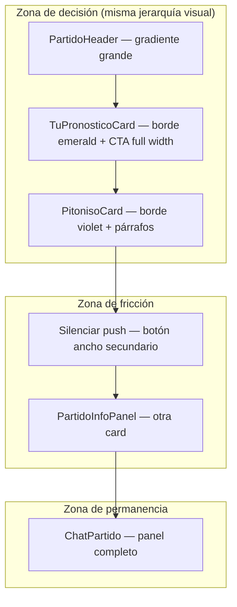

# UX-AUDIT-1 — Detalle de partido `/partidos/[id]`

> **Objetivo:** Evaluar la pantalla antes de **MATCH-MULTI-QUINIELA-1**.  
> **Criterio rector:** optimizar para *「Entrar, ver señales, pronosticar y salir」* — no para maximizar información visible.  
> **Alcance:** lectura de `page.tsx` y bloques renderizados. Sin cambios de código.

**Fecha:** 2026-06-14  
**Estado actual:** pronóstico y Pitoniso acoplados a `LIGA_GLOBAL_ID` en server; `TuPronosticoCard` ya acepta `ligaId` en props pero la página no lo parametriza por grupo.

---

## 1. Orden actual de bloques

### Shell

| # | Bloque | Condición |
|---|--------|-----------|
| 0 | Nav sticky `← Partidos` | Siempre |
| 1 | `PartidoHeader` | Siempre |
| 2 | `PartidoPronosticoPitonisoBlock` | `estatus === programado \| aplazado` |
| 2a | → `TuPronosticoCard` | Dentro del bloque (primero) |
| 2b | → `PitonisoCard` | Solo si `estatus === programado` y hay contexto estático |
| 3 | `SilenciarNotificacionesPartido` | Siempre |
| 4 | `PartidoInfoPanel` | Siempre |
| 4a | → metadata (horario, grupo, sede, TV) | Siempre |
| 4b | → `PartidoAlineaciones` | Colapsable dentro del panel |
| 5 | `PronosticoReminder` | Solo si **no** es pronosticable (en vivo, finalizado, etc.) |
| 6 | `PronosticosTodosPanel` | Solo `finalizado` (colapsado por defecto) |
| 7 | `ChatPartido` | Siempre (ocupa flex restante del layout) |

### Flujo visual en móvil (partido programado, pre-pitazo)

```
[ ← Partidos          ]
[ PartidoHeader       ]  equipos, fase, vs
[ TuPronosticoCard    ]  ← acción principal HOY arriba
[ PitonisoCard        ]  ← señales debajo del formulario
[ Silenciar push      ]
[ Info + Alineaciones ]
[ Chat del partido    ]  ← scroll largo para llegar
```

**Observación crítica:** el orden actual invierte el journey deseado (*señales → pronosticar*). El usuario ve el formulario antes de leer al Pitoniso.

---

## 2. Información primaria

Lo que el usuario necesita para cumplir el objetivo en **&lt; 60 s**:

| Prioridad | Contenido | Bloque actual |
|-----------|-----------|---------------|
| P0 | Quién juega, cuándo, estado | `PartidoHeader` + horario en `PartidoInfoPanel` (duplicado parcial) |
| P0 | Señales / inclinación antes de decidir | `PitonisoCard` (mensaje + confianza + marcador popular) |
| P0 | Ingresar y guardar marcador | `TuPronosticoCard` |
| P1 | Confirmación de guardado / lock | `TuPronosticoCard` (estados saved/locked) |

Para partido **en vivo / finalizado**, lo primario cambia a marcador live + chat + (post-partido) resultado vs pronóstico.

---

## 3. Información secundaria

| Contenido | Bloque | Cuándo importa |
|-----------|--------|------------------|
| Horario CDMX, sede, TV México | `PartidoInfoPanel` | Pre-partido, planificar viewing |
| Alineaciones | `PartidoAlineaciones` | ~1 h antes del pitazo |
| Disclaimer Pitoniso largo | `PitonisoCard` expand | Legal/educación, no decisión rápida |
| Silenciar notificaciones push | `SilenciarNotificacionesPartido` | Preferencia, no flujo pronóstico |
| Agregados detallados + pick value | `PronosticosTodosPanel` | Solo post-partido |
| Lista nominal de todos los picks | `PronosticosTodosPanel` | Curiosidad social post-partido |
| Chat + eventos sistema | `ChatPartido` | Social / live; compite con pronóstico pre-partido |

---

## 4. Bloques que compiten visualmente



| Competencia | Detalle |
|-------------|---------|
| **TuPronostico vs Pitoniso** | Dos `rounded-2xl` con bordes de color fuerte (emerald vs violet). Ambos piden atención lectura + acción. |
| **Header vs pronóstico** | Header con escudos grandes compite con inputs de marcador por espacio vertical above-the-fold. |
| **Info vs acción** | Horario/grupo aparece en header (fase, grupo) y otra vez en info panel. |
| **Chat vs todo lo anterior** | En layout `flex-col`, el chat empuja el stack; en pre-partido el usuario que solo quiere pronosticar debe hacer scroll para descubrir que hay chat. |
| **Agregados duplicados** | Pitoniso muestra marcador más repetido; post-partido `PronosticosTodosPanel` repite agregados + pick value. Aceptable por fase, pero concepto similar. |

---

## 5. Elementos que generan fatiga

1. **Scroll depth pre-pronóstico:** 4–5 bloques full-width antes del chat; en pantallas pequeñas el CTA de guardar puede quedar cerca del fold pero Pitoniso empuja info y mute hacia abajo.
2. **Copy denso en Pitoniso:** mensaje principal + línea de contradicción + dl inclinación + marcador popular + disclaimer + expand educativo.
3. **Botón silenciar push verboso:** dos líneas de texto por un toggle que no es parte del job-to-be-done principal.
4. **Doble card de pronóstico post-partido:** `PronosticoReminder` (asegurado) vs ausencia de Pitoniso — OK, pero si no hubo pronóstico, CTA manda a `/quiniela` genérico (no contextual).
5. **Carga cognitiva de agregados:** Pitoniso hace fetch async de multitud; loading state intermedio añade incertidumbre antes de decidir.
6. **Chat siempre visible:** invita a quedarse; contradice *「pronosticar y salir」* en fase programado.
7. **Sin selector de liga:** usuario multi-quiniela no sabe que solo está guardando en global (deuda explícita para MATCH-MULTI-QUINIELA-1).

---

## 6. Elementos que podrían colapsarse

| Elemento | Estado hoy | Recomendación |
|----------|------------|---------------|
| `PartidoAlineaciones` | Ya colapsable | Mantener; default cerrado salvo confirmadas |
| Pitoniso disclaimer largo | Expand opcional | Mantener; acortar copy visible por defecto |
| `PartidoInfoPanel` metadata | Siempre expandido | Colapsar en acordeón 「Detalle del partido」 |
| `SilenciarNotificacionesPartido` | Card completa | Reducir a icono/link en header o menú ⋮ |
| `PronosticosTodosPanel` | Colapsado post-partido | Mantener |
| Pitoniso detalle (inclinación + popular) | Siempre visible | Colapsar bajo mensaje principal en 1 línea |
| Chat | Siempre expandido | Colapsar o tab en fase **programado**; expandido en **en_vivo** |

---

## 7. Elementos que podrían moverse a tabs

Propuesta de tabs **solo si** se quiere separar modos de uso sin ocultar chat en vivo:

| Tab | Contenido | Fase ideal |
|-----|-----------|------------|
| **Pronosticar** | Pitoniso resumido + selector liga + `TuPronosticoCard` | programado / aplazado |
| **Partido** | Info, alineaciones, silenciar push | programado → en_vivo |
| **Chat** | `ChatPartido` | en_vivo (default) / programado (secundario) |
| **Resultado** | `PronosticoReminder` + `PronosticosTodosPanel` | finalizado |

**Riesgo de tabs:** añade un tap extra para pronosticar; aceptable si el tab Pronosticar es default en partidos abiertos.

**Alternativa más ligera:** sin tabs; solo colapsar chat e info en pre-partido y auto-expandir chat cuando `estatus` pasa a en_vivo.

---

## 8. MATCH-MULTI-QUINIELA-1 — dónde debería vivir

| Opción | Pros | Contras | Veredicto |
|--------|------|---------|-----------|
| **Inline** (chips/segmented control arriba de pronóstico) | Mínima fricción; un guardar visible; Pitoniso puede re-fetch por `ligaId` | Con 4+ ligas ocupa ancho | **Recomendado** para 2–4 ligas |
| **Acordeón** (una card por liga) | Escalable; estados independientes claros | Mucho scroll; fatiga con 3+ ligas | Secundario si &gt; 4 ligas |
| **Modal** | No ensucia layout | Oculta contexto partido; extra taps | **No recomendado** |
| **Tabs** (tab por liga) | Clara separación | Confunde tabs de liga vs tabs de sección; mal encaje | **No recomendado** |
| **Reemplazar TuPronosticoCard** | API única | Pierde patrón familiar; Pitoniso quedaría huérfano | **No** — **extender**, no reemplazar |

### Comportamiento propuesto para MATCH-MULTI-QUINIELA-1

1. **Extender `TuPronosticoCard`** (o wrapper `PartidoPronosticoPitonisoBlock`) con:
   - Selector horizontal de ligas (global primero, luego grupos).
   - Label explícito: 「Guardando en: Mundial Compas / {Grupo}」.
   - Un solo formulario activo a la vez.
2. **`PitonisoCard`** recibe el `ligaId` seleccionado (ya soportado en props) y refresca agregados al cambiar liga.
3. **No** mandar a `/partidos/[id]` distinto por grupo — misma URL, contexto de liga en UI.
4. CTAs secundarios (`PronosticoReminder` post-partido) deberían enlazar a `/quiniela` o `/grupos/{slug}/quiniela` según liga activa (hoy solo global).

### Contexto técnico confirmado

- `fetchPartidoDetallePageData` carga pronóstico **solo** `LIGA_GLOBAL_ID`.
- `savePronostico(..., ligaId)` ya acepta liga de grupo.
- Detalle partido **no** tiene query param `?liga=` hoy — MATCH-MULTI-QUINIELA-1 puede ser 100% client-side selector + fetch adicional por liga.

---

## 9. Wireframe ASCII propuesto

### A. Pre-partido — foco 「señales → pronosticar → salir」

```
┌─────────────────────────────────────┐
│ ← Partidos                    [🔔] │  mute compacto en header
├─────────────────────────────────────┤
│  [Fase] [Grupo]     programado      │
│   🇲🇽 MEX        vs        🇦🇷 ARG   │  PartidoHeader (compacto)
│         Jue 18 Jun · 14:00 CDMX     │  horario inline bajo marcador
├─────────────────────────────────────┤
│ 🔮 El Pitoniso · Bastante convencido│
│ «La multitud inclina a MEX, pero…»   │  2–3 líneas max
│ [Ver señales ▾]                     │  inclinación + popular colapsado
├─────────────────────────────────────┤
│ Quiniela: ( Global ) ( Compas MX )  │  ← MATCH-MULTI-QUINIELA-1
│         ( La Office )               │     scroll chips si muchas
├─────────────────────────────────────┤
│ Tu pronóstico · Mundial Compas      │
│  MEX  [ 2 ] - [ 1 ]  ARG            │
│  [ Guardar pronóstico          ]    │  CTA sticky opcional
├─────────────────────────────────────┤
│ ▸ Detalle (sede, TV, alineaciones)  │  colapsado default
├─────────────────────────────────────┤
│ ▸ Chat del partido                  │  colapsado pre-partido
└─────────────────────────────────────┘
```

### B. En vivo — foco chat

```
┌─────────────────────────────────────┐
│ ← Partidos                          │
│  MEX  2 - 1  ARG        🔴 67'      │
├─────────────────────────────────────┤
│ Tu pick: 2-1 ✓  (Global · 3 pts)    │  barra compacta, multi-liga TBD
├─────────────────────────────────────┤
│ Chat del partido          [activo]  │
│ ┌─────────────────────────────────┐ │
│ │ mensajes…                       │ │
│ │                                 │ │
│ └─────────────────────────────────┘ │
│ [ Escribe un mensaje…           ]   │
├─────────────────────────────────────┤
│ ▸ Info · Alineaciones               │
└─────────────────────────────────────┘
```

### C. Finalizado

```
┌─────────────────────────────────────┐
│  MEX  2 - 1  ARG        Final       │
├─────────────────────────────────────┤
│ Tu pronóstico: 2-1 · +3 pts 🎯      │
│ [ Predicciones de todos ▾ ]         │  PronosticosTodosPanel
├─────────────────────────────────────┤
│ Chat (cerrado / lectura)            │
└─────────────────────────────────────┘
```

---

## 10. Recomendación final

### Para UX-AUDIT-1 (sin implementar aún)

1. **Reordenar** en partido programado: `PitonisoCard` (resumido) **antes** de `TuPronosticoCard`.
2. **Compactar** metadata: horario en header; `PartidoInfoPanel` colapsado por defecto.
3. **Mover** silenciar push a control compacto en header (no card full-width).
4. **Colapsar chat** en fase programado; expandir automáticamente en en_vivo.
5. **Acortar** Pitoniso above-the-fold a mensaje + confianza; detalle en expand.

### Para MATCH-MULTI-QUINIELA-1

| Decisión | Elección |
|----------|----------|
| Patrón UI | **Inline** — chips/segmented control de liga sobre el formulario |
| Componente base | **Extender** `PartidoPronosticoPitonisoBlock` + `TuPronosticoCard`; no modal ni tabs por liga |
| Pitoniso | Sincronizado con liga seleccionada (`ligaId` prop existente) |
| Datos server | Ampliar fetch inicial: membresías + pronósticos por liga para el partido (sin cambiar schema) |
| CTAs legacy | Actualizar `PronosticoReminder` links para respetar liga (fase 2) |

### Métrica de éxito UX post-cambios

- Usuario con 1 liga: **≤ 2 scrolls** desde entrada hasta guardar tras leer Pitoniso.
- Usuario con N ligas: cambio de liga + guardar en **≤ 3 taps** adicionales.
- Chat no visible above-the-fold en partido programado (opcional expand).

### Qué no hacer en MATCH-MULTI-QUINIELA-1

- No duplicar `PitonisoCard` por liga (una instancia, refresh por liga).
- No abrir modal de quiniela.
- No asumir `/partidos/[id]?liga=uuid` hasta evaluar deep links; selector client-side basta para v1.

---

*Auditoría UX-AUDIT-1 — solo documentación. Sin cambios en código ni commits.*
