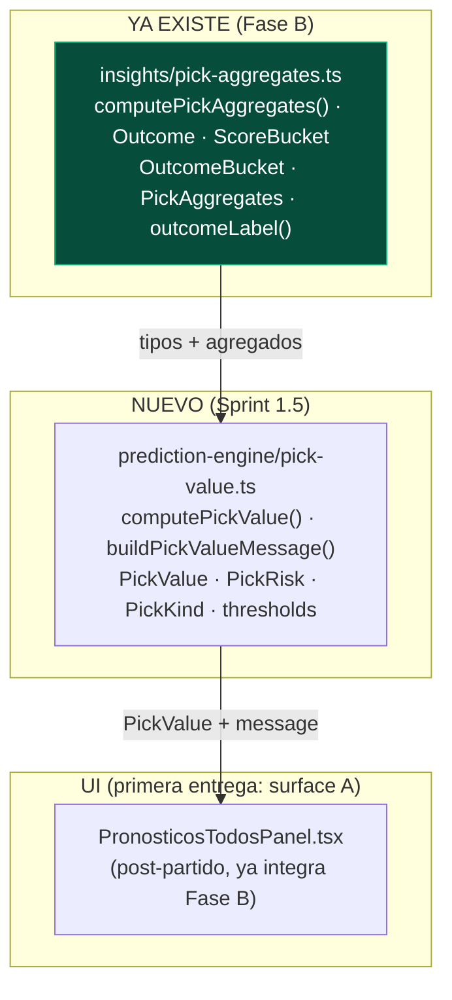
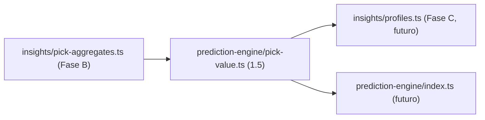

# SPRINT 1.5 — PICK VALUE ENGINE — PLAN DE EJECUCIÓN

> **Documento de plan. No es implementación.** No se escribe código, no se crean tablas/migraciones/vistas, no se toca scoring/triggers/webhooks/LigaPro, no se llama a APIs externas, no se usa LLM.
> Fuentes de verdad: `SPORTS_CORE_MASTERPLAN.md`, `SPRINT1_EXECUTION_PLAN.md`, `SPRINT1_PHASE_B_REPORT.md`, `SPRINT1_PHASE_C_DESIGN.md`, `PREDICTION_ENGINE_DESIGN.md`.
>
> **Objetivo:** ejecutar `pick-value`, **primer módulo del Prediction Engine** (Fase 0). TypeScript puro, solo lectura, reversible. Reutiliza `computePickAggregates` (Fase B, ya implementada).

---

## 0. Resumen ejecutivo

`pick-value` responde, para **un partido y un pick concreto**: *¿qué tan popular, qué tan arriesgado y de qué tipo es este pick, y cómo lo explico de forma responsable?*

- **Núcleo = función pura** `computePickValue(aggregates, pick)` que recibe la salida de `computePickAggregates` (Fase B) y un marcador, y devuelve popularidad + riesgo + tipo + mensaje.
- **Cero acceso a datos nuevo en la primera entrega:** se monta sobre los `participantes` que el panel post-partido **ya carga** (Fase B).
- Diseñado para que **perfiles de usuario (Fase C)**, **Prediction Engine** y **LigaPro/ProGol** lo reutilicen sin reescribir nada.

---

## 1. Arquitectura del módulo



**Principios:**
1. **Pureza:** `pick-value.ts` no hace fetch, no toca red, no toca BD. Recibe `PickAggregates` ya calculado.
2. **Reúso, no duplicación:** la distribución (conteos, `sharePct`, 1X2) la sigue calculando `computePickAggregates`. `pick-value` solo **interpreta** esa salida.
3. **Separación de capas:** estructura (`computePickValue`) vs. prosa (`buildPickValueMessage`). Esto deja el camino listo para `narrative-template` del Prediction Engine.

---

## 2. Funciones propuestas

| Función | Tipo | Responsabilidad | Pura |
|---------|------|-----------------|------|
| `computePickValue(aggregates, pick, options?)` | core | De `PickAggregates` + un marcador → `PickValue` (popularidad exacta, 1X2, riesgo, tipo). | ✅ |
| `buildPickValueMessage(value, ctx?)` | narrativa | De `PickValue` (+ nombres de equipo opcionales) → string responsable. | ✅ |
| `pickValueThresholds` | constantes | Umbrales configurables (share→tipo/riesgo, muestra mínima). | — |

**Cambio mínimo en Fase B (aditivo, sin romper):** exportar la función `outcomeOf` (hoy privada en `pick-aggregates.ts`) para que `pick-value` derive el resultado 1X2 del pick **sin duplicar** esa lógica. Es un `export` de una función ya existente; no cambia comportamiento.

---

## 3. Tipos TypeScript (inputs / outputs)

```ts
// Reutilizados de insights/pick-aggregates.ts:
//   Outcome, ScoreBucket, OutcomeBucket, PickAggregates, outcomeLabel, outcomeOf

export type PickRisk = "bajo" | "medio" | "alto" | "extremo";
export type PickKind = "popular" | "balanceado" | "diferencial" | "raro";

/** Pick a evaluar (marcador exacto). */
export interface PickValueInput {
  local: number;
  visitante: number;
}

/** Contexto opcional para enriquecer el mensaje (sin PII). */
export interface PickValueContext {
  homeName?: string;
  awayName?: string;
}

export interface PickValueOptions {
  minSample?: number; // default: 5
  context?: PickValueContext;
}

export interface PickValue {
  // --- Popularidad del marcador exacto ---
  scoreSharePct: number;        // % que eligió este marcador exacto
  isMostPopularScore: boolean;  // ¿es el marcador top?
  // --- Popularidad del resultado 1X2 ---
  outcome: Outcome;             // local | empate | visitante del pick
  outcomeSharePct: number;      // % que eligió este resultado 1X2
  isMostPopularOutcome: boolean;
  // --- Derivados ---
  risk: PickRisk;               // bajo | medio | alto | extremo
  kind: PickKind;               // popular | balanceado | diferencial | raro
  // --- Narrativa ---
  message: string;              // copy responsable (de buildPickValueMessage)
  // --- Muestra ---
  total: number;                // nº de pronósticos comparados
  sampleOk: boolean;            // total >= minSample
}
```

### Inputs / Outputs (resumen)

| Función | Input | Output |
|---------|-------|--------|
| `computePickValue` | `PickAggregates`, `PickValueInput`, `PickValueOptions?` | `PickValue` |
| `buildPickValueMessage` | `PickValue`, `PickValueContext?` | `string` |

**Cómo se obtiene `PickAggregates`:** en surface A, ya está en memoria (el panel llama a `fetchPronosticosPartidoTodos` y luego `computePickAggregates` vía el `useMemo` de Fase B). `pick-value` no agrega ninguna consulta.

---

## 4. Thresholds sugeridos (configurables)

Eje único de popularidad = **`scoreSharePct`** (share del marcador exacto). `kind` y `risk` se derivan del mismo eje pero con framings distintos; el **mensaje** añade matiz con `outcomeSharePct`.

| `scoreSharePct` | `kind` | `risk` | Lectura |
|-----------------|--------|--------|---------|
| ≥ 20% | `popular` | `bajo` | Vas con la mayoría. |
| 10% – 20% | `balanceado` | `medio` | Elección común pero no masiva. |
| 3% – 10% | `diferencial` | `alto` | Pocos lo eligieron; ventaja si pega. |
| < 3% | `raro` | `extremo` | Muy poca gente; máxima ventaja/máximo riesgo. |

| Parámetro | Valor inicial | Nota |
|-----------|---------------|------|
| `minSample` | **5** | Coherente con `N_min` de Fase C. Bajo esto, `sampleOk=false`. |
| Matiz 1X2 | `outcomeSharePct ≥ 50%` | Si el **resultado** es mayoritario aunque el marcador sea raro → mensaje tipo "vas con la mayoría en el resultado, pero el marcador exacto es diferencial". |

> Umbrales **iniciales**; se calibran con la distribución real del Mundial (PostHog + datos). Viven como constantes en `pickValueThresholds`, no hardcodeados dispersos.

---

## 5. Mensajes narrativos (ejemplos → reglas)

`buildPickValueMessage` mapea `(kind, risk, outcome, shares, sampleOk, ctx)` a copy responsable. Sin tono de apuesta.

| Situación | Mensaje (con nombres si hay contexto) |
|-----------|----------------------------------------|
| `popular` | *"Pick popular: tu marcador coincide con el 24% de los participantes. Buen camino si quieres mantener posición."* |
| `balanceado` | *"Elección equilibrada: el 14% eligió este marcador."* |
| `diferencial` | *"Pick diferencial: solo el 6% eligió este marcador. Alto potencial si pega."* |
| `raro` | *"Pick arriesgado: casi nadie eligió este marcador. Máxima ventaja, mínima popularidad."* |
| Resultado mayoritario, marcador raro | *"La mayoría espera victoria de México, pero tu empate puede mover la tabla si pega."* |
| `sampleOk = false` | *"Aún hay pocos pronósticos para comparar este pick."* |

Cada superficie añade el **disclaimer** (ver §6 copy): *"Estimación recreativa basada en datos disponibles, no es garantía."*

---

## 6. UI mínima — dónde se muestra primero

### Decisión: **Opción A — dentro del panel post-partido actual** (primera implementación más segura).

| Opción | Seguridad | Veredicto |
|--------|-----------|-----------|
| **A) Panel post-partido (`PronosticosTodosPanel`)** | **Máxima** | ✅ **ELEGIDA** — los datos ya están en memoria (Fase B), post-finalizado (sin lock/live/privacidad), 100% aditivo. |
| C) Detalle de partido pre-lock | Media | Siguiente paso. Requiere ruta de lectura **solo-agregado** (conteos sin nombres) → privacidad-safe pero **nuevo data path**. |
| B) Quiniela antes de guardar pick | Media | Tras C; máximo valor de producto, mismo data path agregado. |
| D) Leaderboard | Baja prioridad | Se combina con perfiles (Fase C), no ahora. |

**Por qué A primero:** valida la función pura `computePickValue` contra datos reales **sin ningún riesgo nuevo** (sin fetch nuevo, sin pre-lock, sin exponer picks individuales, sin tocar la ventana de scoring). Es el beachhead seguro; B/C son el objetivo de producto inmediatamente después.

### UI en surface A (enriquece el bloque de insights de Fase B)

```
Resultado real: 2-1

┌─ Marcador más elegido ─┬─ Resultado más elegido ─┐   (Fase B, ya existe)
│        1-1  23%        │        Local  62%       │
└────────────────────────┴─────────────────────────┘

[ NUEVO pick-value, sobre tu pick ]
🃏 Pick diferencial · riesgo alto
"Solo el 6% eligió tu marcador (2-1). Alto potencial si pega."
Estimación recreativa basada en datos disponibles, no es garantía.
```

- Badge: emoji por `kind` (popular 🟢 / balanceado ⚖️ / diferencial 🃏 / raro 🎲) + etiqueta de `risk`.
- Solo se muestra si el usuario tuvo pick (`aggregates.userScore != null`) y `sampleOk`.
- Reutiliza `aggregates` ya calculado; **cero llamadas nuevas**.

---

## 7. Compatibilidad futura (cómo evita duplicación)

| Consumidor futuro | Cómo reutiliza `pick-value` | Qué se evita duplicar |
|-------------------|------------------------------|------------------------|
| **Perfiles de usuario (Fase C)** | `scoreSharePct` por pick → promedio = `minorityRate`; `kind="diferencial"/"raro"` alimenta el perfil *Apostador Diferencial 🃏*. | La lógica de "qué tan minoritario es un pick" se escribe **una vez aquí**, no dentro de profiles. |
| **Prediction Engine** | `pick-value` ES su primer módulo (Fase 0, CrowdProvider). | Nada; es el cimiento. |
| **LigaPro** | La función es genérica sobre cualquier `PickAggregates`; sirve si LigaPro algún día tiene picks de usuarios. | Reescribir el cálculo por producto. |
| **ProGol / 1X2 (entry_type futuro)** | `outcomeSharePct` + `outcome` ya resuelven el caso 1X2 puro. | Un módulo aparte para 1X2. |

**Regla anti-duplicación con perfiles:** `pick-value` expone el cálculo por-pick; `profiles` (cuando se implemente) **importa** `computePickValue`/`outcomeOf` en lugar de recalcular shares. Ubicar ambos bajo `src/lib/` con dependencia unidireccional `profiles → pick-value → pick-aggregates`.



---

## 8. Ubicación de archivos

| Archivo | Acción | Nota |
|---------|--------|------|
| `src/lib/prediction-engine/pick-value.ts` | **Nuevo** | Núcleo puro + tipos + thresholds + mensaje. |
| `src/lib/insights/pick-aggregates.ts` | **Editar (mínimo)** | `export` de `outcomeOf` (hoy privada). Sin cambio de comportamiento. |
| `src/components/quiniela/PronosticosTodosPanel.tsx` | **Editar** | Calcular `computePickValue` con el `aggregates` ya existente y renderizar el badge + mensaje. |
| `src/lib/analytics/events.ts` | **Editar** | Añadir evento(s) de §9. |
| `SPRINT1_5_PICK_VALUE_REPORT.md` | **Nuevo (al final)** | Reporte de ejecución. |

> Carpeta `prediction-engine/` nueva, alineada con `PREDICTION_ENGINE_DESIGN.md` §7. Pensada para extraerse a `packages/sports-core` en enero 2027 (masterplan).

---

## 9. Eventos de analytics

Se añaden al `AnalyticsEventMap` (Fase A) y se disparan con `trackEvent` (ya conectado a PostHog). **Sin PII.**

| Evento | Payload | Dónde | Mide |
|--------|---------|-------|------|
| `pick_value_shown` | `{ liga_scope: "global"\|"grupo"; kind: PickKind; risk: PickRisk }` | Al renderizar el badge en surface A | Exposición y mezcla de tipos de pick |

Futuro (no en esta entrega, surfaces B/C):
| `pick_value_hint_viewed` | `{ liga_scope }` | Hint pre-lock | Engagement antes de guardar |

Funnel: `match_view` (Fase A, ya existe) → `pick_value_shown`.

---

## 10. Copy responsable (no sonar a apuesta)

- **Disclaimer obligatorio** en toda superficie de pick-value:
  > *"Estimación recreativa basada en datos disponibles. No es una garantía ni un consejo de apuesta."*
- **Prohibido:** cuotas/odds de dinero, "apuesta segura", "ganarás", lenguaje de casa de apuestas.
- **Permitido:** "popularidad", "diferencial", "puede mover la tabla", "potencial" — siempre con marco recreativo.
- El riesgo se expresa como **popularidad/ventaja competitiva**, nunca como rendimiento económico.

---

## 11. Riesgos

| Riesgo | Severidad | Mitigación |
|--------|-----------|------------|
| Sonar a apuesta | Alta | Copy §10 + disclaimer; sin odds monetarias. |
| Sobreprometer precisión | Media | `sampleOk` gate; porcentajes redondeados; nada de decimales falsos. |
| Muestras pequeñas (`total < 5`) | Media | `minSample`; mensaje "pocos pronósticos para comparar". |
| Usuario cree que es garantía | Media | Disclaimer visible + marco recreativo. |
| Duplicación con perfiles | Media | Dependencia unidireccional; profiles importa, no recalcula. |
| Framing retrospectivo en surface A | Baja | Copy en pasado post-partido ("tu marcador coincidió con el 24%"); el valor predictivo real llega en B/C. |
| Privacidad pre-lock (cuando se haga B/C) | Media | **No en esta entrega.** B/C exigirán ruta solo-agregado (sin nombres). |
| Rendimiento liga global pre-lock (B/C) | Media | **No en esta entrega.** B/C: agregación server-side, acotada. |

---

## 12. Checklist de implementación

### Fase 1.5-A (única entrega de este sprint)

- [ ] 1. Exportar `outcomeOf` en `src/lib/insights/pick-aggregates.ts` (cambio aditivo).
- [ ] 2. Crear `src/lib/prediction-engine/pick-value.ts`: tipos (`PickRisk`, `PickKind`, `PickValueInput`, `PickValue`, etc.), `pickValueThresholds`, `computePickValue`, `buildPickValueMessage`. **Función pura, sin fetch.**
- [ ] 3. Integrar en `PronosticosTodosPanel.tsx`: derivar `computePickValue` del `aggregates` ya calculado (Fase B) y renderizar badge (`kind`+`risk`) + mensaje + disclaimer, solo si `userScore != null` y `sampleOk`.
- [ ] 4. Añadir evento `pick_value_shown` a `events.ts` y dispararlo en surface A.
- [ ] 5. `npx tsc --noEmit` (typecheck) + `npm run lint` filtrado a archivos tocados; corregir solo errores introducidos.
- [ ] 6. Generar `SPRINT1_5_PICK_VALUE_REPORT.md` (archivos, funciones, ejemplos de salida, riesgos, ideas siguientes).

---

## 13. Qué NO implementar (límites explícitos)

- ❌ Surfaces B, C, D (pre-lock / leaderboard). Solo A en este sprint.
- ❌ Ninguna ruta de datos nueva (server action de conteos pre-lock) → es para B/C.
- ❌ Estimación numérica de "impacto exacto en leaderboard" (solo lenguaje cualitativo "puede mover la tabla"). El cálculo de posiciones queda fuera de `pick-value`.
- ❌ Perfiles de usuario (Fase C): este sprint **prepara** su base, no la implementa.
- ❌ Elo, LigaPro, ProGol, LLM, narrative-template completo.
- ❌ Tablas, migraciones, vistas, materialized views.
- ❌ Tocar scoring, triggers, webhooks, producción.
- ❌ APIs externas, proveedor de analytics nuevo.

---

*Plan de ejecución de Sprint 1.5 · Pick Value Engine. TypeScript puro, solo lectura, reversible, reutiliza Fase B. Pendiente de aprobación antes de implementar.*
