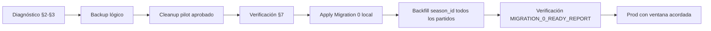

# PILOT-CLEANUP-1 — Diagnóstico

> **Estado:** Solo diagnóstico. **NO** se ejecutó SQL destructivo. **NO** se modificó Supabase producción.

**Fecha:** 2026-06-15  
**Objetivo:** Identificar partidos piloto/de prueba y dependencias antes de borrarlos, como prerequisito de Migration 0.

---

## 1. Criterio exacto para detectar partidos piloto

### 1.1 Criterio canónico (app)

Fuente: `src/lib/apifootball/pilot-config.ts` → `isPilotPartidoMetadata()`

Un partido es **piloto** si su columna `metadata` (JSONB) cumple **cualquiera** de:

| Condición | Ejemplo |
|-----------|---------|
| `metadata->>'competencia' = 'pilot'` | Todos los scripts pilot lo setean |
| `metadata->'pilot' = true` (boolean JSON) | `map-fixture-row.ts`, `cargar-pilot-*.mjs` |

**Predicado SQL canónico:**

```sql
(
  COALESCE(p.metadata->>'competencia', '') = 'pilot'
  OR COALESCE((p.metadata->'pilot')::boolean, FALSE) = TRUE
)
```

### 1.2 Criterio parcial en UI admin (banner pilot)

`src/lib/apifootball/pilot-queries.ts` filtra solo:

```sql
metadata->>'competencia' = 'pilot'
```

Todos los loaders conocidos setean **ambos** flags (`competencia: "pilot"` y `pilot: true`). Para cleanup usar el **criterio canónico** (§1.1).

### 1.3 Qué NO es piloto

| Señal | ¿Piloto? |
|-------|----------|
| Partidos del Mundial real (`recargar-mundial.mjs`, admin `cargar-partidos`) | **No** |
| `PILOT_MODE_ENABLED=true` sin partidos cargados | **No** (solo banner/env) |
| `api_football_fixture_id` de ligas UCL/Concacaf/amistosos **sin** metadata pilot | **No** — revisar manualmente si existieran filas huérfanas |
| Partidos con `metadata.competencia_label` pero sin `competencia = 'pilot'` | **No** — tratar como excepción manual |

### 1.4 Origen de partidos pilot (código/scripts)

| Origen | Archivo | Metadata pilot |
|--------|---------|----------------|
| Champions / fin de semana UCL | `scripts/cargar-pilot-local.mjs` | `competencia: "pilot"`, `pilot: true` |
| Concacaf pilot | `scripts/cargar-pilot-concacaf.mjs` | Idem |
| México vs Serbia live | `scripts/cargar-pilot-mexico-serbia.mjs` | Idem |
| Ingesta API con flag pilot | `src/lib/api-football/map-fixture-row.ts` | Idem |
| Ingesta apifootball events | `src/lib/apifootball/map-event-to-partido.ts` | Idem |
| Admin cargar-partidos (modo pilot) | `src/app/api/admin/cargar-partidos/route.ts` | Vía mappers anteriores |

### 1.5 Exclusión en app (sin borrar BD)

`filterOutPilotPartidos()` se usa en:

- `src/lib/home/home-dashboard-queries.ts`
- `src/lib/partidos/calendario-queries.ts`
- `src/lib/partidos/queries.ts`
- `src/lib/quiniela/queries.ts`
- `src/lib/quiniela/next-pending-prediction.ts`

Los pilot **conviven en BD** pero no aparecen en home, calendario, quiniela ni dashboard. El banner pilot (`fetchPilotUiState`) los cuenta cuando `PILOT_MODE_ENABLED=true`.

---

## 2. SQL SELECT — listar partidos piloto

```sql
SELECT
  p.id,
  p.api_football_fixture_id,
  p.equipo_local_nombre,
  p.equipo_visitante_nombre,
  p.fecha_kickoff,
  p.estatus,
  p.fase,
  p.grupo,
  p.metadata->>'competencia'       AS competencia,
  p.metadata->>'competencia_label' AS competencia_label,
  p.metadata->'pilot'              AS pilot_flag,
  p.created_at,
  p.updated_at
FROM public.partidos p
WHERE (
  COALESCE(p.metadata->>'competencia', '') = 'pilot'
  OR COALESCE((p.metadata->'pilot')::boolean, FALSE) = TRUE
)
ORDER BY p.fecha_kickoff DESC;
```

---

## 3. SQL SELECT — conteos por dependencia

Reemplazar el predicado pilot en todos los bloques:

```sql
-- CTE reutilizable
WITH pilot AS (
  SELECT p.id
  FROM public.partidos p
  WHERE (
    COALESCE(p.metadata->>'competencia', '') = 'pilot'
    OR COALESCE((p.metadata->'pilot')::boolean, FALSE) = TRUE
  )
)
SELECT 'partidos_pilot' AS metric, COUNT(*) AS cnt FROM pilot
UNION ALL
SELECT 'pronosticos', COUNT(*)
FROM public.pronosticos pr
WHERE pr.partido_id IN (SELECT id FROM pilot)
UNION ALL
SELECT 'mensajes_chat', COUNT(*)
FROM public.mensajes_chat mc
WHERE mc.partido_id IN (SELECT id FROM pilot)
UNION ALL
SELECT 'notificaciones', COUNT(*)
FROM public.notificaciones n
WHERE n.partido_id IN (SELECT id FROM pilot)
UNION ALL
SELECT 'webhook_eventos', COUNT(*)
FROM public.webhook_eventos w
WHERE w.partido_id IN (SELECT id FROM pilot)
UNION ALL
SELECT 'push_partidos_silenciados', COUNT(*)
FROM public.push_partidos_silenciados ps
WHERE ps.partido_id IN (SELECT id FROM pilot);
```

### 3.1 Desglose adicional recomendado

```sql
-- Pronósticos pilot por liga (global vs grupos)
WITH pilot AS (
  SELECT id FROM public.partidos p
  WHERE COALESCE(p.metadata->>'competencia', '') = 'pilot'
     OR COALESCE((p.metadata->'pilot')::boolean, FALSE) = TRUE
)
SELECT lp.slug, lp.nombre, COUNT(pr.id) AS pronosticos
FROM public.pronosticos pr
JOIN pilot ON pilot.id = pr.partido_id
JOIN public.ligas_privadas lp ON lp.id = pr.liga_id
GROUP BY lp.slug, lp.nombre
ORDER BY pronosticos DESC;

-- Notificaciones pilot ya enviadas vs pendientes
WITH pilot AS (
  SELECT id FROM public.partidos p
  WHERE COALESCE(p.metadata->>'competencia', '') = 'pilot'
     OR COALESCE((p.metadata->'pilot')::boolean, FALSE) = TRUE
)
SELECT n.enviada, COUNT(*) AS cnt
FROM public.notificaciones n
WHERE n.partido_id IN (SELECT id FROM pilot)
GROUP BY n.enviada;
```

### 3.2 Tablas con FK hacia `partidos` (inventario schema)

| Tabla | FK | ON DELETE | Impacto al borrar partido pilot |
|-------|-----|-----------|----------------------------------|
| `pronosticos` | `partido_id` NOT NULL | **CASCADE** | Filas eliminadas automáticamente |
| `mensajes_chat` | `partido_id` NOT NULL | **CASCADE** | Filas eliminadas automáticamente |
| `push_partidos_silenciados` | `partido_id` NOT NULL | **CASCADE** | Filas eliminadas automáticamente |
| `notificaciones` | `partido_id` nullable | **SET NULL** | Quedan filas con `partido_id = NULL` |
| `webhook_eventos` | `partido_id` nullable | **SET NULL** | Quedan filas con `partido_id = NULL` |

**No hay otras FKs** hacia `partidos` en `supabase/migrations/` actuales (30 archivos revisados).

`mensajes_chat.partido_id` es nullable para chat `liga_general`, pero mensajes de partido pilot tienen `partido_id` NOT NULL → entran en CASCADE.

---

## 4. Riesgos de borrar

| # | Riesgo | Severidad | Mitigación |
|---|--------|-----------|------------|
| 1 | Pérdida irreversible de pronósticos/chat de prueba | Baja | Son datos de QA; export backup §5 antes |
| 2 | Leaderboard global incluye puntos de pronósticos pilot | **Media** | Tras CASCADE, puntos pilot desaparecen de `pronosticos`; verificar `tabla_liderato` post-cleanup |
| 3 | Notificaciones/webhooks huérfanos (`partido_id NULL`) | Baja | Opcional DELETE explícito pre/post |
| 4 | Borrar filas no-pilot por error de predicado | **Crítica** | Ejecutar §2 y §3; revisar lista manualmente antes de DELETE |
| 5 | `PILOT_MODE_ENABLED=true` con 0 pilot post-cleanup | Baja | Banner vacío; poner env `false` |
| 6 | Scripts pilot re-insertan partidos | Baja | No ejecutar `cargar-pilot-*` en prod tras cleanup |
| 7 | Usuario real pronosticó partido pilot en prueba | Baja–Media | Revisar conteo `pronosticos` por liga antes de borrar |
| 8 | Migration 0 backfill mezclaría pilot con WC 2026 | **Alta** (si no se limpia) | **Pilot cleanup antes de Migration 0 apply** |

---

## 5. Orden correcto de borrado (respetando FKs)

### Opción A — DELETE directo en `partidos` (recomendada)

PostgreSQL aplica CASCADE/SET NULL según FK:

1. **Backup lógico** — exportar IDs y filas dependientes (ver `PILOT_CLEANUP_SQL_REVIEW.md` §1).
2. **(Opcional)** `DELETE FROM notificaciones WHERE partido_id IN (pilot_ids)` — evita huérfanos.
3. **(Opcional)** `DELETE FROM webhook_eventos WHERE partido_id IN (pilot_ids)` — evita huérfanos.
4. **`DELETE FROM partidos WHERE <predicado pilot>`** — CASCADE elimina `pronosticos`, `mensajes_chat`, `push_partidos_silenciados`.
5. **Verificación** — §7.

### Opción B — DELETE explícito hijo → padre (auditoría)

1. Backup lógico.
2. `DELETE pronosticos` WHERE partido_id IN pilot.
3. `DELETE mensajes_chat` WHERE partido_id IN pilot.
4. `DELETE push_partidos_silenciados` WHERE partido_id IN pilot.
5. `DELETE notificaciones` WHERE partido_id IN pilot.
6. `DELETE webhook_eventos` WHERE partido_id IN pilot (o UPDATE SET NULL).
7. `DELETE partidos` WHERE predicado pilot.
8. Verificación.

Ambas opciones son equivalentes en resultado final si se cubren SET NULL en paso opcional.

---

## 6. SQL de limpieza propuesto — ⛔ NO EJECUTAR AÚN

Ver archivo dedicado: **`PILOT_CLEANUP_SQL_REVIEW.md`** (SQL completo comentado y ordenado).

Resumen:

```sql
-- ⛔ NO EJECUTAR AÚN — solo referencia
-- BEGIN;
-- ... backup SELECTs ...
-- DELETE FROM public.notificaciones WHERE partido_id IN (SELECT id FROM pilot);
-- DELETE FROM public.webhook_eventos WHERE partido_id IN (SELECT id FROM pilot);
-- DELETE FROM public.partidos WHERE <predicado pilot>;
-- COMMIT;
```

---

## 7. SQL de verificación post-cleanup

```sql
-- 7.1 Cero partidos pilot
SELECT COUNT(*) AS partidos_pilot_restantes
FROM public.partidos p
WHERE (
  COALESCE(p.metadata->>'competencia', '') = 'pilot'
  OR COALESCE((p.metadata->'pilot')::boolean, FALSE) = TRUE
);
-- Esperado: 0

-- 7.2 Cero dependencias con partido_id pilot (si se borraron partidos)
WITH pilot_ids AS (
  SELECT id FROM public.partidos p
  WHERE COALESCE(p.metadata->>'competencia', '') = 'pilot'
     OR COALESCE((p.metadata->'pilot')::boolean, FALSE) = TRUE
)
SELECT
  (SELECT COUNT(*) FROM public.pronosticos WHERE partido_id IN (SELECT id FROM pilot_ids)) AS pronosticos,
  (SELECT COUNT(*) FROM public.mensajes_chat WHERE partido_id IN (SELECT id FROM pilot_ids)) AS mensajes,
  (SELECT COUNT(*) FROM public.push_partidos_silenciados WHERE partido_id IN (SELECT id FROM pilot_ids)) AS silenciados;
-- Esperado: 0, 0, 0

-- 7.3 Partidos reales intactos
SELECT COUNT(*) AS partidos_no_pilot
FROM public.partidos p
WHERE NOT (
  COALESCE(p.metadata->>'competencia', '') = 'pilot'
  OR COALESCE((p.metadata->'pilot')::boolean, FALSE) = TRUE
);
-- Esperado: > 0 (calendario Mundial)

-- 7.4 Huérfanos notificaciones/webhook (partido_id NULL post-SET NULL)
-- Solo relevante si NO se hizo DELETE explícito en §5
SELECT COUNT(*) AS notif_sin_partido
FROM public.notificaciones
WHERE partido_id IS NULL AND metadata ? 'pilot'; -- ajustar si no hay tag en metadata

-- 7.5 Leaderboard smoke (manual app)
-- Verificar /leaderboard y /grupos/*/leaderboard no muestran puntos anómalos
```

---

## 8. Rollback

**No hay rollback automático** tras DELETE en producción.

| Escenario | Recuperación |
|-----------|--------------|
| Sin backup | **Irrecuperable** — recrear partidos pilot con scripts `cargar-pilot-*` (nuevos UUIDs; pronósticos/chat perdidos) |
| Con backup lógico (§5 de SQL review) | `INSERT` desde export CSV/JSON en orden inverso: `partidos` → dependientes |
| Supabase PITR / backup diario | Restaurar snapshot previo al cleanup (ventana de mantenimiento; afecta todo el proyecto) |

**Recomendación:** ejecutar backup lógico obligatorio en staging antes de prod.

---

## 9. Secuencia recomendada con Migration 0



---

## 10. Checklist pre-ejecución (humano)

- [ ] Ejecutar §2 y §3 en **staging** (no prod).
- [ ] Revisar lista de partidos pilot vs expectativa (UCL, Concacaf, México-Serbia, etc.).
- [ ] Confirmar conteo `pronosticos` pilot aceptable para borrar.
- [ ] Export backup lógico.
- [ ] `PILOT_MODE_ENABLED=false` post-cleanup.
- [ ] Aplicar Migration 0 solo después de §7 = 0 pilot.

---

*Generado para PILOT-CLEANUP-1. No incluye ejecución en Supabase.*
