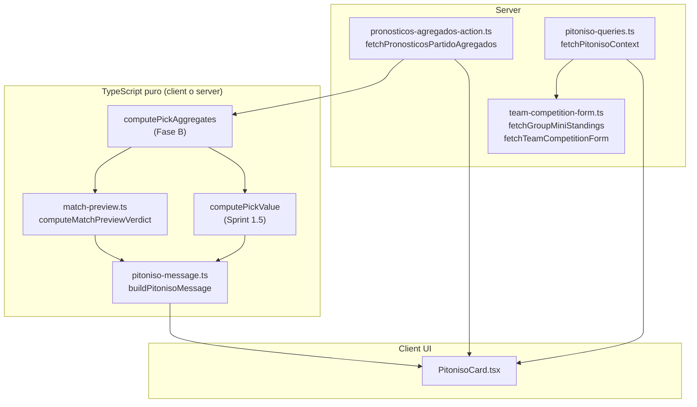

# EL PITONISO — PLAN DE EJECUCIÓN OFICIAL

> **Fuente de verdad para implementación.** Supersede `PULPO_PAUL_EXECUTION_PLAN.md` (histórico). Branding definitivo: **🔮 El Pitoniso**. Nomenclatura aprobada en `PITONISO_EXECUTION_REVIEW.md`.
>
> **Estado:** ✅ **PI-1 … PI-4 completados** (jun 2026). Reporte de cierre: `PITONISO_REPORT.md`.

---

## Next: Sports Core extraction

El Pitoniso v1 está cerrado en producto. El siguiente hito de plataforma es **extraer el motor sin marca** (`match-preview.ts`, pesos, tipos) hacia **Sports Core** reutilizable (LigaPro, otras quinielas), manteniendo `pitoniso-message.ts` como capa de marca en Mundial Compas. Ver `SPORTS_CORE_MASTERPLAN.md` y backlog en `PITONISO_REPORT.md` §10.

---
>
> **Restricciones duras:** sin LLM · sin APIs externas en este módulo · sin tablas/migraciones/vistas · no tocar scoring/triggers/webhooks/zona congelada · no exponer picks individuales pre-lock · copy recreativo (no apuestas).

---

## 0. Resumen ejecutivo

**El Pitoniso** es un bloque recreativo pre-partido en `/partidos/[id]` que interpreta señales observables (multitud de la quiniela, mini-tabla del grupo, forma en el torneo, contexto) y devuelve una **inclinación 1X2** con copy divertido. No predice resultados.

| Capa | Módulo | Rol |
|------|--------|-----|
| Motor (sin marca) | `match-preview.ts` | Score rule-based → veredicto 1X2 + confianza |
| Marca (copy) | `pitoniso-message.ts` | Plantillas, disclaimers, tono mexicano/futbolero |
| Datos torneo | `team-competition-form.ts` | Mini-tabla + forma desde `partidos` |
| Agregados picks | `pronosticos-agregados-action.ts` | Conteos pre-lock sin PII |
| Orquestación | `pitoniso-queries.ts` | Ensambla contexto para la página |
| UI | `PitonisoCard.tsx` | Card + estados + analytics |

**Superficie v1:** detalle de partido, solo `estatus === 'programado'`. Consume la ruta agregada pre-lock (surface C del Pick Value Engine).

---

# 1. Arquitectura final

## 1.1 Diagrama



## 1.2 Responsabilidades exactas por archivo

### `src/lib/prediction-engine/match-preview.ts` — Motor (B)

**Responsabilidad:** Cálculo determinístico del veredicto 1X2 recreativo. **Sin strings de UI, sin marca Pitoniso.**

| Export | Descripción |
|--------|-------------|
| `matchPreviewWeights` | Pesos `{ crowd: 0.40, table: 0.20, form: 0.25, context: 0.15 }` |
| `matchPreviewMinSample` | `5` (coherente con pick-value y perfiles) |
| `MatchPreviewConfidence` | `"indeciso" \| "leve" \| "bastante" \| "presentimiento"` |
| `MatchPreviewFavorite` | `"local" \| "empate" \| "visitante"` |
| `MatchPreviewContext` | Input: señales normalizadas + flags (`crowdSampleOk`, `hasGroupStandings`, etc.) |
| `MatchPreviewVerdict` | Output: `favorite`, `confidence`, `margin`, `scores`, señales usadas, `popularScore` ref |
| `computeMatchPreviewVerdict(ctx)` | Fórmula §1.3 → veredicto |

**No hace:** fetch, copy, analytics, imports de React.

**Importa:** tipos de `pick-aggregates` (`Outcome`, `PickAggregates`); opcionalmente recibe `PickValue` ya calculado como campo de contexto (no recalcular shares).

---

### `src/lib/prediction-engine/pitoniso-message.ts` — Marca (A)

**Responsabilidad:** Copy rule-based de El Pitoniso. **Sin lógica de score.**

| Export | Descripción |
|--------|-------------|
| `PITONISO_DISCLAIMER_SHORT` | Disclaimer visible en card (~120 chars) |
| `PITONISO_DISCLAIMER_LONG` | Texto expandido (acordeón P1) |
| `PitonisoMessageInput` | `MatchPreviewVerdict` + nombres equipos + `PickValue \| null` + flags |
| `PitonisoMessage` | `{ message, confidenceLabel, confidenceEmoji }` |
| `buildPitonisoMessage(input)` | Plantillas §1.4 |
| `confidenceUiLabel(id)` | Mapa ID → etiqueta UI (§7) |

**No hace:** fetch, score, analytics.

---

### `src/lib/prediction-engine/team-competition-form.ts` — Datos torneo

**Responsabilidad:** Lectura Supabase de `partidos` finalizados. **Sin API Football.**

| Export | Descripción |
|--------|-------------|
| `fetchGroupMiniStandings(supabase, grupo, beforeKickoffIso)` | Mini-tabla del grupo on-the-fly |
| `fetchTeamCompetitionForm(supabase, teamCode, beforeKickoffIso, limit?)` | Forma W/D/L, GF/GC, puntos forma |
| Tipos | `GroupMiniStandings`, `TeamCompetitionForm`, `TeamStandingRow` |

**No hace:** pronósticos, score, copy.

---

### `src/lib/quiniela/pronosticos-agregados-action.ts` — Agregados pre-lock

**Responsabilidad:** Server action. Devuelve **solo marcadores** para un partido programado.

| Export | Descripción |
|--------|-------------|
| `fetchPronosticosPartidoAgregados(partidoId, ligaId?)` | `{ ok, picks: PickInput[] }` sin `usuario_id`, sin nombres |

**Validaciones:** auth; membresía si grupo; partido `programado`; SELECT solo `goles_local`, `goles_visitante`.

**Reutilizable por:** surface B (quiniela pre-guardar) en el futuro.

---

### `src/lib/partidos/pitoniso-queries.ts` — Orquestación

**Responsabilidad:** Server-side helper para precargar contexto estático del partido.

| Export | Descripción |
|--------|-------------|
| `fetchPitonisoStaticContext(partidoId)` | Partido + mini-tabla (si grupo) + forma local/visitante |

**Retorna:** objeto serializable para pasar como props a `PitonisoCard` (sin picks — esos vienen de la server action en cliente).

**Alternativa v1 aceptable:** un solo `fetchPitonisoContext` que también llame agregados server-side si se prefiere SSR completo. **Decisión v1:** estático en server + agregados en cliente (picks cambian más often).

---

### `src/components/partidos/PitonisoCard.tsx` — UI

**Responsabilidad:** Render, estados, ensamblaje motor+copy, analytics.

| Hace | No hace |
|------|---------|
| Fetch agregados al mount | Lógica de score inline |
| `computePickAggregates` + `computePickValue` + `computeMatchPreviewVerdict` + `buildPitonisoMessage` | Exponer picks individuales |
| `trackEvent('pitoniso_shown')` once | Mostrar en vivo/finalizado |
| Estados loading / error / vacío / pequeña muestra / normal | Comparar pick del usuario vs Pitoniso (P2) |

**Props:** `partido` (mínimo), `ligaId`, `staticContext` (de server).

---

### `src/lib/prediction-engine/pitoniso.ts` — Barrel (opcional)

Re-exporta para imports limpios:

```ts
export { computeMatchPreviewVerdict } from "./match-preview";
export { buildPitonisoMessage, PITONISO_DISCLAIMER_SHORT } from "./pitoniso-message";
```

---

## 1.3 Fórmula de score (motor — heredada y congelada para v1)

### Señales normalizadas ∈ [0, 1]

| Señal | Cálculo | Default si falta |
|-------|---------|------------------|
| `crowdLocal/Draw/Away` | `outcomes[i].pct / 100` | 0.33 cada uno si `total < minSample` |
| `tableLocal/Away` | `1 − (pos − 1) / (nTeams − 1)` | 0.5 |
| `formLocal/Away` | `formPoints / (3 × min(PJ, limit))` | 0.5 |
| `ctxLocal/Away` | Heurísticas contexto | 0.5 |

**Heurísticas contexto (v1):**

- Eliminatoria + equipo peor posicionado en mini-tabla global del torneo → +0.15 al que “necesita”.
- Última jornada de grupo + fuera de top 2 con gap ≤ 3 pts → +0.10 al que compite pase.
- Local en fase grupos → +0.05 `ctxLocal` (simbólico).

**Score compuesto:**

```text
scoreLocal     = 0.40×crowdLocal     + 0.20×tableLocal     + 0.25×formLocal     + 0.15×ctxLocal
scoreDraw      = 0.40×crowdDraw      + 0.20×drawTableBlend + 0.25×drawFormBlend + 0.15×0.5
scoreVisitante = 0.40×crowdAway      + 0.20×tableAway      + 0.25×formAway      + 0.15×ctxAway
```

`drawTableBlend` / `drawFormBlend`: suben empate cuando local y visitante están parejos (cap empate 0.65).

**Favorito:** `argmax(scores)`. **Margen:** `scoreTop − scoreSecond`.

### Niveles de confianza

| ID | Condición | Cap |
|----|-----------|-----|
| `indeciso` | `margin < 0.08` o señales muy mezcladas | — |
| `leve` | `0.08 ≤ margin < 0.15` | Max si `!crowdSampleOk` |
| `bastante` | `0.15 ≤ margin < 0.25` y `crowdSampleOk` | — |
| `presentimiento` | `margin ≥ 0.25` + ≥2 señales no-crowd alineadas | Cap a `bastante` si solo gana multitud |

### Marcador popular (informativo, fuera del score)

- `aggregates.mostPopularScore` → línea UI.
- `computePickValue(aggregates, topScore)` → matiz en copy (`kind`, `scoreSharePct`).

---

## 1.4 Copy — reglas (`pitoniso-message.ts`)

**Voz:** tercera persona, mexicana, futbolera, ligera. El Pitoniso **interpreta señales**, no predice.

**Disclaimers:**

- **Corto:** *Solo entretenimiento. El Pitoniso resume datos de la quiniela y del torneo; no es predicción real ni consejo de apuesta.*
- **Largo:** *El Pitoniso es una opinión recreativa. Combina tendencias de la quiniela (picks agregados), resultados del torneo en la app y contexto del partido. No usa inteligencia artificial ni datos de casas de apuestas. No garantiza resultados y no sustituye tu criterio al pronosticar.*

**Prohibido:** “apuesta”, “fijo”, “gana seguro”, “momio”, prob. real disfrazada (“72% de ganar”).

**Permitido:** “72% de la quiniela inclina al local”, “inclinación”, “moda de picks”, “le huele a partido cerrado”.

---

## 1.5 Límites (zona congelada)

**No tocar:** `calcular_puntos_pronostico`, triggers de puntos, webhooks, `LIGA_GLOBAL_ID` en triggers, enum `fase_mundial`, shape de `pronosticos`.

**No usar:** `getCachedGroupStandings()` (API Football). Mini-tabla solo desde `partidos` en Supabase.

---

## 1.6 Contradicción de señales (PI-2 → PI-3)

El contexto de datos debe exponer **qué lado favorece cada familia de señal** de forma explícita, para que PI-3 (UI/copy) pueda mostrar mensajes como:

> *"El Pitoniso no está tan convencido como la multitud."*

### Líderes por señal

| Señal | Origen | Valores |
|-------|--------|---------|
| **Multitud** | `aggregates.outcomes[]` (PI-3, client) | `local \| empate \| visitante \| null` |
| **Tabla** | mini-tabla del grupo (PI-2, server) | `local \| empate \| visitante \| null` |
| **Forma** | `fetchTeamCompetitionForm` (PI-2, server) | `local \| empate \| visitante \| null` |

### Contradicción

Se detecta cuando **al menos dos señales no nulas** favorecen lados distintos (empate cuenta como lado propio).

Tipos en `pitoniso-queries.ts`:

- `PitonisoSignalLeaders` — `{ crowd, table, form }` (crowd `null` en contexto estático)
- `PitonisoSignalContradiction` — `{ hasContradiction, conflicts[], summary }`
- `analyzePitonisoSignalContradiction(leaders)` — función pura

`summary` para copy PI-3:

| Valor | Uso copy |
|-------|----------|
| `aligned` | Señales coinciden |
| `crowd_vs_form` | Multitud vs racha |
| `crowd_vs_table` | Multitud vs tabla |
| `table_vs_form` | Tabla vs forma (solo estático) |
| `mixed` | ≥2 conflictos |

**PI-1 no se modifica:** el motor ya combina señales en el score; la contradicción es **metadata de presentación** para enriquecer copy en PI-3 sin recalcular el veredicto.

---

# 2. Plan de implementación

## PI-1 — Motor

**Objetivo:** Funciones puras testeables sin UI ni fetch.

### Checklist PI-1

- [ ] **PI-1.1** Crear `src/lib/prediction-engine/match-preview.ts`
  - [ ] Tipos: `MatchPreviewConfidence`, `MatchPreviewFavorite`, `MatchPreviewContext`, `MatchPreviewVerdict`
  - [ ] Constantes: `matchPreviewWeights`, `matchPreviewMinSample`
  - [ ] Normalización de señales (crowd, table, form, context)
  - [ ] Heurísticas de contexto §1.3
  - [ ] Score compuesto + `margin` + `argmax` favorito
  - [ ] Resolución de confianza + gates (coherencia, cap sin crowd)
  - [ ] Campos informativos: referencia a `mostPopularScore`, flags `crowdSampleOk`
- [ ] **PI-1.2** Crear `src/lib/prediction-engine/pitoniso-message.ts`
  - [ ] `PITONISO_DISCLAIMER_SHORT`, `PITONISO_DISCLAIMER_LONG`
  - [ ] `confidenceUiLabel(confidence)` → etiquetas §7
  - [ ] `buildPitonisoMessage(input)` — plantillas: favorito local/visitante/empate, indeciso, pocos picks, debut, multitud vs forma, marcador popular
  - [ ] Sin importar Supabase ni React
- [ ] **PI-1.3** (Opcional recomendado) Tests unitarios `match-preview.test.ts`
  - [ ] Fixture: multitud clara → favorito local, confianza ≥ leve
  - [ ] Fixture: empate parejo → favorito empate o indeciso
  - [ ] Fixture: `total = 0` picks → crowd neutro, max confianza leve
  - [ ] Fixture: debut equipo (form null) → defaults 0.5
  - [ ] Fixture: margin alto solo por crowd → cap presentimiento
- [ ] **PI-1.4** Crear barrel opcional `src/lib/prediction-engine/pitoniso.ts`
- [ ] **PI-1.5** Verificar: `npx tsc --noEmit` pasa con archivos nuevos

**Criterio de done PI-1:** `computeMatchPreviewVerdict` + `buildPitonisoMessage` funcionan con fixtures manuales; cero fetch; cero referencias a “Paul” o 🐙.

---

## PI-2 — Datos

**Objetivo:** Rutas de lectura Supabase + server action agregados.

### Checklist PI-2

- [ ] **PI-2.1** Crear `src/lib/prediction-engine/team-competition-form.ts`
  - [ ] `fetchGroupMiniStandings`: partidos `finalizado`, mismo `grupo`, antes de kickoff
  - [ ] Stats FIFA 3/1/0 por `equipo_*_codigo`
  - [ ] Orden: Pts → DG → GF → nombre
  - [ ] Retorna posiciones local/visitante + gap
  - [ ] `fetchTeamCompetitionForm`: últimos K=3 partidos del equipo en el torneo
  - [ ] Solo lectura; admin o server client según patrón de `detail-queries.ts`
- [ ] **PI-2.2** Crear `src/lib/quiniela/pronosticos-agregados-action.ts`
  - [ ] `"use server"`
  - [ ] Auth + `assertUsuarioEsMiembro` si `ligaId !== LIGA_GLOBAL_ID`
  - [ ] Rechazar si partido no `programado`
  - [ ] SELECT `goles_local, goles_visitante` — **sin** join usuarios, **sin** `usuario_id` en respuesta
  - [ ] Mapear a `PickInput[]` (`golesLocal`, `golesVisitante` solamente)
- [ ] **PI-2.3** Crear `src/lib/partidos/pitoniso-queries.ts`
  - [ ] `fetchPitonisoStaticContext(partidoId)` — paralelo: partido + mini-tabla + forma ambos equipos
  - [ ] Tipos serializables para props de cliente
- [ ] **PI-2.4** Verificar privacidad: inspeccionar que respuesta de agregados no filtra PII
- [ ] **PI-2.5** `npx tsc --noEmit`

**Criterio de done PI-2:** Desde server se obtiene contexto estático; desde client action solo marcadores; partido finalizado rechazado en agregados.

---

## PI-3 — UI y Analytics

**Objetivo:** Card visible en detalle de partido programado + eventos PostHog.

### Checklist PI-3

- [ ] **PI-3.1** Añadir eventos en `src/lib/analytics/events.ts` (§6)
- [ ] **PI-3.2** Crear `src/components/partidos/PitonisoCard.tsx`
  - [ ] Props: partido, ligaId, staticContext
  - [ ] Early return `null` si `estatus !== 'programado'`
  - [ ] Mount: `fetchPronosticosPartidoAgregados` → `computePickAggregates(picks, null)`
  - [ ] Pipeline: aggregates → `computePickValue` (top score) → `computeMatchPreviewVerdict` → `buildPitonisoMessage`
  - [ ] Estados UI §7 (loading, error, sin datos, muestra pequeña, normal)
  - [ ] Disclaimer corto siempre visible
  - [ ] Acordeón “¿Qué es El Pitoniso?” con disclaimer largo (dispara `pitoniso_expanded`)
  - [ ] Estilo: `rounded-2xl`, borde violeta/ámbar suave (distinto de pick-value emerald)
  - [ ] Emoji 🔮 en título
- [ ] **PI-3.3** Editar `src/app/(app)/partidos/[id]/page.tsx`
  - [ ] Import `fetchPitonisoStaticContext` + `PitonisoCard`
  - [ ] Fetch estático en server (solo si `partido.estatus === 'programado'`)
  - [ ] Insertar **después de `PartidoHeader`**, **antes de `SilenciarNotificacionesPartido`**
- [ ] **PI-3.4** Analytics en card
  - [ ] `useRef` anti-duplicado
  - [ ] `pitoniso_shown` al primer render con veredicto válido
  - [ ] `pitoniso_expanded` al abrir acordeón (once per open)
- [ ] **PI-3.5** `npx tsc --noEmit` + lint solo archivos tocados

**Criterio de done PI-3:** Partido programado muestra card; en vivo/finalizado no; evento en PostHog; sin PII en payload.

---

## PI-4 — Validación

**Objetivo:** QA manual + reporte de cierre.

### Checklist PI-4

- [x] **PI-4.1** Validación manual en staging (§8.1)
- [x] **PI-4.2** Validación PostHog (§8.2)
- [x] **PI-4.3** `npx tsc --noEmit` final
- [x] **PI-4.4** Lint archivos tocados — corregir solo errores introducidos
- [x] **PI-4.5** Generar `PITONISO_REPORT.md` (§9)
- [x] **PI-4.6** Confirmar cero referencias `pulpo`, `Paul`, 🐙 en código nuevo

**Criterio de done PI-4:** ✅ Reporte entregado; funnel PostHog verificado en código + checklist manual; listo para commit/push bajo instrucción del usuario.

---

# 3. Dependencias

## 3.1 Módulos existentes (reutilizar, no duplicar)

| Módulo | Ruta | Uso en Pitoniso |
|--------|------|-----------------|
| `computePickAggregates` | `src/lib/insights/pick-aggregates.ts` | Distribución 1X2, `mostPopularScore`, `total`, `outcomes[]` |
| `outcomeOf`, `outcomeLabel`, `Outcome` | idem | Tipos 1X2, labels en copy |
| `PickInput` | idem | Shape de picks agregados |
| `computePickValue` | `src/lib/prediction-engine/pick-value.ts` | Sobre marcador top; `kind`, `scoreSharePct`, `sampleOk` |
| `pickValueThresholds` | idem | Alineado con `minSample = 5` |
| `trackEvent` | `src/lib/analytics/track.ts` | Disparo eventos client-side |
| `AnalyticsEventMap` | `src/lib/analytics/events.ts` | Extender con `pitoniso_*` |
| `LIGA_GLOBAL_ID` | `src/lib/constants.ts` | Default liga en page |
| `assertUsuarioEsMiembro` | `src/lib/liga/grupos-queries.ts` | Agregados en quinielas de grupo |

## 3.2 Rutas y páginas actuales

| Ruta / archivo | Relación |
|----------------|----------|
| `/partidos/[id]` | `src/app/(app)/partidos/[id]/page.tsx` — integración Pitoniso |
| `fetchPartidoDetallePageData` | `src/lib/partidos/detail-queries.ts` — no modificar salvo necesidad mínima |
| `fetchPronosticosPartidoTodos` | `src/lib/quiniela/pronosticos-partido-action.ts` — **post-finalizado con nombres**; Pitoniso **no lo usa** |
| `PronosticosTodosPanel` | Post-partido pick-value — superficie distinta, sin cambios |
| `match_view` | Ya disparado en page — funnel padre |

## 3.3 Cadena de dependencias (orden de imports)

```text
pick-aggregates.ts
    ↓
pick-value.ts
    ↓
match-preview.ts
    ↓
pitoniso-message.ts

team-competition-form.ts ──┐
pronosticos-agregados-action.ts ──┼→ pitoniso-queries.ts → PitonisoCard.tsx
partido (page data) ──────────────┘
```

## 3.4 Lo que NO se modifica en dependencias

- `pick-aggregates.ts` — sin cambios (salvo bugfix accidental)
- `pick-value.ts` — sin cambios
- Scoring, triggers, webhooks
- `PronosticosTodosPanel.tsx` — sin cambios en v1

---

# 4. Orden de desarrollo

Secuencia **estricta** para minimizar rework. Tras cada paso, ejecutar la prueba indicada.

| Paso | Archivo | Acción | Prueba |
|------|---------|--------|--------|
| **1** | `match-preview.ts` | Crear motor completo | `npx tsc --noEmit` |
| **2** | `match-preview.test.ts` | Tests fixtures (opcional) | `npx vitest run match-preview` o test runner del proyecto; si no hay runner, skip con validación manual PI-1 |
| **3** | `pitoniso-message.ts` | Copy + disclaimers | `npx tsc --noEmit`; revisar strings sin “Paul” |
| **4** | `pitoniso.ts` | Barrel (opcional) | `npx tsc --noEmit` |
| **5** | `team-competition-form.ts` | Lectura partidos | `npx tsc --noEmit` |
| **6** | `pronosticos-agregados-action.ts` | Server action agregados | `npx tsc --noEmit` |
| **7** | `pitoniso-queries.ts` | Orquestación estática | `npx tsc --noEmit` |
| **8** | `events.ts` | + `pitoniso_shown`, `pitoniso_expanded` | `npx tsc --noEmit` |
| **9** | `PitonisoCard.tsx` | UI + pipeline + analytics | `npx tsc --noEmit` |
| **10** | `partidos/[id]/page.tsx` | Integrar card | Manual: abrir partido programado |
| **11** | — | Lint archivos tocados | `npm run lint -- --file …` o equivalente |
| **12** | `PITONISO_REPORT.md` | Reporte PI-4 | — |

### Comandos de verificación (repetir al cierre de cada fase)

```bash
npx tsc --noEmit
```

Lint (solo archivos tocados — ajustar paths):

```bash
npx eslint src/lib/prediction-engine/match-preview.ts src/lib/prediction-engine/pitoniso-message.ts src/lib/prediction-engine/team-competition-form.ts src/lib/quiniela/pronosticos-agregados-action.ts src/lib/partidos/pitoniso-queries.ts src/components/partidos/PitonisoCard.tsx src/lib/analytics/events.ts "src/app/(app)/partidos/[id]/page.tsx"
```

**Regla:** no corregir errores de lint preexistentes fuera de archivos tocados.

---

# 5. Riesgos

| Riesgo | Severidad | Mitigación |
|--------|-----------|------------|
| **Privacidad — exponer picks individuales pre-lock** | **Alta** | Server action solo devuelve marcadores; sin join `usuarios`; sin `usuario_id` en wire; documentar en code review |
| **Sonar a casa de apuestas** | **Alta** | Disclaimers §1.4; “quiniela/multitud”; prohibir odds/fijo/apuesta en plantillas |
| **Usuario cree que El Pitoniso predice** | **Alta** | Ocultar card en vivo/finalizado; copy “inclinación/opinión recreativa”; nunca “predice” |
| **Muestra pequeña de picks** | Media | `minSample = 5`; cap confianza a `leve`; copy “pocos pronósticos”; `crowd_sample_ok: false` en analytics |
| **Primer partido / sin grupo** | Media | Defaults neutros; omitir señal tabla; copy debut |
| **Mini-tabla ≠ tabla oficial** | Baja | Solo partidos en BD; no llamar “oficial FIFA” |
| **Performance (muchos picks liga global)** | Media | Índice `(partido_id, liga_id)`; si lento → agregación SQL v1.1 (fuera de v1) |
| **Confusión con pick-value post-partido** | Media | UI violeta/🔮 vs emerald post-partido; pre vs post superficie |
| **Duplicar lógica pick-value** | Media | Import directo; no recalcular `pct` |
| **Mezclar nomenclatura Paul** | Media | Grep `pulpo|Paul|🐙` antes de commit |
| **Pitoniso contradice al usuario** | Baja | v1 no compara pick usuario; habla del partido |

---

# 6. Analytics

## 6.1 Eventos definitivos

Añadir a `AnalyticsEventMap` en `src/lib/analytics/events.ts`:

```ts
// El Pitoniso (pre-partido)
pitoniso_shown: {
  partido_id: string;
  liga_scope: "global" | "grupo";
  confidence: "indeciso" | "leve" | "bastante" | "presentimiento";
  favorite: "local" | "empate" | "visitante";
  crowd_sample_ok: boolean;
};
pitoniso_expanded: {
  partido_id: string;
};
```

## 6.2 Cuándo disparar

| Evento | Condición | Frecuencia |
|--------|-----------|------------|
| `pitoniso_shown` | Card renderizada con veredicto (incluye estados indeciso/leve con datos) | **Once per mount** (`useRef`) |
| `pitoniso_expanded` | Usuario abre acordeón “¿Qué es El Pitoniso?” | Once per open (opcional P1; implementar en v1 si acordeón existe) |

## 6.3 Qué NO enviar

- Nombres de usuario, `usuario_id`
- Picks individuales, marcador del usuario
- Texto completo del mensaje
- Probabilidades implícitas de resultado

## 6.4 Funnel

```text
match_view → pitoniso_shown → pronostico_saved | prediction_updated
```

Comparar también con `pick_value_shown` (post-partido, distinto funnel branch).

---

# 7. UI

## 7.1 Ubicación exacta

**Archivo:** `src/app/(app)/partidos/[id]/page.tsx`

**Orden en `<main>` tras integración:**

```text
PartidoHeader
PitonisoCard              ← NUEVO (solo programado)
SilenciarNotificacionesPartido
PartidoInfoPanel
PronosticoReminder
PronosticosTodosPanel     (sin cambios — solo finalizado)
ChatPartido
```

**Visibilidad:**

| `partido.estatus` | Pitoniso |
|-------------------|----------|
| `programado` | Visible |
| `en_vivo`, `medio_tiempo`, `finalizado`, otros | **No renderizar** (`return null`) |

## 7.2 Wireframe

```
┌─────────────────────────────────────────────┐
│ 🔮 ¿Qué dice El Pitoniso?                   │
│                                             │
│  🔮👀  El Pitoniso ve señales claras        │
│                                             │
│  "El Pitoniso ve señales interesantes:      │
│   casi 6 de cada 10 en la quiniela…"        │
│                                             │
│  Inclinación:  🇲🇽 México                   │
│  Marcador más repetido en la quiniela: 2-1  │
│                                             │
│  Solo entretenimiento. No es predicción…      │
│  [¿Qué es El Pitoniso? ▾]                   │
└─────────────────────────────────────────────┘
```

## 7.3 Estilo

- Base: `rounded-2xl border border-zinc-800 bg-zinc-900/40 px-4 py-3`
- Acento: `border-violet-500/30` o badge `bg-violet-950/40 text-violet-200`
- Distinto de pick-value (emerald) y perfiles (leaderboard)

## 7.4 Etiquetas de confianza (UI)

| ID | Etiqueta | Emoji badge |
|----|----------|-------------|
| `indeciso` | El Pitoniso no se decide | 🔮❓ |
| `leve` | Leve inclinación | 🔮🤏 |
| `bastante` | El Pitoniso ve señales claras | 🔮👀 |
| `presentimiento` | Fuerte presentimiento | 🔮✨ |

## 7.5 Estados de UI

### Loading

- Card visible con skeleton o texto: *“El Pitoniso está leyendo las señales…”*
- Sin analytics hasta veredicto listo

### Error (fetch agregados falló)

- Mensaje: *“El Pitoniso no pudo cargar la quiniela ahora. Intenta de nuevo.”*
- Botón “Reintentar” opcional
- **No** disparar `pitoniso_shown`

### Sin datos (0 picks + sin forma/tabla útil)

- Mensaje: *“Aún no hay señales suficientes. Vuelve cuando haya más pronósticos o resultados del torneo.”*
- Mostrar disclaimer corto
- Disparar `pitoniso_shown` con `confidence: indeciso`, `crowd_sample_ok: false`

### Muestra pequeña (`total > 0` y `total < 5`)

- Copy: *“Todavía hay pocos pronósticos. El Pitoniso se guía más por la tabla y la racha.”*
- Confianza capada a `leve` máximo
- `crowd_sample_ok: false` en analytics
- Mostrar inclinación si motor produce veredicto

### Normal (`total ≥ 5` o señales torneo fuertes)

- Mensaje completo de `buildPitonisoMessage`
- Línea inclinación + marcador popular (si existe)
- Disclaimer corto + acordeón largo
- `pitoniso_shown` con payload completo

---

# 8. Validación

## 8.1 Revisión manual en producción / staging

| # | Caso | Esperado |
|---|------|----------|
| 1 | Partido `programado` con ≥5 picks | Card visible, copy coherente, inclinación mostrada |
| 2 | Partido `programado` con 0 picks | Estado sin datos o muestra pequeña; sin crash |
| 3 | Partido `programado` con 1–4 picks | Copy “pocos pronósticos”; confianza ≤ leve |
| 4 | Partido `en_vivo` o `finalizado` | **Sin card** |
| 5 | Primer partido de equipo en torneo | Copy debut; sin inventar forma |
| 6 | Partido de grupos con resultados previos | Menciona tabla si aplica |
| 7 | Multitud favorece local, forma favorece visitante | Copy contrasta ambos (no solo un bando) |
| 8 | DevTools → Network → agregados | Solo `{ golesLocal, golesVisitante }[]`; sin nombres/IDs |
| 9 | Disclaimer visible | Corto siempre; largo en acordeón |
| 10 | Pick-value post-partido | Sigue funcionando en panel finalizado; UI distinta |

## 8.2 PostHog

| Check | Cómo |
|-------|------|
| Evento existe | Live events → filtrar `pitoniso_shown` |
| Payload correcto | Ver `partido_id`, `confidence`, `favorite`, `crowd_sample_ok`, `liga_scope` |
| Sin PII | Confirmar ausencia de nombres/mensajes |
| Funnel | `match_view` → `pitoniso_shown` en misma sesión |
| No duplicados | Una sola `pitoniso_shown` por visita a partido programado |
| `pitoniso_expanded` | Solo si usuario abre acordeón |

## 8.3 Automatizado (CI local)

```bash
npx tsc --noEmit
# + lint archivos tocados
# + tests match-preview si PI-1.3 implementado
```

---

# 9. Reporte final esperado — `PITONISO_REPORT.md`

Generar al completar **PI-4**. Estructura obligatoria:

```markdown
# EL PITONISO — REPORTE DE EJECUCIÓN

> Ejecución según PITONISO_EXECUTION_PLAN.md
> Resultado: ✅ / ⚠️ (detallar)

## 1. Objetivos cumplidos
Tabla PI-1 … PI-4 con ✅/❌

## 2. Archivos creados / modificados
### Creados (lista con propósito)
### Modificados (lista con cambio)

## 3. API implementada
### match-preview.ts — exports y firma
### pitoniso-message.ts — exports
### team-competition-form.ts — exports
### pronosticos-agregados-action.ts — contrato privacidad
### PitonisoCard.tsx — comportamiento

## 4. Fórmula y ejemplos
- Un ejemplo numérico end-to-end (como §14 del plan Paul, con copy Pitoniso)
- Tabla confianza observada en prueba manual

## 5. UI
- Ruta, captura descriptiva, estados probados

## 6. Analytics
- Eventos añadidos
- Funnel verificado en PostHog (sí/no)

## 7. Verificación
| Check | Resultado |
| tsc | |
| lint (touched) | |

## 8. Riesgos y mitigaciones aplicadas

## 9. Qué NO se implementó (límites v1)

## 10. Siguientes pasos sugeridos (opcional)
- Surface B quiniela pre-guardar
- Comparar pick usuario vs Pitoniso (P2)
```

---

# Apéndice A — Inventario de archivos (v1)

| Archivo | Fase | Acción |
|---------|------|--------|
| `src/lib/prediction-engine/match-preview.ts` | PI-1 | Crear |
| `src/lib/prediction-engine/pitoniso-message.ts` | PI-1 | Crear |
| `src/lib/prediction-engine/pitoniso.ts` | PI-1 | Crear (opcional) |
| `src/lib/prediction-engine/match-preview.test.ts` | PI-1 | Crear (opcional) |
| `src/lib/prediction-engine/team-competition-form.ts` | PI-2 | Crear |
| `src/lib/quiniela/pronosticos-agregados-action.ts` | PI-2 | Crear |
| `src/lib/partidos/pitoniso-queries.ts` | PI-2 | Crear |
| `src/components/partidos/PitonisoCard.tsx` | PI-3 | Crear |
| `src/lib/analytics/events.ts` | PI-3 | Editar |
| `src/app/(app)/partidos/[id]/page.tsx` | PI-3 | Editar |
| `PITONISO_REPORT.md` | PI-4 | Crear |

**Total:** 8–10 archivos nuevos, 2 editados, 1 reporte.

---

# Apéndice B — Qué NO implementar en v1

- ❌ LLM, narrativa generativa
- ❌ APIs externas (API Football, odds)
- ❌ Tablas, migraciones, persistir veredictos
- ❌ Card en vivo o post-partido
- ❌ Comparar pick del usuario vs Pitoniso
- ❌ Elo, ModelProvider, LigaPro
- ❌ Tocar scoring, triggers, webhooks
- ❌ Modificar `PronosticosTodosPanel` / pick-value post-partido
- ❌ Cualquier referencia a Pulpo Paul en código o copy

---

# Apéndice C — Ejemplo end-to-end

**Partido:** México vs Polonia · Grupo C · Jornada 2 · `programado`

**Inputs:**

- Agregados (120 picks): local 58%, empate 22%, visitante 20%; top 2-1 (16%)
- Mini-tabla: México 2.º (4 pts), Polonia 3.º (1 pt)
- Forma: México WD, Polonia LL

**Motor:**

- `scoreLocal ≈ 0.61`, `scoreVisitante ≈ 0.38` → favorito **local**, `margin ≈ 0.19`
- Confianza: **`bastante`**

**Copy (Pitoniso):**

*“El Pitoniso ve señales interesantes: casi **6 de cada 10** en la quiniela inclinan al local. **México** va **2.º** en el grupo con mejor racha reciente. Leve inclinación hacia **México** — nada escrito en piedra. El marcador más repetido en la quiniela es **2-1** (**16%**): moda de picks, no resultado asegurado.”*

**Analytics:**

`pitoniso_shown { partido_id, liga_scope: "global", confidence: "bastante", favorite: "local", crowd_sample_ok: true }`

---

# Apéndice D — Cómo iniciar la siguiente sesión

Comandos literales para el agente:

1. *“Implementa PI-1”* → pasos 1–4 del §4
2. *“Implementa PI-2”* → pasos 5–7 del §4
3. *“Implementa PI-3”* → pasos 8–10 del §4
4. *“Implementa PI-4”* → §8 + `PITONISO_REPORT.md`

---

*Plan de ejecución oficial · El Pitoniso · TypeScript puro + Supabase · Recreativo, explicable, reversible. Listo para implementación.*
