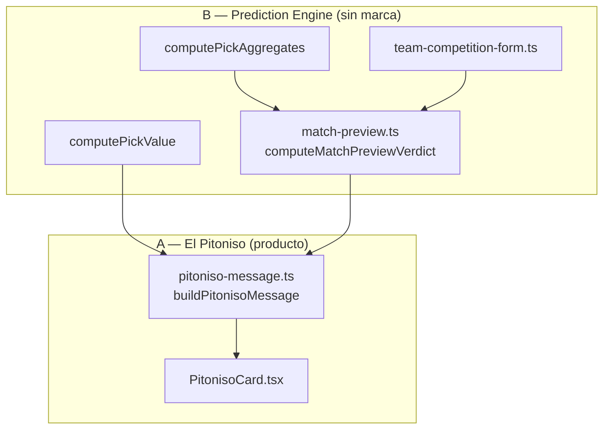

# EL PITONISO — REVISIÓN DE NOMENCLATURA Y BRANDING

> **Documento de revisión. No es implementación.** Adapta `PULPO_PAUL_EXECUTION_PLAN.md` al nuevo branding **🔮 El Pitoniso**. No toca código ni archivos de producción.
>
> **Decisión de producto:** la feature se implementará; **“Pulpo Paul” queda descartado**. Nombre oficial: **El Pitoniso**.

---

## 0. Resumen

El plan técnico de Pulpo Paul **sigue siendo válido** (fórmula, datos, ruta agregada pre-lock, reutilización de pick-aggregates/pick-value, UI en detalle de partido). Lo que cambia es:

1. **Marca y voz** → El Pitoniso (pitonisa, no predice).
2. **Nomenclatura en código** → prefijo `Pitoniso` / `pitoniso` de forma consistente.
3. **Separación recomendada** → motor genérico (`match-preview`) + capa de producto (`pitoniso`).
4. **Generalización menor** → renombrar helpers acoplados al Mundial (`fetchTeamMundialForm` → `fetchTeamCompetitionForm`).

**Antes de implementar:** actualizar el plan base (renombrar `PULPO_PAUL_EXECUTION_PLAN.md` → `PITONISO_EXECUTION_PLAN.md` o equivalente) con esta nomenclatura. **No hace falta rediseñar la arquitectura.**

---

## 1. Inventario: nombres ligados a “Pulpo Paul”

### 1.1 Producto / copy / UI (visible al usuario)

| Original (Paul) | Ubicación en plan |
|-----------------|-------------------|
| “¿Qué dice el Pulpo Paul?” | Título feature, wireframe §7.3 |
| “Pulpo Paul” / “Paul” | Todo el documento (voz, disclaimer, ejemplos) |
| “Paul predice…”, “Favorito según Paul” | §1, §6, §14 |
| “Paul está indeciso / convencido / presentimiento” | §4 etiquetas UI |
| “Paul movió todos los tentáculos…” | §6.3 |
| “Paul ya nadó” | §7.2 (ocultar en vivo) |
| “Paul está meditando…” | §7.2 fallback loading |
| Emoji 🐙 (pulpo) | §4, §7.3, §7.4 |
| Acento violeta/coral “Paul” | §7.4 |
| `PULPO_PAUL_DISCLAIMER` | §6.1, §11 |

### 1.2 Código / dominio (implementación)

| Original | Tipo | Plan § |
|----------|------|--------|
| `PulpoPaulCard` / `PulpoPaulCard.tsx` | Componente UI | §7, §11 |
| `computePulpoPaulVerdict` | Función pura | §0, §7.5, §12 |
| `buildPulpoPaulMessage` | Función pura | §0, §6.3, §11 |
| `fetchPulpoPaulContext` | Server helper | §7.5, §12 |
| `pulpo-paul.ts` | Módulo | §8.3, §11 |
| `pulpo-paul-queries.ts` | Módulo queries | §11 |
| `pulpoPaulWeights` | Constantes | §3.3, §11 |
| `PulpoConfidence` | Tipo | §12 |
| `PulpoFavorite` | Tipo | §12 |
| `PulpoPaulContext` | Tipo | §12 |
| `PulpoPaulVerdict` | Tipo | §6.3, §12 |
| `PULPO_PAUL_REPORT.md` | Reporte post-impl. | §11, §12 |

### 1.3 Analytics

| Original | Payload |
|----------|---------|
| `pulpo_paul_shown` | `confidence`, `favorite`, `crowd_sample_ok` |
| `pulpo_paul_expanded` | `partido_id` (opcional P1) |

### 1.4 Documentación / fases

| Original | Nota |
|----------|------|
| `PULPO_PAUL_EXECUTION_PLAN.md` | Plan base actual |
| Fases `PP-1` … `PP-4` | Checklist §12 |
| Referencias “Paul” en riesgos §10 | Copy de mitigación |

### 1.5 Nombres que NO llevan marca Paul (se mantienen)

Estos son **genéricos** y no requieren rename por branding:

| Nombre | Motivo |
|--------|--------|
| `fetchPronosticosPartidoAgregados` | Infra compartida (surface B/C) |
| `fetchGroupMiniStandings` | Lógica de torneo |
| `computePickAggregates`, `computePickValue` | Prediction Engine existente |
| Señales `crowdLocal`, `tableLocal`, `formLocal`, etc. | Dominio deportivo neutro |

**Excepción recomendada:** `fetchTeamMundialForm` → renombrar a **`fetchTeamCompetitionForm`** (escalable fuera del Mundial; ver §6).

---

## 2. Nomenclatura definitiva propuesta

### 2.1 Convención general

| Capa | Patrón | Ejemplo |
|------|--------|---------|
| **Marca UI** | “El Pitoniso” (con artículo y emoji 🔮) | Título de card |
| **Componentes React** | `Pitoniso` + sufijo | `PitonisoCard` |
| **Tipos TS** | `Pitoniso` + concepto | `PitonisoVerdict` |
| **Funciones de producto** | verbo + `Pitoniso` + concepto | `buildPitonisoMessage` |
| **Constantes** | `PITONISO_` o `pitoniso` camelCase | `PITONISO_DISCLAIMER`, `pitonisoWeights` |
| **Archivos producto** | kebab `pitoniso-*` | `pitoniso.ts`, `pitoniso-queries.ts` |
| **Analytics** | snake `pitoniso_*` | `pitoniso_shown` |
| **Motor interno** | `match-preview` (sin marca) | `computeMatchPreviewVerdict` |
| **Reporte** | `PITONISO_REPORT.md` | Post-implementación |

### 2.2 Tabla de mapeo completo (Paul → Pitoniso)

| Pulpo Paul (descartado) | **El Pitoniso (oficial)** |
|-------------------------|---------------------------|
| ¿Qué dice el Pulpo Paul? | **¿Qué dice El Pitoniso?** |
| `PulpoPaulCard.tsx` | `PitonisoCard.tsx` |
| `computePulpoPaulVerdict` | **`computeMatchPreviewVerdict`** (motor) + alias opcional `computePitonisoVerdict` |
| `buildPulpoPaulMessage` | `buildPitonisoMessage` |
| `fetchPulpoPaulContext` | `fetchPitonisoContext` |
| `pulpo-paul.ts` | **`match-preview.ts`** (motor) + **`pitoniso.ts`** (pesos/copy re-export) *o* solo `pitoniso.ts` en v1 |
| `pulpo-paul-queries.ts` | `pitoniso-queries.ts` |
| `pulpoPaulWeights` | `pitonisoWeights` (re-export de `matchPreviewWeights`) |
| `PULPO_PAUL_DISCLAIMER` | `PITONISO_DISCLAIMER` |
| `PulpoConfidence` | `PitonisoConfidence` (UI) / `MatchPreviewConfidence` (motor) |
| `PulpoFavorite` | `PitonisoFavorite` / `MatchPreviewFavorite` |
| `PulpoPaulContext` | `MatchPreviewContext` (motor) / `PitonisoContext` (extends + locale) |
| `PulpoPaulVerdict` | `MatchPreviewVerdict` (motor) / `PitonisoVerdict` (= verdict + message) |
| `pulpo_paul_shown` | `pitoniso_shown` |
| `pulpo_paul_expanded` | `pitoniso_expanded` |
| `PULPO_PAUL_REPORT.md` | `PITONISO_REPORT.md` |
| Fases PP-1…PP-4 | **PI-1…PI-4** (Pitoniso) |
| `fetchTeamMundialForm` | `fetchTeamCompetitionForm` |
| 🐙 | 🔮 |
| “Paul está indeciso” | **“El Pitoniso no se decide”** |
| “Favorito según Paul” | **“Inclinación del Pitoniso”** |

### 2.3 Decisión de nombres en código (recomendación)

**Opción elegida: separación motor + producto (ver §3).**

```text
src/lib/prediction-engine/
  match-preview.ts          ← computeMatchPreviewVerdict, tipos genéricos, pesos
  pitoniso-message.ts       ← buildPitonisoMessage, PITONISO_DISCLAIMER, plantillas
  team-competition-form.ts  ← fetchTeamCompetitionForm, fetchGroupMiniStandings

src/lib/partidos/
  pitoniso-queries.ts       ← fetchPitonisoContext

src/lib/quiniela/
  pronosticos-agregados-action.ts   ← sin cambio de nombre

src/components/partidos/
  PitonisoCard.tsx
```

**Alias v1 (opcional, comodidad):**

```ts
// pitoniso.ts (barrel fino)
export { computeMatchPreviewVerdict as computePitonisoVerdict } from "./match-preview";
export { buildPitonisoMessage, PITONISO_DISCLAIMER } from "./pitoniso-message";
```

Así el checklist puede decir `computePitonisoVerdict` en docs de producto mientras el motor queda exportable sin marca.

### 2.4 Analytics — tipos finales

```ts
pitoniso_shown: {
  partido_id: string;
  liga_scope: "global" | "grupo";
  confidence: "indeciso" | "leve" | "bastante" | "presentimiento";
  favorite: "local" | "empate" | "visitante";
  crowd_sample_ok: boolean;
};

pitoniso_expanded?: { partido_id: string };  // P1, si hay acordeón
```

### 2.5 Niveles de confianza — etiquetas UI

| ID (código) | Etiqueta UI |
|-------------|-------------|
| `indeciso` | *El Pitoniso no se decide* 🔮❓ |
| `leve` | *Leve inclinación* 🔮🤏 |
| `bastante` | *El Pitoniso ve señales claras* 🔮👀 |
| `presentimiento` | *Fuerte presentimiento* 🔮✨ |

Los IDs en código **no cambian** (`indeciso`, `leve`, …) → continuidad analítica si algún día se comparara con borradores Paul (no hay eventos Paul en prod).

---

## 3. ¿Separar branding (“El Pitoniso”) del motor (Prediction Engine)?

### 3.1 Propuesta

| Capa | Qué es | Ejemplos |
|------|--------|----------|
| **A) Branding visible** | Personaje, copy, UI, analytics de producto | `PitonisoCard`, `buildPitonisoMessage`, `pitoniso_shown` |
| **B) Motor interno** | Score rule-based, señales, veredicto 1X2 sin personalidad | `match-preview.ts`, `computeMatchPreviewVerdict`, `MatchPreviewContext` |



### 3.2 Ventajas de separar

| Ventaja | Detalle |
|---------|---------|
| **Sports Core / LigaPro** | LigaPro puede usar el mismo motor con otra voz (“El Oráculo del Barrio”) sin fork de lógica. |
| **Multi-liga sin rebrand** | Mundial, Liga MX, Premier, Champions comparten **El Pitoniso** en UI latina; el motor no sabe de “pitonisos”. |
| **Tests más limpios** | Unit tests del score sin assert de strings mexicanos. |
| **Copy iterativo** | Cambiar tono/disclaimer no toca fórmula ni pesos. |
| **Coherencia con Prediction Engine** | Encaja en `PREDICTION_ENGINE_DESIGN.md`: CrowdProvider + heurísticas → preview; Pitoniso = narrative-template de producto. |

### 3.3 Desventajas de separar

| Desventaja | Mitigación |
|------------|------------|
| Más archivos en v1 | Barrel `pitoniso.ts`; solo 2 archivos extra (`match-preview` + `pitoniso-message`). |
| Indirección para devs | Documentar en plan: “producto importa desde pitoniso; motor desde match-preview”. |
| Riesgo de over-abstraction | v1: **un solo veredicto**; no crear providers pluggables hasta LigaPro. |

### 3.4 Ventajas de NO separar (todo `pitoniso.ts`)

| Ventaja | Cuándo tiene sentido |
|---------|----------------------|
| Menos archivos | MVP ultra-rápido |
| Nombre único en stack traces | Equipo pequeño, solo Mundial Compas forever |

### 3.5 Recomendación

**Separar en v1**, pero con **mínima superficie**: 2 módulos (`match-preview.ts` + `pitoniso-message.ts`). El resto del plan Paul aplica tal cual. El coste es bajo y evita renombrar el motor cuando llegue Liga MX o LigaPro.

---

## 4. Tono de voz — El Pitoniso

### 4.1 Principios

| Atributo | Guía |
|----------|------|
| Divertida | Metáforas de “leer las señales”, “presentimiento”, “cartas sobre la mesa”. |
| Futbolera | Grupos, tabla, racha, “partido de six”, “cerrado”. |
| Mexicana | “Le huele a…”, “ojo con…”, “nada escrito en piedra”, “se puso bueno”. |
| Ligera | Frases cortas; emoji 🔮 con moderación. |
| Nunca burlona | No mofarse de selecciones, usuarios ni picks minoritarios. |
| Nunca apuestas | “Multitud”, “quiniela”, “inclinación” — no “fijo”, “bank”, “momio”. |

**Personaje:** El Pitoniso **no predice**; **interpreta señales** (multitud + torneo). Tercera persona con artículo: *“El Pitoniso ve…”*, *“A El Pitoniso le…”* (o natural *“Al Pitoniso le…”*).

**Prohibido heredado de Paul:** tentáculos, “nadó”, referencias al pulpo, 🐙.

### 4.2 Diez ejemplos de copy (válidos)

1. *“El Pitoniso ve señales interesantes: casi **6 de cada 10** en la quiniela inclinan al local. En la tabla del grupo, **México** va **2.º** con mejor racha. Leve inclinación hacia **México** — nada escrito en piedra.”*

2. *“A El Pitoniso le huele a partido cerrado: **28%** espera empate y la tabla está pegada. Puede ser un día de empates y nervios.”*

3. *“La multitud apunta hacia **México** (**58%**), pero el torneo cuenta otra historia: el visitante llega con mejor forma. El Pitoniso no mete las manos al fuego por un solo bando.”*

4. *“El Pitoniso movió las cartas y sigue en duda. Señales mezcladas — típico partido de grupos donde cualquiera se complica la vida.”*

5. *“Todavía hay pocos pronósticos. Por ahora El Pitoniso se guía más por la tabla y la racha que por la multitud.”*

6. *“Debut de **Polonia** en el torneo. El Pitoniso mira sobre todo lo que dice la quiniela hasta que haya más historial en la cancha.”*

7. *“El marcador más repetido en la quiniela: **2-1** (**18%**). Eso es la moda de picks, no un resultado asegurado — ojo ahí.”*

8. *“Última jornada de grupo y el pase en juego. El Pitoniso nota presión sobre el local: la tabla aprieta y la multitud lo acompaña (**64%**).”*

9. *“Partido parejo en papel: poca diferencia en forma y posiciones. El Pitoniso inclina levemente al **empate**, pero sin dramatizar.”*

10. *“Fuerte presentimiento hacia el visitante: la racha reciente pesa más que el favoritismo de la quiniela. Recreativo, eh — el balón siempre redondo.”*

### 4.3 Wireframe actualizado (referencia)

```
┌─────────────────────────────────────────────┐
│ 🔮 ¿Qué dice El Pitoniso?                   │
│                                             │
│  🔮👀  El Pitoniso ve señales claras        │
│                                             │
│  "La multitud apunta hacia México (58%)…"   │
│                                             │
│  Inclinación:  🇲🇽 México                   │
│  Marcador más repetido en la quiniela: 2-1  │
│                                             │
│  [disclaimer corto]                         │
└─────────────────────────────────────────────┘
```

---

## 5. Disclaimer — versiones finales

### 5.1 Corto (siempre visible en card)

> **Solo entretenimiento.** El Pitoniso resume datos de la quiniela y del torneo; no es predicción real ni consejo de apuesta.

*(~120 caracteres; cabe bajo el mensaje.)*

### 5.2 Largo (tooltip, acordeón “¿Qué es esto?” o footer expandido)

> **El Pitoniso es una opinión recreativa.** Combina tendencias de la quiniela (picks agregados), resultados del torneo en la app y contexto del partido. No usa inteligencia artificial ni datos de casas de apuestas. **No garantiza resultados** y **no sustituye** tu criterio al pronosticar. Juega por diversión dentro de Mundial Compas.

### 5.3 Relación con pick-value

| Feature | Disclaimer |
|---------|------------|
| Pick Value (post-partido) | Mantener `DISCLAIMER` existente en `pick-value.ts` |
| El Pitoniso (pre-partido) | `PITONISO_DISCLAIMER` — texto distinto para no confundir superficies |

**Constantes propuestas:**

```ts
export const PITONISO_DISCLAIMER_SHORT = "Solo entretenimiento. No es predicción real ni consejo de apuesta.";
export const PITONISO_DISCLAIMER_LONG = "…"; // §5.2
```

---

## 6. Escalabilidad multi-competición

### 6.1 ¿“El Pitoniso” funciona en todas las ligas?

| Competición | ¿Misma marca? | Señales disponibles | Notas |
|-------------|---------------|---------------------|-------|
| **Mundial Compas** | ✅ Sí | Multitud + mini-tabla grupo + forma | Caso de diseño original |
| **Liga MX** | ✅ Sí | Multitud + tabla jornada + forma | Misma voz; “Jornada 12”, “relegation zone” en copy MX |
| **Premier** | ✅ Sí | Idem | Pitoniso como personaje latino en producto global ES — funciona como marca unificada Sports Core |
| **Champions** | ✅ Sí | Grupos + eliminatorias | Heurísticas de contexto ya contemplan fases |
| **LigaPro** | ✅ Sí (con matiz) | **Sin multitud** al inicio → motor usa solo forma/tabla local | Copy: *“El Pitoniso aún no tiene quiniela aquí; mira la tabla del torneo.”* Mismo personaje, distinto `crowdWeight = 0` |

**Conclusión:** **El Pitoniso** es marca **transversal** — no amarrada al Mundial ni al pulpo. El personaje “pitonisa” encaja en cultura futbolera mexicana/latina sin chocar en otras ligas si el tono se mantiene neutro (no chistes locales extremos).

### 6.2 Cambios técnicos para escalar (no de marca)

| Acoplamiento Paul | Rename / generalización |
|-------------------|-------------------------|
| `fetchTeamMundialForm` | `fetchTeamCompetitionForm(competitionId, teamCode, …)` |
| Copy “Mundial” | Parametrizar `competitionLabel` en `PitonisoContext` |
| Mini-tabla por `grupo` | Reutilizable; en ligas sin grupos usar tabla general por jornada acumulada |
| `liga_scope` analytics | Ya genérico `global \| grupo` |

### 6.3 Lo que NO cambia entre ligas

- Fórmula de score y pesos (`pitonisoWeights` / `matchPreviewWeights`)
- Reutilización de `computePickAggregates` + `computePickValue`
- Eventos `pitoniso_shown`
- Disclaimer (ajustar solo nombre del producto contenedor: “Mundial Compas” → configurable)

---

## 7. Recomendación final

### 7.1 ¿Implementar ahora?

**Sí — después de un paso de documentación de ~30 minutos, no de rediseño.**

| Paso | Acción | Bloqueante |
|------|--------|------------|
| 1 | Crear **`PITONISO_EXECUTION_PLAN.md`** (copia actualizada del plan Paul con nomenclatura §2) | ✅ Recomendado |
| 2 | Dejar `PULPO_PAUL_EXECUTION_PLAN.md` como histórico o añadir banner “superseded by PITONISO…” | Opcional |
| 3 | Implementar según checklist **PI-1…PI-4** con nombres §2 | Siguiente sesión |

**No implementar sin el paso 1** evita que el dev mezcle `pulpo_*` y `pitoniso_*` en el mismo PR.

### 7.2 ¿Ajustar algo más antes?

| Tema | ¿Ajustar? | Comentario |
|------|-----------|------------|
| Nomenclatura | ✅ Hecho en este doc | Aplicar al plan base |
| Separación motor/marca | ✅ Decidido | 2 archivos en `prediction-engine/` |
| Tono + disclaimer | ✅ Hecho | §4–§5 listos para plantillas |
| Fórmula / pesos | ❌ No | Heredar del plan Paul |
| Ruta agregados pre-lock | ❌ No | Sigue siendo el mismo bloque crítico |
| Tests | ⚠️ Opcional | Acordar si PI-1 incluye tests unitarios (plan Paul los menciona) |
| Asset visual 🔮 vs ilustración | ⚠️ P2 | Emoji basta en v1 |
| Comparar pick usuario vs Pitoniso | ❌ P2 | Fuera de v1 como en plan Paul |

### 7.3 Checklist renombrado (preview para implementación)

**PI-1 — Motor**
- [ ] `match-preview.ts`: `computeMatchPreviewVerdict`, tipos, pesos
- [ ] `pitoniso-message.ts`: `buildPitonisoMessage`, disclaimers
- [ ] Tests del motor (sin strings de marca)

**PI-2 — Datos**
- [ ] `team-competition-form.ts`
- [ ] `fetchPronosticosPartidoAgregados`
- [ ] `fetchPitonisoContext`

**PI-3 — UI + analytics**
- [ ] `PitonisoCard.tsx`
- [ ] Integración en `partidos/[id]/page.tsx`
- [ ] `pitoniso_shown` en `events.ts`

**PI-4 — Cierre**
- [ ] `PITONISO_REPORT.md`
- [ ] Validación PostHog: `match_view` → `pitoniso_shown`

### 7.4 Veredicto

| Pregunta | Respuesta |
|----------|-----------|
| ¿Plan Paul reusable? | **Sí**, casi 100% técnico |
| ¿Listo para code? | **Sí**, tras actualizar plan con esta nomenclatura |
| ¿Cambio de arquitectura? | **No** |
| ¿Cambio de producto? | **Sí** — voz, emoji, nombres, analytics |
| ¿Riesgo principal? | Mezclar branding Paul en implementación → mitigar con plan renombrado |

---

## Apéndice A — Referencia rápida de imports (futuro)

```ts
// Producto (UI / server)
import { fetchPitonisoContext } from "@/lib/partidos/pitoniso-queries";
import { PitonisoCard } from "@/components/partidos/PitonisoCard";

// Motor (reutilizable Sports Core)
import { computeMatchPreviewVerdict } from "@/lib/prediction-engine/match-preview";

// Marca (copy)
import {
  buildPitonisoMessage,
  PITONISO_DISCLAIMER_SHORT,
} from "@/lib/prediction-engine/pitoniso-message";
```

---

*Revisión de branding · El Pitoniso · Supersede nomenclatura Pulpo Paul · Pendiente: `PITONISO_EXECUTION_PLAN.md` antes de implementar.*
