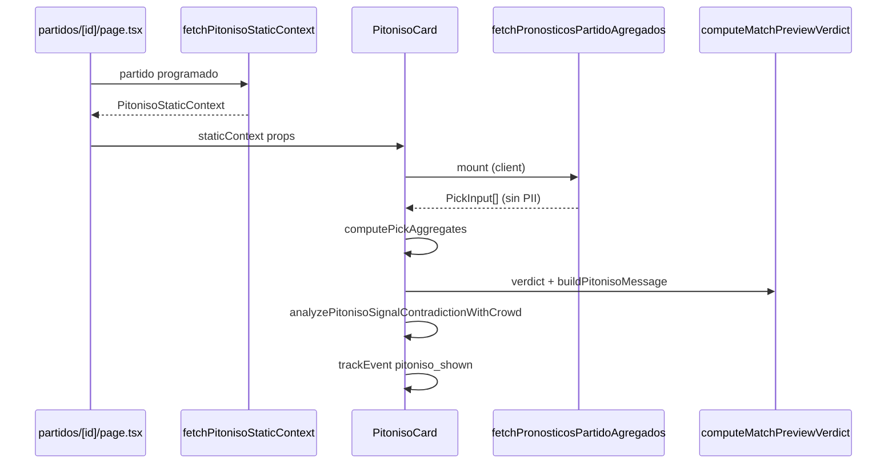

# EL PITONISO — PI-3 UI — REPORTE

> Ejecución de **PI-3** según `PITONISO_EXECUTION_PLAN.md`.
> Alcance: `PitonisoCard`, wiring en detalle de partido, analytics, copy de contradicción.
> **Sin** PI-4. **Sin** cambios a motor PI-1, datos PI-2, scoring, triggers, webhooks, RLS.
>
> **Resultado:** ✅ Completado. Typecheck y lint limpios.

---

## 1. Archivos tocados

| Archivo | Acción |
|---------|--------|
| `src/components/partidos/PitonisoCard.tsx` | **Nuevo** — card client + pipeline completo |
| `src/app/(app)/partidos/[id]/page.tsx` | **Editado** — fetch server + render condicional |
| `src/lib/analytics/events.ts` | **Editado** — `pitoniso_shown`, `pitoniso_expanded` |
| `PITONISO_PI3_REPORT.md` | **Nuevo** — este reporte |

---

## 2. Flujo server / client



### Server (`page.tsx`)

1. `fetchPartidoDetallePageData` (existente).
2. Si `estatus === "programado"` → `fetchPitonisoStaticContext(id)`.
3. Si `ok` → render `<PitonisoCard staticContext={...} />` **después de `PartidoHeader`**.

### Client (`PitonisoCard.tsx`)

1. `fetchPronosticosPartidoAgregados(partidoId, ligaId)` en mount.
2. `computePickAggregates(picks, null)`.
3. `computeMatchPreviewVerdict({ aggregates, local/visitante teamInput, ...phase })`.
4. `computePickValue` sobre marcador top (copy moda).
5. `buildPitonisoMessage` con `formDebut`, posiciones tabla, `isLastGroupMatch`.
6. `leaderFromCrowdOutcomes` + `analyzePitonisoSignalContradictionWithCrowd`.
7. Línea extra de contradicción según `summary`.

---

## 3. Payloads usados

### Props server → client

`PitonisoStaticContext` completo (serializable): partido, phase, local/visitante bundles, `signalLeaders`, `staticSignalContradiction`.

### Client → server action

```ts
fetchPronosticosPartidoAgregados(partidoId, ligaId)
// → { ok: true, picks: PickInput[], total } | { ok: false, error }
```

### Analytics `pitoniso_shown`

```ts
{
  partido_id: string;
  liga_scope: "global" | "grupo";
  confidence: "indeciso" | "leve" | "bastante" | "presentimiento";
  favorite: "local" | "empate" | "visitante";
  crowd_sample_ok: boolean;
}
```

### Analytics `pitoniso_expanded`

```ts
{ partido_id: string }
```

Disparo: una vez al abrir acordeón «¿Qué es El Pitoniso?».

---

## 4. Manejo de errores y estados UX

| Estado | Comportamiento |
|--------|----------------|
| **Loading** | «El Pitoniso está leyendo las señales…»; sin `pitoniso_shown` |
| **Listo** | Mensaje + inclinación + disclaimer; `pitoniso_shown` once |
| **Agregados fallan** | `picks = []`; card sigue con señales de torneo; banner amber + Reintentar |
| **0 picks** | Motor con crowd neutro; copy «sin señales suficientes» (PI-1) |
| **No programado** | Sin card (server no fetch; componente `return null`) |
| **Static fetch falla** | Sin card; página intacta |

### Copy extra contradicción (PI-3)

| `summary` | Línea añadida |
|-----------|---------------|
| `crowd_vs_form` | El Pitoniso no está tan convencido como la multitud. |
| `crowd_vs_table` | La multitud ve una cosa, pero la tabla cuenta otra historia. |
| `table_vs_form` | La tabla dice una cosa, la forma reciente otra. |
| `mixed` | Las señales están cruzadas… |

---

## 5. Validación privacidad

| Check | Estado |
|-------|--------|
| Agregados sin `usuario_id` / nombres | ✅ Server action PI-2 |
| UI no lista picks individuales | ✅ Solo % y moda agregada |
| Analytics sin PII | ✅ Solo enums + `partido_id` |
| Sin join usuarios en wire client | ✅ |

---

## 6. Verificación técnica

| Check | Resultado |
|-------|-----------|
| `npx tsc --noEmit` | ✅ Exit 0 |
| ESLint (`PitonisoCard`, `page.tsx`, `events.ts`) | ✅ Sin errores |

---

## 7. Validación manual sugerida (PI-4)

| Caso | Ruta / condición | Esperado |
|------|------------------|----------|
| a) Picks alineados | Partido programado con ≥5 picks | Card violeta, inclinación + moda |
| b) Crowd vs form | Multitud local fuerte + forma visitante mejor | Línea extra `crowd_vs_form` |
| c) Sin picks | Partido programado sin pronósticos | Mensaje neutral, `crowd_sample_ok: false` en PostHog |
| d) No programado | Partido en vivo/finalizado | **Sin card** |

PostHog: `match_view` → `pitoniso_shown` → (opcional) `pitoniso_expanded`.

---

## 8. Notas para PI-4

1. **Staging/prod:** Validar los 4 casos manuales arriba en un partido real.
2. **PostHog:** Confirmar eventos en Live Events; funnel con `match_view`.
3. **Re-fetch tras pronóstico:** PI-4 puede añadir refresh de agregados al guardar pick (hoy solo mount + retry manual).
4. **Grupos privados:** `ligaId` prop listo; page usa `LIGA_GLOBAL_ID` — extender en quinielas de grupo cuando exista ruta partido grupo.
5. **`PITONISO_REPORT.md`:** Reporte final de cierre tras QA PI-4.
6. **Commit/push:** Bajo instrucción explícita del usuario.

---

## 9. Qué NO se implementó

- ❌ PI-4 QA formal / reporte final consolidado
- ❌ Auto-refresh agregados post-`pronostico_saved`
- ❌ Cambios a PI-1 / PI-2 / BD / scoring / webhooks

---

*PI-3 · El Pitoniso · UI conectada · Listo para PI-4 validación.*
