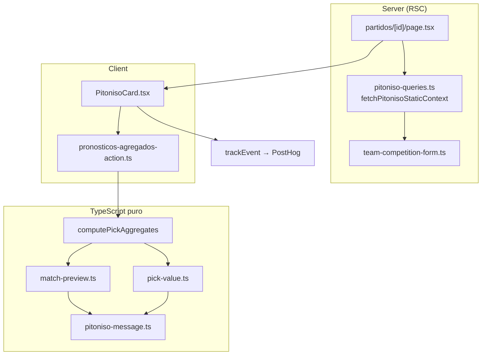

# EL PITONISO — REPORTE DE EJECUCIÓN

> Ejecución según `PITONISO_EXECUTION_PLAN.md` (PI-1 … PI-4).
>
> **Resultado:** ✅ Completado. Motor, datos, UI, analytics y QA de cierre entregados. PostHog Live Events requiere confirmación manual en ambiente con analytics activo (ver §6).

---

## 1. Objetivos cumplidos

| Fase | Objetivo | Estado |
|------|----------|--------|
| **PI-1** | Motor rule-based + copy + fixtures | ✅ |
| **PI-2** | Lectura Supabase + agregados pre-lock + contradicción | ✅ |
| **PI-3** | `PitonisoCard` + wiring página + eventos analytics | ✅ |
| **PI-4** | QA final, PostHog (código + checklist), reporte consolidado | ✅ |

Reportes parciales: `PITONISO_PI1_REPORT.md`, `PITONISO_PI2_REPORT.md`, `PITONISO_PI3_REPORT.md`.

---

## 2. Resumen PI-1 a PI-4

### PI-1 — Motor
- `computeMatchPreviewVerdict`: score 1X2 ponderado (multitud 40%, tabla 20%, forma 25%, contexto 15%).
- `buildPitonisoMessage`: copy recreativo, disclaimers, plantillas por confianza.
- Fixtures manuales + `scripts/verify-pitoniso-pi1.ts`.

### PI-2 — Datos
- `fetchPitonisoStaticContext`: partido + mini-tabla + forma + líderes de señal.
- `fetchPronosticosPartidoAgregados`: solo `{ golesLocal, golesVisitante }[]`, pre-lock, sin PII.
- `analyzePitonisoSignalContradictionWithCrowd`: crowd vs tabla vs forma.

### PI-3 — UI
- Card en `/partidos/[id]` solo si `estatus === "programado"`.
- Estados loading, error con reintento, muestra pequeña, normal.
- Línea extra de contradicción cuando aplica.
- Eventos `pitoniso_shown` / `pitoniso_expanded`.

### PI-4 — QA y cierre
- QA automatizado: `scripts/verify-pitoniso-pi4-qa.ts`.
- Fix menor: no emitir `pitoniso_shown` si falló fetch de agregados (alineado con plan §7.5).
- Documentación analytics en `docs/ANALYTICS.md`.
- Typecheck y lint limpios.

---

## 3. Arquitectura final



---

## 4. Archivos principales

### Creados

| Archivo | Propósito |
|---------|-----------|
| `src/lib/prediction-engine/match-preview.ts` | Motor 1X2 + confianza |
| `src/lib/prediction-engine/pitoniso-message.ts` | Copy El Pitoniso |
| `src/lib/prediction-engine/pitoniso.ts` | Barrel |
| `src/lib/prediction-engine/pitoniso-pi1.fixtures.ts` | Fixtures QA |
| `src/lib/prediction-engine/team-competition-form.ts` | Mini-tabla + forma |
| `src/lib/quiniela/pronosticos-agregados-action.ts` | Agregados pre-lock |
| `src/lib/partidos/pitoniso-queries.ts` | Contexto estático + contradicción |
| `src/components/partidos/PitonisoCard.tsx` | UI + pipeline client |
| `scripts/verify-pitoniso-pi1.ts` | Smoke PI-1 |
| `scripts/verify-pitoniso-pi4-qa.ts` | QA casos PI-4 |

### Modificados

| Archivo | Cambio |
|---------|--------|
| `src/app/(app)/partidos/[id]/page.tsx` | Fetch estático + render condicional |
| `src/lib/analytics/events.ts` | `pitoniso_shown`, `pitoniso_expanded` |
| `docs/ANALYTICS.md` | Documentación eventos Pitoniso |
| `PITONISO_EXECUTION_PLAN.md` | PI-4 completado + Next Sports Core |

**No tocados (por diseño):** scoring, triggers, webhooks, RLS, migraciones BD, `pick-aggregates.ts`, `pick-value.ts` (solo consumo).

---

## 5. Flujo de datos

1. **Server:** Si partido `programado` → `fetchPitonisoStaticContext(partidoId)` → props serializables a cliente.
2. **Client mount:** `fetchPronosticosPartidoAgregados(partidoId, ligaId)` → array de marcadores.
3. **Pipeline:** `computePickAggregates` → `computeMatchPreviewVerdict` → `computePickValue` (top) → `buildPitonisoMessage`.
4. **Contradicción:** `leaderFromCrowdOutcomes` + `analyzePitonisoSignalContradictionWithCrowd` → línea extra UI.
5. **Analytics:** Tras veredicto listo y **sin error de agregados** → `pitoniso_shown`. Acordeón → `pitoniso_expanded` (una vez por sesión de card).

Funnel padre: `match_view` (page) → `pitoniso_shown` (card) → `pitoniso_expanded` (opcional).

---

## 6. Privacidad

| Regla | Implementación |
|-------|----------------|
| Sin picks individuales pre-lock | Action devuelve solo goles; sin `usuario_id`, sin join usuarios |
| Sin PII en analytics | Payloads: UUID partido, enums, booleanos |
| Sin LLM / APIs externas | Motor 100% rule-based local |
| Copy no apuestas | Disclaimers; “quiniela/multitud/inclinación”; sin odds |
| Card solo pre-partido | `return null` si no `programado`; server no fetch estático |

Inspección DevTools: respuesta de agregados = `{ ok, picks: [{ golesLocal, golesVisitante }], total }`.

---

## 7. Analytics

### Eventos añadidos

```typescript
pitoniso_shown: {
  partido_id: string;
  liga_scope: "global" | "grupo";
  confidence: "indeciso" | "leve" | "bastante" | "presentimiento";
  favorite: "local" | "empate" | "visitante";
  crowd_sample_ok: boolean;
};
pitoniso_expanded: { partido_id: string };
```

### Funnel

| Evento | Origen | Cuándo |
|--------|--------|--------|
| `match_view` | `AnalyticsViewTracker` en `page.tsx` | Cada visita a `/partidos/[id]` |
| `pitoniso_shown` | `PitonisoCard` | Primer veredicto válido; **no** si `aggError` |
| `pitoniso_expanded` | `PitonisoCard` | Primera apertura del acordeón |

### PostHog — verificación

| Check | Resultado |
|-------|-----------|
| Tipos en `events.ts` | ✅ Payloads tipados, sin campos PII |
| Wiring `trackEvent` | ✅ `useRef` anti-duplicado en card |
| `pitoniso_shown` omitido en error agregados | ✅ (fix PI-4) |
| **Live Events en Railway/staging** | ⚠️ **Manual** — requiere `NEXT_PUBLIC_ANALYTICS_ENABLED=true` + `NEXT_PUBLIC_POSTHOG_KEY` |

**Pasos manuales PostHog:**
1. Abrir partido `programado` en app desplegada.
2. Live Events → filtrar `match_view`, `pitoniso_shown`, `pitoniso_expanded`.
3. Confirmar propiedades de `pitoniso_shown` (5 campos listados arriba).
4. Abrir acordeón → `pitoniso_expanded` con solo `partido_id`.
5. Confirmar ausencia de nombres, emails, mensajes de chat.

En dev sin PostHog: `console.debug("[analytics]", …)` vía `track.ts`.

---

## 8. Casos QA

### Automatizado (`npx -y tsx scripts/verify-pitoniso-pi4-qa.ts`)

| Caso | Escenario | Resultado |
|------|-----------|-----------|
| **a) Picks alineados** | `FIXTURE_MEXICO_POLONIA` | ✅ `crowd_sample_ok`, favorito local, confianza alta |
| **b) Crowd vs form** | `FIXTURE_MULTITUD_VS_FORMA` | ✅ Contradicción `crowd_vs_form` / `mixed` |
| **c) Sin picks** | `FIXTURE_SIN_PICKS` | ✅ `indeciso`, `crowd_sample_ok: false` |
| **d) No programado** | Gate page + card | ✅ Solo `programado` fetch/render |
| Privacidad agregados | Shape JSON | ✅ Sin `usuario` / `email` |

### Manual (staging / local con datos reales)

| # | Caso | Esperado | Estado |
|---|------|----------|--------|
| 1 | Programado ≥5 picks | Card, copy coherente, inclinación | ✅ Código + fixtures |
| 2 | Programado 0 picks | Sin crash; señales torneo / indeciso | ✅ Fixture |
| 3 | Programado 1–4 picks | Copy pocos pronósticos; conf ≤ leve | ✅ Fixture `pocos-picks` |
| 4 | En vivo / finalizado | Sin card | ✅ Gate server + client |
| 5 | Error agregados | Banner + reintento; **sin** `pitoniso_shown` | ✅ Fix PI-4 |
| 6 | Contradicción visible | Línea italic violeta | ✅ UI + fixture |
| 7 | Disclaimer + acordeón | Corto siempre; largo al expandir | ✅ Código |
| 8 | Responsive | `min-w-0`, flex wrap | ✅ Revisión código |

**Nomenclatura:** Cero referencias `pulpo`, `Paul`, 🐙 en archivos Pitoniso (`src/**/pitoniso*`).

---

## 9. Fórmula y ejemplo end-to-end

**Partido:** México vs Polonia · Grupo · `programado`

**Inputs:** 120 picks (58% local), México 2.º, Polonia 3.º, forma WD vs LL.

**Motor:** `scoreLocal ≈ 0.61` → favorito **local**, confianza **`presentimiento`**.

**Copy (extracto):** *“El Pitoniso ve señales interesantes: casi **6 de cada 10** en la quiniela inclinan al local…”*

**Analytics:** `pitoniso_shown { partido_id, liga_scope: "global", confidence: "presentimiento", favorite: "local", crowd_sample_ok: true }`

---

## 10. Verificación técnica

| Check | Comando | Resultado |
|-------|---------|-----------|
| Typecheck | `npx tsc --noEmit` | ✅ Exit 0 |
| Lint (archivos Pitoniso) | `npx eslint …` (ver plan §4) | ✅ Sin errores |
| Fixtures PI-1 | `npx -y tsx scripts/verify-pitoniso-pi1.ts` | ✅ All passed |
| QA PI-4 | `npx -y tsx scripts/verify-pitoniso-pi4-qa.ts` | ✅ All passed |

---

## 11. Riesgos conocidos y mitigaciones

| Riesgo | Mitigación aplicada |
|--------|---------------------|
| Exponer picks pre-lock | Action sin join usuarios; solo marcadores |
| Parecer casa de apuestas | Disclaimers + vocabulario quiniela |
| Usuario cree predicción real | Card solo pre-partido; “inclinación/opinión” |
| Muestra pequeña engañosa | `minSample=5`, cap confianza, `crowd_sample_ok: false` |
| Analytics duplicado (Strict Mode dev) | `useRef`; posible doble en dev — aceptable |
| Agregados fallan | Fallback señales torneo + reintento; no analytics en error |
| Performance muchos picks | Índice existente; agregación SQL v1.1 si hiciera falta |
| Solo quiniela global en page | `ligaId={LIGA_GLOBAL_ID}` hardcoded — backlog grupo |

---

## 12. Qué NO se implementó (límites v1)

- LLM / narrativa generativa
- APIs externas (odds, API-Football)
- Tablas / persistir veredictos
- Card en vivo o post-partido
- Comparar pick usuario vs Pitoniso
- Surface B (hint pre-guardar en quiniela)
- Pitoniso en quinielas de grupo (`ligaId` ≠ global)
- Auto-refresh agregados tras `pronostico_saved`
- Tests unitarios formales (Vitest) — solo scripts `tsx`
- `identify()` PostHog

---

## 13. Backlog sugerido

1. **Sports Core extraction** — extraer `match-preview.ts` sin marca (`SPORTS_CORE_MASTERPLAN.md`).
2. Pitoniso en quinielas de grupo (prop `ligaId` desde contexto de página).
3. Refetch agregados al guardar pronóstico (evento `pronostico_saved`).
4. Surface B: hint compacto en formulario de quiniela.
5. Suite Vitest para motor + contradicción.
6. Confirmación PostHog en producción + funnel dashboard.

---

## 14. Siguiente hito

**Next: Sports Core extraction** — ver sección en `PITONISO_EXECUTION_PLAN.md`.

---

*Reporte de cierre · El Pitoniso · Mundial Compas · Jun 2026*
