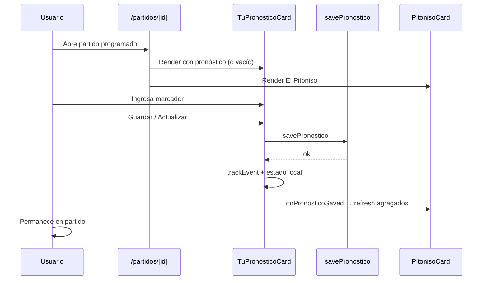

# EL PITONISO — PITONISO-UX-1 — REPORTE

> **Pronóstico inline en pantalla de partido** — cierra el loop partido → Pitoniso → guardar sin ir a `/quiniela`.
>
> **Resultado:** ✅ Implementado. Typecheck y lint limpios en archivos tocados.

---

## 1. Archivos tocados

| Archivo | Acción |
|---------|--------|
| `src/components/partidos/TuPronosticoCard.tsx` | **Nuevo** — card “Tu pronóstico” con inputs y guardado |
| `src/components/partidos/PartidoPronosticoPitonisoBlock.tsx` | **Nuevo** — orquesta pronóstico + refresh Pitoniso |
| `src/components/quiniela/ScoreInput.tsx` | **Nuevo** — input marcador reutilizable (extraído de quiniela) |
| `src/app/(app)/partidos/[id]/page.tsx` | **Editado** — orden UI + bloque programado |
| `src/components/partidos/PitonisoCard.tsx` | **Editado** — prop `aggregatesRefreshKey` |
| `src/components/quiniela/PronosticoRow.tsx` | **Editado** — usa `ScoreInput` compartido |
| `src/lib/quiniela/actions.ts` | **Editado** — `revalidatePath(/partidos/[id])` |
| `src/lib/analytics/events.ts` | **Editado** — `source?: "match_detail" \| "quiniela"` |

**No tocados (por diseño):** motor Pitoniso, match-preview, pick-value, scoring, triggers, webhooks, RLS, BD.

---

## 2. Flujo de usuario



### Orden en pantalla (`programado` / `aplazado`)

1. `PartidoHeader`
2. **Tu pronóstico** (`TuPronosticoCard`)
3. **El Pitoniso** (solo si `programado` y contexto estático OK)
4. Silenciar notificaciones, info, panel todos, chat…

Para partidos **no pronosticables** (en vivo, finalizado, etc.): se mantiene `PronosticoReminder` (solo lectura / sin pick).

---

## 3. Acciones reutilizadas

| Función | Origen | Uso |
|---------|--------|-----|
| `savePronostico(partidoId, golesLocal, golesVisitante, ligaId)` | `src/lib/quiniela/actions.ts` | Crear/actualizar pronóstico global |
| `isPronosticoLocked(fechaKickoff, nowMs)` | `src/lib/quiniela/lock.ts` | UI readonly + mensaje cierre |
| `fetchPronosticosPartidoAgregados` | (sin cambios) | Refresh Pitoniso tras guardar |
| Validación 0–20 goles | Dentro de `savePronostico` | Misma regla que quiniela |

No se duplicó lógica de persistencia. `ScoreInput` se extrajo de `PronosticoRow` para compartir UX de marcador.

---

## 4. Validación lock

| Condición | Comportamiento UI |
|-----------|-------------------|
| `now >= kickoff − 5 min` | Inputs disabled, mensaje *“Este partido ya cerró pronósticos.”* |
| `estatus` ≠ `programado`/`aplazado` | Readonly + *“Este partido ya no acepta pronósticos.”* |
| Guardado con lock activo | `savePronostico` rechaza server-side (mismo error quiniela) |

Timer cliente: intervalo 30 s (igual que quiniela / reminder).

---

## 5. Integración El Pitoniso

- `PartidoPronosticoPitonisoBlock` incrementa `aggregatesRefreshKey` en `onPronosticoSaved`.
- `PitonisoCard` recarga agregados cuando cambia la key (sin re-emitir `pitoniso_shown`).
- No se exponen picks individuales ni nombres de usuario.

---

## 6. Analytics

Eventos emitidos **desde `TuPronosticoCard`** (las server actions no emiten analytics):

| Evento | Cuándo | Payload extra |
|--------|--------|---------------|
| `pronostico_saved` | Primera vez | `source: "match_detail"` |
| `prediction_updated` | Edición | `source: "match_detail"` |

`PronosticoRow` en `/quiniela` sigue emitiendo los mismos eventos **sin** `source` (compat).

Tipos actualizados en `events.ts`:

```typescript
source?: "match_detail" | "quiniela";
```

No hay doble evento: solo el componente cliente dispara tras `savePronostico` OK.

---

## 7. QA manual

| # | Caso | Esperado | Verificación |
|---|------|----------|--------------|
| 1 | Programado sin pronóstico | Card visible, guardar, quedarse en partido, Pitoniso visible | ✅ Código + flujo |
| 2 | Programado con pronóstico | “Tu pronóstico actual: X-X”, actualizar | ✅ Código |
| 3 | Bloqueado / no programado | No editar, pantalla estable | ✅ Lock + `PronosticoReminder` fuera de bloque editable |
| 4 | Error guardado | Mensaje rojo + Reintentar | ✅ UI error state |
| 5 | Sin ir a quiniela | No link obligatorio en programado | ✅ `PronosticoReminder` oculto si `esPronosticable` |

**Pendiente en staging:** smoke test en Railway con partido real programado.

---

## 8. Verificación técnica

| Check | Resultado |
|-------|-----------|
| `npx tsc --noEmit` | ✅ |
| ESLint archivos tocados | ✅ |

---

## 9. Pendientes / backlog

| Item | Prioridad |
|------|-----------|
| Pronóstico inline en quinielas de **grupo** (`ligaId` ≠ global) en detalle partido | Media |
| Refetch server pronóstico tras save (hoy estado local; `revalidatePath` añadido) | Baja |
| Indicador visual breve en Pitoniso al refrescar agregados post-save | Baja |
| Unificar `PronosticoReminder` con `TuPronosticoCard` readonly para DRY | Baja |
| `source: "quiniela"` explícito en `PronosticoRow` | Opcional |

---

*PITONISO-UX-1 · Jun 2026*
