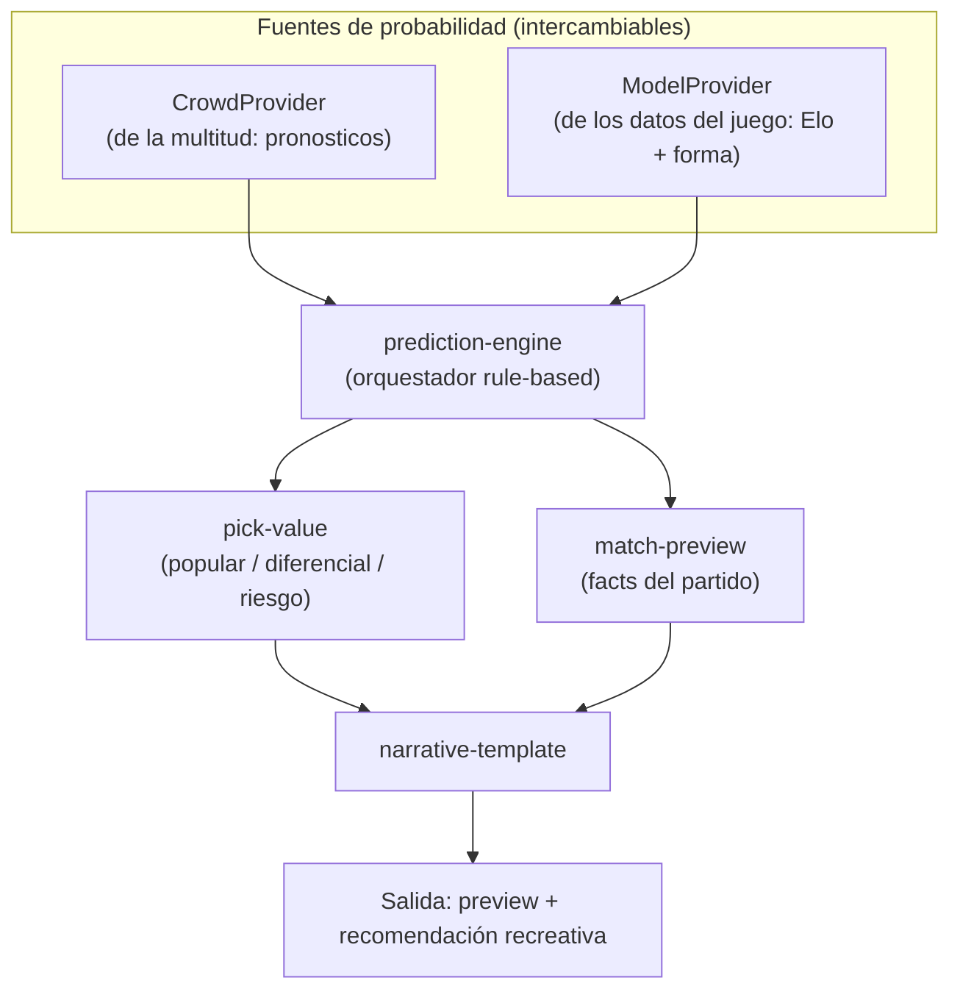
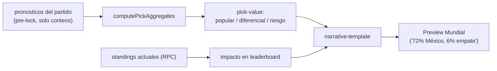
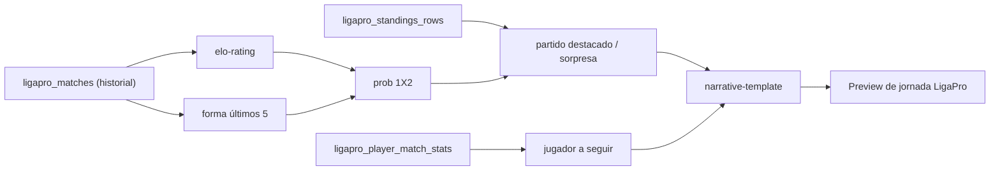
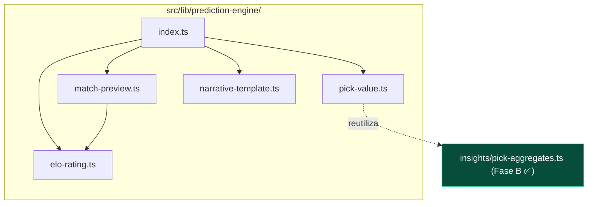
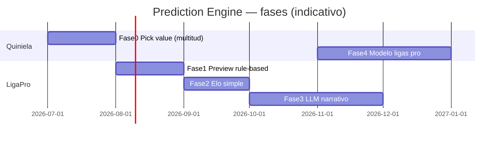

# PREDICTION ENGINE — DISEÑO

> **Documento de diseño. No es implementación.** Sin código, sin migraciones, sin tocar scoring/webhooks/producción.
> Fuentes de verdad: `SPORTS_CORE_MASTERPLAN.md`, `SPRINT1_EXECUTION_PLAN.md`, `SPRINT1_PHASE_C_DESIGN.md`.
>
> **Objetivo:** diseñar un motor de predicción/previews deportivos **rule-based primero, explicable**, reutilizable por:
> 1. Mundial Compas / La Quiniela
> 2. Futuras quinielas (Liga MX, Premier, Champions)
> 3. LigaPro (torneos amateur/locales)
>
> **Principio rector:** *no inventamos resultados.* Todo número sale de datos observables y de una fórmula que un humano puede leer y explicar. El LLM, si aparece, solo **pule prosa**, nunca genera hechos.

---

## 0. Idea central (una imagen)

Hay **dos fuentes de probabilidad** distintas, unificadas bajo una misma interfaz:

- **Mundial Compas / La Quiniela:** hoy tiene **multitud** (miles de `pronosticos`) pero no un modelo de fuerza de selecciones cargado → usa principalmente **CrowdProvider**.
- **LigaPro:** no tiene multitud (nadie pronostica torneos de barrio) pero sí **resultados** → usa **ModelProvider** (Elo + forma).
- El mismo motor sirve a ambos cambiando el proveedor. Eso es lo que lo hace **exportable a Sports Core**.

---

## 1. Concepto: definiciones que NO se deben confundir

| Concepto | Qué es | Fuente de datos | Producto |
|----------|--------|-----------------|----------|
| **Predicción deportiva** | Probabilidad de un resultado del PARTIDO (1X2 / marcador), independiente de la quiniela. | Datos del juego (Elo, forma) **o** consenso de multitud. | LigaPro (modelo) / Quiniela (multitud) |
| **Preview narrativo** | Texto explicativo previo al partido ("X llega como favorito ligero…"). | Facts calculados → template → (opcional) LLM. | Ambos |
| **Recomendación para quiniela** | Sugerencia **recreativa** de qué pick podría tener valor. **No es consejo de apuesta ni garantía.** | Combina probabilidad + popularidad + riesgo. | Quiniela |
| **Pick popular** | El resultado/marcador **más elegido por la gente**. Habla de la MULTITUD, no del partido. | `pronosticos` (distribución). | Quiniela |
| **Pick diferencial** | Pick **poco elegido** que, si acierta, da ventaja competitiva en el leaderboard. | `pronosticos` (baja cuota) + standings. | Quiniela |
| **Probabilidad estimada** | Número 0–1, explicable, del resultado. | Elo/forma (modelo) o frecuencia de multitud. | Ambos |

**Distinción clave:** *pick popular ≠ predicción deportiva.* Que el 72% elija a México **no significa** que México tenga 72% de probabilidad real; significa que la gente lo cree. El motor mantiene ambos números separados y los puede contrastar ("la gente confía más de lo que sugieren los datos").

---

## 2. Mundial Compas — generación PRE-partido (sin IA, solo multitud)

Con los datos actuales (`pronosticos` previos al lock + `partidos` + standings vía RPC), antes del pitazo se genera:

| Salida | Cómo se calcula (rule-based) | Reutiliza |
|--------|------------------------------|-----------|
| **Pick más popular** | Marcador con mayor `count` entre los pronósticos ya guardados del partido. | `computePickAggregates` (Fase B) |
| **Marcador más popular** | = el bucket top de `exactScores`. | Fase B |
| **Distribución 1X2** | Normalizar cada pick a local/empate/visitante; `% = count/total`. | Fase B (`outcomes`) |
| **Pick diferencial** | Marcador/resultado con `sharePct` bajo (< 15%) pero **plausible** (no absurdo). | Fase B + heurística |
| **Riesgo del pick** | `riesgo = f(1 − sharePct)`. Pick popular → bajo riesgo/baja recompensa; diferencial → alto riesgo/alta recompensa. Escala 1–5. | pick-value |
| **Posible impacto en leaderboard** | Si el pick diferencial acierta (3 pts) y la mayoría falla, estimar salto de posiciones desde el standing actual (RPC) y los puntos de los rivales cercanos. | RPC `tabla_liderato_quiniela` |
| **Preview tipo frase** | Template con los números: *"El 72% eligió México, pero solo el 6% se atrevió al empate."* | narrative-template |

### 2.1 Privacidad pre-partido (importante)
Hoy `fetchPronosticosPartidoTodos` solo revela picks individuales **post-finalización** (con nombres). Para el preview pre-partido se mostrará **solo el agregado** (porcentajes, sin nombres ni IDs) → privacy-safe. Es una nueva ruta de lectura **solo de conteos**, sin exponer quién eligió qué.

### 2.2 Por qué NO hay modelo deportivo en Mundial (todavía)
No tenemos Elo de selecciones cargado ni historial estructurado de equipos (los `partidos` guardan strings de equipo, no entidades). Por eso el Mundial usa **CrowdProvider**. Un Elo de selecciones es factible más adelante (Fase 4, exportar a ligas pro), no ahora.

### 2.3 Diagrama de flujo Mundial

---

## 3. LigaPro — modelo para torneos locales (ModelProvider)

Sin multitud, con resultados. Usa la tabla actual + historial reciente. Insumos por equipo:

| Insumo | Fuente (LigaPro, esquema futuro `ligapro_*`) |
|--------|----------------------------------------------|
| Tabla actual (pts, PJ, DG) | `ligapro_standings_rows` |
| Últimos 5 partidos (forma) | `ligapro_matches` (resultados recientes) |
| Goles a favor / en contra | derivado de `ligapro_matches` |
| Racha (V/E/D consecutivas) | derivado de `ligapro_matches` |
| Localía | flag local/visitante del fixture |
| **Rating Elo simple** | calculado al vuelo del historial (ver §4) |

### Salidas del motor LigaPro

| Salida | Regla |
|--------|-------|
| **Probabilidad 1X2** | De Elo ajustado por localía + bonus de forma (ver §4.4). |
| **Partido destacado de la jornada** | Mayor de: (cercanía de ratings) × (relevancia: top de tabla / clásico). |
| **Posible sorpresa** | Partido donde el equipo de menor rating juega de local y/o llega en mejor forma que el favorito (gap de Elo medio + diferencia de forma positiva). |
| **Equipo en mejor forma** | Mayor puntaje de forma en últimos 5 (V=3,E=1,D=0; ponderar recencia). |
| **Jugador a seguir** | Goleador/asistidor líder del torneo o en racha (de `ligapro_player_match_stats`). |
| **Preview automático de jornada** | Template que ensambla los puntos anteriores en prosa. |

### Diagrama LigaPro

---

## 4. Elo simple (diseño conceptual, sin código)

### 4.1 Fórmula conceptual
- Cada equipo tiene un rating `R`.
- Antes del partido, la **expectativa** del local:
  `E_local = 1 / (1 + 10^((R_visitante − R_local_ajustado) / 400))`
  donde `R_local_ajustado = R_local + H` (ventaja de localía).
- Resultado real `S` para el local: victoria = 1, empate = 0.5, derrota = 0.
- Actualización: `R_local' = R_local + K · (S − E_local)`; el visitante se mueve en sentido opuesto.

### 4.2 Rating inicial
- Todos arrancan en **1500**.
- Equipos nuevos sin historial → 1500 con `K` **alto** (más volátil) durante sus primeros ~5 partidos ("provisional"), luego `K` normal.

### 4.3 Cómo actualizar tras cada partido
- Recorrer el historial de `ligapro_matches` finalizados en orden cronológico aplicando la fórmula.
- **Sin tabla nueva (MVP):** el rating se **recalcula al vuelo** reproduciendo el historial cuando se necesita (cacheable en memoria). Persistirlo en `ligapro_team_ratings` es una optimización futura, **fuera de las restricciones de hoy**.
- `K` sugerido: 20 normal, 40 provisional. (Calibrable.)
- Opcional: ponderar margen de goles (golpaliza mueve más el rating) con un multiplicador acotado.

### 4.4 Convertir rating en probabilidad 1X2
- `P(local gana)` y `P(visitante gana)` salen de la expectativa Elo.
- El **empate** no está en el Elo clásico → se introduce con un parámetro `draw_base` (p. ej. 24–28% en fútbol amateur) que se reparte proporcionalmente, **mayor cuando los ratings están cerca**. Fórmula conceptual: `P(empate) = draw_base · (1 − |E_local − 0.5|·2)` y renormalizar las tres a sumar 1.
- Todo el cálculo es explicable: se puede mostrar "Real 60% / Empate 22% / Halcones 18%".

### 4.5 Ajuste por localía
- `H` ≈ +60 a +100 puntos de rating al local (calibrable por torneo; canchas chicas suelen tener fuerte localía).

### 4.6 Equipos nuevos / sin historial
- Inicial 1500, `K` provisional alto.
- En el preview, marcar con un disclaimer suave: *"datos limitados para este equipo"*. Nunca dar probabilidad con falsa precisión si `PJ < 3`.

---

## 5. Narrativa: tres capas separadas

El motor produce **facts**; la prosa es opcional. Separación estricta para que el LLM no pueda inventar:

| Capa | Qué hace | Determinismo | Costo |
|------|----------|--------------|-------|
| **A) Facts (reglas)** | Números/etiquetas: ratings, forma, %1X2, pick popular, racha. | 100% determinístico | ~0 |
| **B) Template** | Frase armada con los facts, sin libertad creativa. | Determinístico | ~0 |
| **C) LLM (opcional)** | **Pule** el texto del template; recibe los facts como JSON anclado; prohibido agregar datos. | No determinístico (acotado) | Bajo, batch |

### Ejemplo (LigaPro)
- **A) Facts:** `{ local:"Real Zapopan", R_local:1540, visitante:"Halcones", R_visit:1480, racha_local:"3V", prob:{L:0.58,E:0.24,V:0.18} }`
- **B) Template:** *"Real Zapopan llega como favorito ligero (58%) ante Halcones, con 3 victorias seguidas."*
- **C) LLM:** *"Con tres triunfos al hilo, el Real Zapopan parte como favorito ante unos Halcones que buscarán dar la sorpresa."* — mismos hechos, mejor prosa.

**Guardrails LLM (heredados del masterplan):** sin PII, facts en JSON anclado, `max_tokens`, cache por `(entity, jornada)`, log de costo. **El LLM nunca inventa marcadores, minutos ni nombres.**

---

## 6. Datos: qué existe vs qué falta

### Mundial Compas / La Quiniela
| Dato | ¿Existe? |
|------|----------|
| Pronósticos por partido (multitud) | ✅ `pronosticos` |
| Distribución de picks / 1X2 | ✅ vía `computePickAggregates` (Fase B) |
| Standings para impacto en leaderboard | ✅ RPC `tabla_liderato_quiniela` |
| Conteos pre-partido sin exponer nombres | ⚠️ Falta ruta de lectura solo-agregado (diseño, no tabla) |
| Elo/fuerza de selecciones | ❌ No cargado (no urgente) |

### LigaPro
| Dato | ¿Existe? |
|------|----------|
| Equipos / jugadores | ❌ requiere esquema `ligapro_*` (Sprint 3, agosto) |
| Resultados de partidos | ❌ `ligapro_matches` |
| Eventos (goles, tarjetas, MVP) | ❌ `ligapro_match_events` |
| Stats por jugador (goleo) | ❌ `ligapro_player_match_stats` |
| Tabla persistida | ❌ `ligapro_standings_rows` |
| Almacenamiento de Elo | ❌ (MVP: recalcular al vuelo, sin tabla) |

**Conclusión:** el motor para Mundial puede empezar **ya** (datos existen). El motor para LigaPro depende de que exista el esquema `ligapro_*` (no se crea aquí; es Sprint 3 del masterplan).

---

## 7. Modelo reusable — módulos y ubicación en el repo

Todos en `src/lib/` (mismo patrón que `src/lib/insights/`). Diseñados como **funciones puras** (entrada → salida), agnósticas de producto, para luego extraerse a `packages/sports-core` (enero 2027, según masterplan).

| Módulo | Responsabilidad | Ubicación propuesta | Depende de |
|--------|-----------------|---------------------|------------|
| `prediction-engine` | Orquestador: elige proveedor (crowd/model), ensambla salida. | `src/lib/prediction-engine/index.ts` | los demás |
| `elo-rating` | Cálculo Elo, probabilidad 1X2, localía, equipos nuevos. | `src/lib/prediction-engine/elo-rating.ts` | — (puro) |
| `match-preview` | Reúne facts de un partido (forma, racha, destacado, sorpresa). | `src/lib/prediction-engine/match-preview.ts` | elo-rating |
| `pick-value` | Popular / diferencial / riesgo / impacto en leaderboard. | `src/lib/prediction-engine/pick-value.ts` | `insights/pick-aggregates` (Fase B) |
| `narrative-template` | Facts → texto (template); hook opcional a LLM. | `src/lib/prediction-engine/narrative-template.ts` | — |

**Interfaz de proveedor (conceptual):** `ProbabilityProvider → { p_local, p_empate, p_visitante, source: "crowd" | "model", explain }`. Quiniela inyecta `CrowdProvider`; LigaPro inyecta `EloModelProvider`. El resto del motor no cambia.

---

## 8. UX — dónde se muestra

### Mundial Compas / La Quiniela
| Superficie | Qué muestra |
|------------|-------------|
| **Detalle de partido** | Distribución 1X2 + marcador popular + (post) "% acertó" (Fase B ya lo hace post; agregar pre-partido). |
| **Quiniela, antes de guardar pick** | Micro-hint: "Tu pick coincide con el 23%" / "Pick diferencial 🃏 (riesgo 4/5)". |
| **Leaderboard** | Combina con perfiles (Fase C): "tus picks suelen ser diferenciales". |
| **Resumen de jornada** | Qué picks populares fallaron, qué diferenciales pegaron. |

### LigaPro
| Superficie | Qué muestra |
|------------|-------------|
| **Dashboard de jornada** | Preview de jornada: destacado, sorpresa, equipo en forma, jugador a seguir. |
| **Partido individual** | Prob 1X2 explicable + racha + ratings. |
| **Post para Facebook** | Preview narrativo (template/LLM) listo para copiar. |
| **Link público read-only** | Versión ligera del preview para compartir. |

---

## 9. Riesgos y copy responsable

| Riesgo | Mitigación |
|--------|------------|
| **Sonar a casa de apuestas** | Lenguaje recreativo, sin cuotas/odds de dinero, sin "apuesta segura". El copy legal ya enfatiza recreación social. |
| **Sobreprometer precisión** | Mostrar probabilidades redondeadas, nunca decimales falsos; ocultar el modelo si la muestra es chica. |
| **Usuario cree que es garantía** | Disclaimer visible en cada superficie de predicción. |
| **Datos insuficientes** | Umbral mínimo (p. ej. `PJ ≥ 3`, `picks ≥ 5`); si no, mostrar "datos limitados" en vez de número. |
| **Sesgo por muestras pequeñas** | Mismo umbral; Elo provisional con `K` alto marcado como provisional. |
| **Equipos nuevos sin historial** | Rating inicial neutro + disclaimer; no inventar fuerza. |

**Copy responsable estándar (a usar en todas las superficies):**
> *"Estimación recreativa basada en datos disponibles. No es una garantía ni un consejo de apuesta."*

Variante LigaPro:
> *"Pronóstico automático basado en la tabla y la forma reciente. Solo para diversión."*

---

## 10. Roadmap por fases

| Fase | Alcance | Depende de | Datos | Riesgo |
|------|---------|------------|-------|--------|
| **Fase 0** | Mundial Compas: **pick popularity + pick differential + riesgo + preview de multitud**. | Fase B (ya hecha) | Existen ✅ | Bajo |
| **Fase 1** | LigaPro: **preview rule-based** (tabla + forma + destacado/sorpresa/jugador), **sin Elo aún**. | Esquema `ligapro_*` (Sprint 3) | Faltan (Sprint 3) | Bajo |
| **Fase 2** | LigaPro: **Elo simple** + probabilidad 1X2 explicable. | Fase 1 + historial de partidos | Historial LigaPro | Medio |
| **Fase 3** | **LLM narrativo** (capa C) para previews/crónicas, con facts anclados. | Fases 0–2 | Facts JSON | Medio (costo) |
| **Fase 4** | **Exportar a ligas profesionales** (Liga MX/Premier): cargar Elo/datos reales como `ModelProvider` en la quiniela. | provider registry (Sports Core) | Datos de proveedor | Medio |

---

## 11. Recomendación: ¿antes, durante o después de los perfiles de usuario?

**Recomendación: hacer la Fase 0 del Prediction Engine (pick-value) EN PARALELO / inmediatamente ANTES de los perfiles de usuario (Fase C), porque comparten el mismo núcleo.**

Razonamiento:
- **Fase B (pick aggregates) ya está construida y aprobada.** Es el cimiento común.
- **`pick-value` (Prediction Engine Fase 0)** y **`profiles` (Fase C)** dependen ambos del mismo cálculo de **distribución de picks y `sharePct`**. Construir `pick-value` primero te da una función reutilizable (`sharePct`, `riesgo`, `diferencial`) que **el cálculo de perfiles consume directamente** para su métrica `minorityRate`.
- Hacer perfiles primero te obligaría a escribir la lógica de "qué tan minoritario es un pick" dentro de profiles, y luego duplicarla/extraerla para el motor. Hacer `pick-value` primero evita esa deuda.

**Orden sugerido:**
1. **Prediction Engine Fase 0 — `pick-value`** (extiende Fase B: popular/diferencial/riesgo + ruta de conteos pre-partido).
2. **Perfiles de usuario (Fase C)** → reusa `pick-value.sharePct` para `minorityRate` y `Apostador Diferencial 🃏`.
3. Resto del Prediction Engine (LigaPro) cuando exista el esquema `ligapro_*`.

### Cómo el Prediction Engine reutiliza el trabajo de Perfiles (y viceversa)

| Pieza | Perfiles (Fase C) | Prediction Engine | Relación |
|-------|-------------------|-------------------|----------|
| `computePickAggregates` (Fase B) | calcula `minorityRate` del usuario | calcula `pick popular/diferencial` del partido | **Mismo helper, dos perspectivas** (usuario vs partido) |
| `sharePct` de un marcador | base de "qué tan raro pronostica el usuario" | base de "qué tan diferencial es este pick" | `pick-value` lo expone; profiles lo consume |
| `narrative-template` | frase "Eres 🎯 Francotirador" | frase "72% eligió México" | Mismo módulo de templates, distintos facts |
| Patrón de analytics (Fase A) | `profile_card_viewed` | `preview_viewed`, `pick_hint_shown` | Mismo `trackEvent`, sin PII |
| Standings RPC | `rankDelta` del usuario | "impacto en leaderboard" del pick | Misma fuente de datos |
| Filosofía | reglas, determinístico, sin PII | reglas, explicable, sin inventar | **Idéntica** |

**Síntesis:** Perfiles responden *"¿cómo eres tú?"*; Prediction Engine responde *"¿qué pasa en este partido y qué valor tiene tu pick?"*. Ambos beben del **mismo lago de datos y del mismo helper de Fase B**. Construir el motor de `pick-value` primero hace que los perfiles salgan casi gratis sobre él, y deja todo listo para que LigaPro reutilice el mismo motor cambiando solo el proveedor de probabilidad (crowd → Elo).

---

*Documento de diseño del Prediction Engine. Rule-based, explicable, reutilizable por La Quiniela y LigaPro. Sin código, sin migraciones, sin tocar producción. Pendiente de aprobación antes de implementar.*
