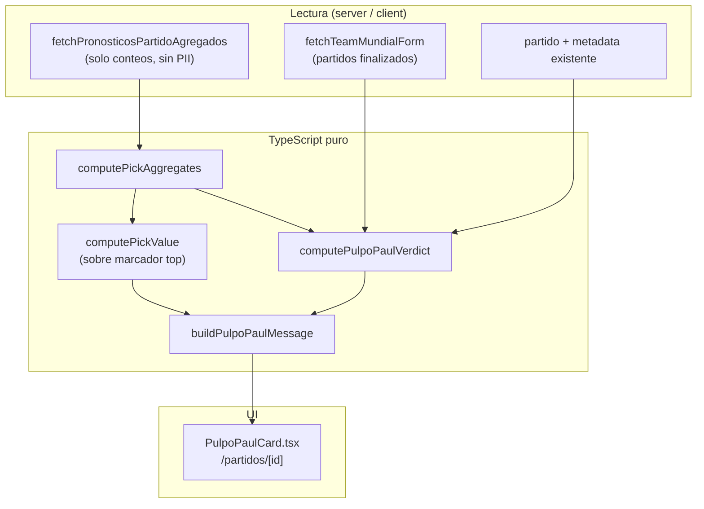
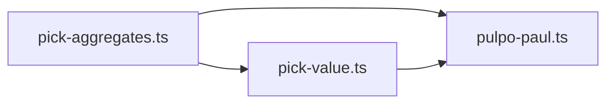

# PULPO PAUL — ¿QUÉ DICE EL PULPO PAUL? — PLAN DE EJECUCIÓN

> **Documento de plan. No es implementación.** No se escribe código, no se crean tablas/migraciones/vistas, no se toca scoring/triggers/webhooks/LigaPro, no se usa LLM, no se invocan APIs externas desde este módulo.
>
> Fuentes de verdad: `SPORTS_CORE_MASTERPLAN.md`, `PREDICTION_ENGINE_DESIGN.md`, `PICK_VALUE_EXECUTION_PLAN.md`, `SPRINT1_PHASE_B_REPORT.md`, `SPRINT1_5_PICK_VALUE_REPORT.md`.
>
> **Objetivo:** diseñar una feature **recreativa** pre-partido que muestre la “opinión” del Pulpo Paul sobre quién *parece* favorito, usando solo datos ya disponibles o derivables en Supabase + TypeScript puro.

---

## 0. Resumen ejecutivo

**“¿Qué dice el Pulpo Paul?”** es un bloque de UI en el detalle de partido (`/partidos/[id]`) que aparece **antes del pitazo** (y se oculta cuando el partido está en vivo o finalizado). Paul no predice el futuro: **resume señales observables** (multitud, tabla del grupo, forma en el Mundial, contexto del encuentro) con tono divertido y un disclaimer claro.

- **Núcleo = función pura** `computePulpoPaulVerdict(context)` → favorito tentativo, nivel de confianza, marcador “de moda” y copy.
- **Datos = lectura on-demand** desde Supabase (`partidos`, `pronosticos` agregados) + cálculo de mini-tabla y forma **desde partidos finalizados** (sin API Football en el camino de datos de Paul).
- **Reutiliza** `computePickAggregates` (Fase B) y `computePickValue` (Sprint 1.5) sobre la distribución de picks — no reimplementa shares ni 1X2.
- **Primera superficie:** detalle de partido pre-lock. Es el “surface C” que `PICK_VALUE_EXECUTION_PLAN.md` posponía; Pulpo Paul es el **product wrapper** que justifica esa ruta agregada.



---

## 1. Principios y límites duros

| Regla | Cómo se cumple |
|-------|----------------|
| No es predicción real | Copy en tercera persona recreativa + disclaimer visible. Nunca “Paul predice que ganará…”. |
| No suena a apuesta | Prohibido odds, “apuesta segura”, “gana dinero”, cuotas. Solo “favorito según la multitud”, “forma”, “tabla”. |
| Sin LLM | Templates rule-based (`buildPulpoPaulMessage`). |
| Sin APIs externas **en este módulo** | No llamar `fetchApifootballStandings`, no sync en caliente. Tabla y forma se derivan de `partidos` en Supabase. |
| Sin tablas / migraciones | Todo calculado al leer. |
| Zona congelada intacta | No tocar scoring RPCs, triggers, webhooks, `LIGA_GLOBAL_ID` en triggers, enum `fase_mundial`, shape de `pronosticos`. |

**Distinción clave (heredada del Prediction Engine):** la opinión de Paul sobre el partido **≠** pick popular de la quiniela. Paul puede decir “la multitud inclina a local” mientras la forma sugiere visitante — y el copy lo contrasta explícitamente.

---

## 2. Datos disponibles y cómo obtenerlos

### 2.1 Inventario

| Señal | Fuente | Cuándo existe | Notas |
|-------|--------|---------------|-------|
| Distribución agregada de picks | `pronosticos` por `partido_id` + `liga_id` | Pre-lock si hay picks guardados | **Nueva ruta solo-agregado** (§5). Sin nombres ni `usuario_id` en respuesta al cliente. |
| Marcador más popular | Salida de `computePickAggregates` | Igual que arriba | `mostPopularScore`. |
| Tendencia 1X2 | `aggregates.outcomes[]` | Igual | `% local / empate / visitante`. |
| Tabla del grupo | `partidos` finalizados del mismo `grupo` | Fase de grupos, tras ≥1 partido jugado en el grupo | Mini-tabla calculada on-the-fly (§2.2). |
| Goles a favor / en contra | Mismos partidos finalizados | Por equipo (`equipo_*_codigo`) | GF, GC, DG acumulados en el Mundial. |
| Forma en el Mundial | Partidos finalizados donde participa cada equipo | Tras ≥1 partido del equipo | Puntos reales (3/1/0), racha W/D/L, GF/GC últimos K partidos. |
| Contexto del partido | `partido.fase`, `grupo`, `jornada`, `metadata`, kickoff | Siempre | Eliminatorias, último partido de grupo, sede, etc. |

### 2.2 Mini-tabla del grupo (sin API externa)

Función de lectura `fetchGroupMiniStandings(grupo, beforeKickoffIso)`:

1. `SELECT` de `partidos` donde `grupo = :grupo`, `estatus = 'finalizado'`, `fecha_kickoff < :kickoff del partido actual`, marcadores no nulos.
2. Por cada fila, actualizar stats de `equipo_local_codigo` y `equipo_visitante_codigo`: PJ, G, E, P, GF, GC, Pts (reglas FIFA: 3/1/0).
3. Ordenar: Pts desc → DG desc → GF desc → nombre asc (desempate determinístico simple; sin H2H profundo en v1).
4. Devolver posición de local y visitante + gap de puntos entre ambos.

**Eliminatorias / sin grupo:** omitir señal de tabla (`standingsWeight = 0`); Paul se apoya más en multitud + forma global del equipo en el torneo.

### 2.3 Forma en el Mundial

Función `fetchTeamMundialForm(teamCode, beforeKickoffIso, limit = 3)`:

- Partidos finalizados donde el equipo fue local o visitante, ordenados por `fecha_kickoff` desc, máximo `limit`.
- Por partido: resultado (W/D/L), GF/GC desde perspectiva del equipo.
- Agregados: `formPoints` (suma 3/1/0), `formGF`, `formGC`, `formString` (ej. `"WDL"`).

**Primer partido del equipo en el torneo:** `formPoints = null`, señal de forma neutral (0.5 en score, ver §3).

---

## 3. Fórmula de score

Paul produce un **veredicto 1X2 recreativo**, no un marcador exacto. El marcador popular es **informativo**, no el output principal del score.

### 3.1 Señales normalizadas (cada una ∈ [0, 1])

| Señal | Símbolo | Cálculo | Default si falta data |
|-------|---------|---------|------------------------|
| **Multitud local** | `crowdLocal` | `aggregates.outcomes[local].pct / 100` | 0.33 |
| **Multitud empate** | `crowdDraw` | idem empate | 0.33 |
| **Multitud visitante** | `crowdAway` | idem visitante | 0.33 |
| **Tabla local** | `tableLocal` | `1 − (posLocal − 1) / (nTeams − 1)` en el grupo | 0.5 |
| **Tabla visitante** | `tableAway` | idem visitante | 0.5 |
| **Forma local** | `formLocal` | `formPoints_local / (3 × min(PJ_form, limit))` | 0.5 |
| **Forma visitante** | `formAway` | idem visitante | 0.5 |
| **Contexto local** | `ctxLocal` | heurísticas §3.2 | 0.5 |
| **Contexto visitante** | `ctxAway` | heurísticas §3.2 | 0.5 |

Si `aggregates.total < minSample` (5): usar crowd uniforme 33/33/33 y marcar `crowdSampleOk = false`.

### 3.2 Heurísticas de contexto (`ctxLocal` / `ctxAway`)

Reglas determinísticas sobre `partido` + mini-tabla (sin inventar facts):

| Condición | Efecto |
|-----------|--------|
| Eliminatoria (`fase` ∉ grupos) y equipo necesita ganar (está abajo en global o es ida/vuelta — v1: solo “fase eliminatoria” + posición peor) | +0.15 al que “necesita” el resultado (cap 1.0) |
| Última jornada de grupo y uno está fuera de top 2 con gap ≤ 3 pts | +0.10 al que compite por el pase |
| Local en sede (siempre local en fase grupos) | +0.05 `ctxLocal` (sesgo simbólico mínimo, no “localía científica”) |
| `metadata` con `round` / fase textual reconocible | Solo en copy, no altera score en v1 |

`ctxDraw` no se modela por separado; el empate compite solo vía multitud + copy cuando crowd empate ≥ 25%.

### 3.3 Score compuesto por outcome

Pesos configurables (`pulpoPaulWeights`, suma = 1):

| Componente | Peso default | Local | Empate | Visitante |
|------------|--------------|-------|--------|-----------|
| Multitud | **0.40** | `crowdLocal` | `crowdDraw` | `crowdAway` |
| Tabla | **0.20** | `tableLocal` | `1 − abs(tableLocal − tableAway)` × 0.5 | `tableAway` |
| Forma | **0.25** | `formLocal` | `1 − abs(formLocal − formAway)` × 0.5 | `formAway` |
| Contexto | **0.15** | `ctxLocal` | 0.5 (neutral) | `ctxAway` |

```text
scoreLocal     = 0.40×crowdLocal     + 0.20×tableLocal     + 0.25×formLocal     + 0.15×ctxLocal
scoreDraw      = 0.40×crowdDraw      + 0.20×drawTableBlend + 0.25×drawFormBlend + 0.15×0.5
scoreVisitante = 0.40×crowdAway      + 0.20×tableAway      + 0.25×formAway      + 0.15×ctxAway
```

`drawTableBlend` / `drawFormBlend`: cuanto más parejos local y visitante en tabla/forma, más sube el empate (máx. 0.65 en empate si ambos ≤ 0.15 pts de diferencia en tabla y forma simétrica).

**Favorito Paul:** `argmax(scoreLocal, scoreDraw, scoreVisitante)`.

**Margen de decisión:**

```text
margin = scoreTop − scoreSecond   // ∈ [0, 1]
```

### 3.4 Marcador “de moda” (informativo)

No entra al score 1X2. Se expone aparte:

- `popularScore = aggregates.mostPopularScore` (Fase B).
- `pickValueTop = computePickValue(aggregates, popularScore)` para enriquecer copy (“el 18% se inclina por 2-1, pick popular según la multitud”).

---

## 4. Niveles de confianza

Paul **nunca** dice “100% seguro”. Los niveles son expresivos, no probabilidades reales.

| Nivel | ID | Condición (`margin` + gates) | Etiqueta UI | Emoji |
|-------|-----|------------------------------|-------------|-------|
| 1 | `indeciso` | `margin < 0.08` **o** (`!crowdSampleOk` **y** `formLocal` y `formAway` neutros) | *Paul está indeciso* | 🐙❓ |
| 2 | `leve` | `0.08 ≤ margin < 0.15` | *Leve inclinación* | 🐙🤏 |
| 3 | `bastante` | `0.15 ≤ margin < 0.25` y `crowdSampleOk` | *Paul está bastante convencido* | 🐙👀 |
| 4 | `presentimiento` | `margin ≥ 0.25` y al menos 2 señales no-crowd coinciden con el favorito | *Paul tiene un presentimiento fuerte* | 🐙✨ |

**Gate de coherencia (nivel 4):** favorito = local implica `tableLocal ≥ tableAway` **o** `formLocal ≥ formAway` **o** `ctxLocal > ctxAway`. Si solo gana la multitud con margin alto → cap en nivel 3 (“la gente inclina fuerte, pero los números del torneo no tanto”).

**Sin picks suficientes:** máximo nivel 2 aunque margin sea alto (Paul no puede apoyarse solo en tabla/forma sin sonar a modelo deportivo serio — el copy lo dice explícitamente).

---

## 5. Ruta de datos nueva (solo agregados, pre-lock)

Hoy `fetchPronosticosPartidoTodos` exige `estatus = finalizado` y devuelve nombres → **no sirve** para Paul pre-partido.

### 5.1 Nueva server action

`fetchPronosticosPartidoAgregados(partidoId, ligaId)`:

```sql
-- Conceptual; implementación vía Supabase client
SELECT goles_local, goles_visitante
FROM pronosticos
WHERE partido_id = :id AND liga_id = :liga
-- SIN join a usuarios, SIN usuario_id en respuesta
```

Validaciones:

- Usuario autenticado; si `ligaId` es grupo → `assertUsuarioEsMiembro`.
- Partido existe y `estatus IN ('programado', 'en_vivo')` **solo pre-lock para Paul** → en v1 mostrar Paul solo si `programado` (más simple). En vivo: ocultar card.
- Opcional: no servir si kickoff pasó hace > 5 min (partido debería estar en_vivo).

Respuesta al cliente:

```ts
type FetchPronosticosAgregadosResult =
  | { ok: true; picks: PickInput[] }  // solo golesLocal, golesVisitante
  | { ok: false; error: string };
```

En cliente: `computePickAggregates(picks, null)` — sin `resultadoReal`, sin `esYo`.

### 5.5 Privacidad

- Cero PII en wire ni en analytics.
- Rate limit suave: misma acción que otras server actions de quiniela (patrón existente).
- No cachear agregados en CDN público; `dynamic` ya en la página.

---

## 6. Copy responsable

### 6.1 Disclaimer obligatorio (siempre visible)

> *Opinión recreativa del Pulpo Paul. No es predicción deportiva ni consejo de apuesta. Basada en datos de la quiniela y del torneo disponibles en la app.*

Reutilizar espíritu de `DISCLAIMER` en `pick-value.ts`; texto específico de Paul para no confundir con pick-value post-partido.

### 6.2 Voz de Paul

- Tercera persona: *“Paul mira la multitud y le huele a…”*, *“A Paul le llama la atención que…”*.
- Humor ligero, nunca burla hacia equipos/selecciones ni usuarios.
- Números redondeados como en Fase B (`pct` entero).

### 6.3 Plantillas (`buildPulpoPaulMessage`)

Entrada: `PulpoPaulVerdict` + nombres de equipos + flags (`crowdSampleOk`, señales usadas).

| Situación | Ejemplo de copy |
|-----------|-----------------|
| Favorito local, confianza leve, multitud alineada | *“Paul ve que el **62%** de la quiniela inclina al local. En la tabla del grupo, **México** va **2.º** con mejor forma reciente. Leve inclinación hacia **México**, nada escrito en piedra.”* |
| Favorito visitante, multitud vs forma | *“La multitud se inclina al local (**58%**), pero Paul nota mejor racha del visitante en el Mundial. Ojo: no todos los tentáculos apuntan al mismo lado.”* |
| Empate favorito | *“Paul detecta un partido parejo: **28%** espera empate y la tabla está muy cerrada. Podría ser un día de tablas.”* |
| Indeciso | *“Paul movió todos los tentáculos y sigue sin decidirse. Señales mezcladas — como buen partido de grupos.”* |
| Pocos picks | *“Aún hay pocos pronósticos para este partido. Paul solo mira la tabla y la forma por ahora.”* |
| Sin forma (debut) | *“Primer partido de **X** en el torneo. Paul se guía más por lo que dice la quiniela.”* |
| Marcador popular | *“El marcador más repetido en la quiniela: **2-1** (**18%**). Eso es moda de picks, no un resultado asegurado.”* |

### 6.4 Prohibido / permitido

| ❌ Prohibido | ✅ Permitido |
|-------------|--------------|
| “Gana seguro”, “apuesta”, “cuota”, “fijo” | “inclinación”, “favorito según la multitud”, “forma reciente” |
| “Paul predice el marcador 2-1” | “el marcador más elegido en la quiniela es 2-1” |
| Probabilidades tipo “72% de ganar” | “72% de la quiniela eligió local” (multitud, no prob. real) |
| Comparar con casas de apuestas | Contrastar multitud vs tabla/forma |

---

## 7. UI en detalle de partido

### 7.1 Ubicación

Archivo: `src/app/(app)/partidos/[id]/page.tsx`

Insertar **`PulpoPaulCard`** después de `PartidoHeader` y **antes** de `PronosticoReminder` (visible antes de pronosticar; no compite con el formulario).

```
PartidoHeader
PulpoPaulCard          ← NUEVO (solo programado)
SilenciarNotificaciones…
PartidoInfoPanel
PronosticoReminder
PronosticosTodosPanel  (solo finalizado — sin cambios)
ChatPartido
```

### 7.2 Comportamiento

| `partido.estatus` | Paul |
|-------------------|------|
| `programado` | Mostrar card (fetch agregados + forma + mini-tabla en mount) |
| `en_vivo`, `medio_tiempo`, `finalizado` | **Ocultar** (Paul “ya nadó”; evita sensación de predicción en directo) |
| Sin datos | Skeleton → fallback amable (“Paul está meditando…”) |

### 7.3 Wireframe

```
┌─────────────────────────────────────────────┐
│ 🐙 ¿Qué dice el Pulpo Paul?                 │
│                                             │
│  [emoji nivel]  Leve inclinación            │
│                                             │
│  "Paul ve que el 62% de la quiniela         │
│   inclina al local. México va 2.º en        │
│   el grupo…"                                  │
│                                             │
│  Favorito según Paul:  🇲🇽 México            │
│  Marcador más repetido en la quiniela: 2-1  │
│                                             │
│  Opinión recreativa… [disclaimer corto]     │
└─────────────────────────────────────────────┘
```

### 7.4 Estilo visual

- Coherente con tarjetas existentes (`rounded-2xl`, `border-zinc-800`, `bg-zinc-900/40`).
- Acento distintivo: borde o badge violeta/coral suave (diferenciar de pick-value verde/emerald post-partido).
- Ilustración: emoji 🐙 en v1 (sin asset nuevo obligatorio).

### 7.5 Componentes

| Componente | Tipo | Responsabilidad |
|------------|------|-----------------|
| `PulpoPaulCard.tsx` | Client | Fetch agregados, loading/error, render, analytics |
| `fetchPulpoPaulContext` | Server helper | Paraleliza agregados + forma + mini-tabla + partido |
| `computePulpoPaulVerdict` | Puro | Score + confianza |
| `buildPulpoPaulMessage` | Puro | Copy |

**Optimización v1:** server component wrapper que precarga forma + mini-tabla; cliente solo pide agregados (más dinámicos).

---

## 8. Reutilización de `computePickAggregates` y `computePickValue`

### 8.1 `computePickAggregates` (Fase B)

| Campo usado | Para qué en Paul |
|-------------|------------------|
| `total`, `outcomes[]` | Señales `crowdLocal/Draw/Away`; gate `minSample` |
| `mostPopularScore` | Línea “marcador más repetido” |
| `mostPopularOutcome` | Refuerzo narrativo si coincide con favorito Paul |

**Entrada:** array de `{ golesLocal, golesVisitante }` sin `esYo`. `resultadoReal = null`.

### 8.2 `computePickValue` (Sprint 1.5)

Aplicar sobre **`mostPopularScore`**, no sobre el pick del usuario:

```ts
const top = aggregates.mostPopularScore;
const pv = top
  ? computePickValue(aggregates, { local: top.local, visitante: top.visitante }, { context: { homeName, awayName } })
  : null;
```

| Campo usado | Para qué |
|-------------|----------|
| `kind`, `risk` | Matiz en copy (“pick popular en la quiniela” vs “marcador diferencial”) |
| `scoreSharePct`, `outcomeSharePct` | Cifras en el mensaje |
| `sampleOk` | Alineado con `crowdSampleOk` |

**No duplicar:** Paul no recalcula `pct` ni umbrales de `pickValueThresholds`.

### 8.3 Cadena de dependencias



`pulpo-paul.ts` vive en `src/lib/prediction-engine/` junto a `pick-value.ts` (mismo Prediction Engine, CrowdProvider + heurísticas torneo).

---

## 9. Eventos PostHog

Sin PII. Añadir a `AnalyticsEventMap` en `src/lib/analytics/events.ts`.

| Evento | Payload | Cuándo | Mide |
|--------|---------|--------|------|
| `pulpo_paul_shown` | `{ partido_id: string; liga_scope: "global" \| "grupo"; confidence: PulpoConfidence; favorite: Outcome; crowd_sample_ok: boolean }` | Primera renderización con veredicto | Exposición y mix de confianza |
| `pulpo_paul_expanded` | `{ partido_id: string }` | Si v1 tiene acordeón “ver señales” (opcional P1) | Engagement |

**No enviar:** nombres de usuario, picks individuales, texto completo del mensaje.

**Funnel:** `match_view` (existente) → `pulpo_paul_shown` → `pronostico_saved` / `prediction_updated`.

---

## 10. Riesgos

| Riesgo | Severidad | Mitigación |
|--------|-----------|------------|
| Sonar a casa de apuestas | **Alta** | Copy §6 + disclaimer; “quiniela/multitud”, no “probabilidad de ganar”. |
| Usuario cree que Paul “predice” | **Alta** | Marca recreativa, tercera persona, ocultar en vivo/finalizado. |
| Muestra pequeña pre-lock | Media | `minSample = 5`; cap confianza; copy “pocos pronósticos”. |
| Privacidad (picks pre-partido) | Media | Ruta solo agregados §5; sin nombres en wire. |
| Primer partido / sin grupo | Media | Defaults neutros; copy explícito; omitir señal tabla. |
| Mini-tabla ≠ tabla oficial FIFA | Baja | Solo partidos en BD; disclaimer; no llamar “oficial”. |
| Duplicar lógica de pick-value | Media | Import directo; tests sobre fixtures compartidos. |
| Performance (liga global, muchos picks) | Media | Query indexada (`partido_id`, `liga_id`); agregación en SQL opcional v1.1 si lento. |
| Confusión con pick-value post-partido | Media | UI distinta (color, título Paul); superficies distintas (pre vs post). |
| Paul contradice al usuario | Baja | Paul habla del partido, no juzga el pick del usuario (v1 sin comparación). |

---

## 11. Ubicación de archivos (propuesta)

| Archivo | Acción | Nota |
|---------|--------|------|
| `src/lib/prediction-engine/pulpo-paul.ts` | **Nuevo** | Tipos, `pulpoPaulWeights`, `computePulpoPaulVerdict`, `buildPulpoPaulMessage`, `PULPO_PAUL_DISCLAIMER`. |
| `src/lib/prediction-engine/team-mundial-form.ts` | **Nuevo** | Lectura Supabase: mini-tabla + forma. Solo `partidos`. |
| `src/lib/quiniela/pronosticos-agregados-action.ts` | **Nuevo** | `fetchPronosticosPartidoAgregados` (pre-lock, sin PII). |
| `src/lib/partidos/pulpo-paul-queries.ts` | **Nuevo** | Orquesta fetch para la página (opcional, mantiene page delgada). |
| `src/components/partidos/PulpoPaulCard.tsx` | **Nuevo** | UI + analytics. |
| `src/app/(app)/partidos/[id]/page.tsx` | **Editar** | Montar card si `programado`. |
| `src/lib/analytics/events.ts` | **Editar** | + `pulpo_paul_shown` (+ opcional `pulpo_paul_expanded`). |
| `PULPO_PAUL_REPORT.md` | **Nuevo (post-implementación)** | Reporte de ejecución. |

**No tocar:** `pick-aggregates.ts`, `pick-value.ts` (salvo import desde pulpo-paul), scoring, triggers, webhooks.

---

## 12. Checklist de implementación

### Fase PP-1 — Núcleo puro

- [ ] 1. Crear `pulpo-paul.ts`: tipos (`PulpoConfidence`, `PulpoFavorite`, `PulpoPaulContext`, `PulpoPaulVerdict`), pesos, `computePulpoPaulVerdict`, `buildPulpoPaulMessage`.
- [ ] 2. Tests unitarios con fixtures (multitud clara, empate parejo, sin picks, debut equipo, eliminatoria).
- [ ] 3. Verificar que `computePickAggregates` + `computePickValue` se importan sin duplicar lógica.

### Fase PP-2 — Datos

- [ ] 4. Crear `team-mundial-form.ts`: `fetchGroupMiniStandings`, `fetchTeamMundialForm` (solo `partidos`, sin API externa).
- [ ] 5. Crear `fetchPronosticosPartidoAgregados` (server action, sin PII, pre-lock).
- [ ] 6. Crear `fetchPulpoPaulContext` (orquestación paralela).

### Fase PP-3 — UI + analytics

- [ ] 7. Crear `PulpoPaulCard.tsx` (loading, error, disclaimer, estados vacíos).
- [ ] 8. Integrar en `partidos/[id]/page.tsx` solo si `estatus === 'programado'`.
- [ ] 9. Añadir `pulpo_paul_shown` a `events.ts` y disparar en card (once per mount).
- [ ] 10. `npx tsc --noEmit` + lint solo archivos tocados.

### Fase PP-4 — Cierre

- [ ] 11. Generar `PULPO_PAUL_REPORT.md` (fórmula, ejemplos, riesgos, validación manual en staging).
- [ ] 12. Validar en PostHog: funnel `match_view` → `pulpo_paul_shown`.

---

## 13. Qué NO implementar (límites explícitos)

- ❌ LLM, narrativa generativa, voz de Paul “diferente cada día”.
- ❌ APIs externas desde el módulo (API Football, odds providers).
- ❌ Tablas, migraciones, vistas, materialized views, persistir veredictos de Paul.
- ❌ Mostrar Paul en vivo o post-partido (v1).
- ❌ Comparar pick del usuario vs Paul (“Paul no está de acuerdo contigo”) — posible P2.
- ❌ Elo, ModelProvider, LigaPro, ProGol.
- ❌ Tocar scoring, triggers, webhooks, zona congelada.
- ❌ Reutilizar `getCachedGroupStandings()` en el camino crítico (evita dependencia de API Football en runtime de Paul).
- ❌ Probabilidades implícitas de resultado real (“65% de ganar”).

---

## 14. Ejemplo end-to-end (ilustrativo)

**Partido:** México vs Polonia · Grupo C · Jornada 2 · `programado`

**Inputs:**

- Agregados (120 picks): local 58%, empate 22%, visitante 20%; marcador top 2-1 (16%).
- Mini-tabla: México 2.º (4 pts), Polonia 3.º (1 pt).
- Forma últimos 2: México WD, Polonia LL.

**Scores (aprox.):**

- `scoreLocal ≈ 0.61`, `scoreDraw ≈ 0.42`, `scoreVisitante ≈ 0.38` → favorito **local**, `margin ≈ 0.19`.

**Salida:**

- Confianza: **bastante** (nivel 3).
- Copy: *“Paul ve que casi **6 de cada 10** picks inclinan al local. México va arriba en el grupo y llega con mejor forma. Leve favoritismo recreativo hacia **México** — el marcador más repetido en la quiniela es **2-1** (**16%**), moda de picks, no resultado asegurado.”*
- Disclaimer visible.

---

## 15. Relación con roadmap

| Iniciativa | Relación |
|------------|----------|
| Pick Value surface C | Pulpo Paul **es** el producto que consume agregados pre-lock. |
| Prediction Engine | Segundo módulo de CrowdProvider + heurísticas torneo (después de pick-value). |
| Perfiles (Fase C) | Sin overlap; perfiles = usuario, Paul = partido. |
| Pick Value pre-quiniela (surface B) | Mismo `fetchPronosticosPartidoAgregados`; reutilizable después. |

---

*Plan de ejecución · Pulpo Paul · TypeScript puro + lectura Supabase · Recreativo, explicable, reversible. Pendiente de aprobación antes de implementar.*
