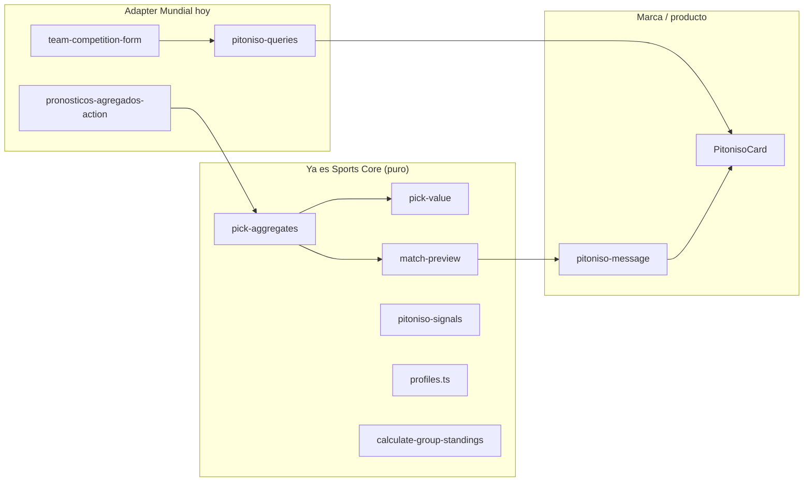
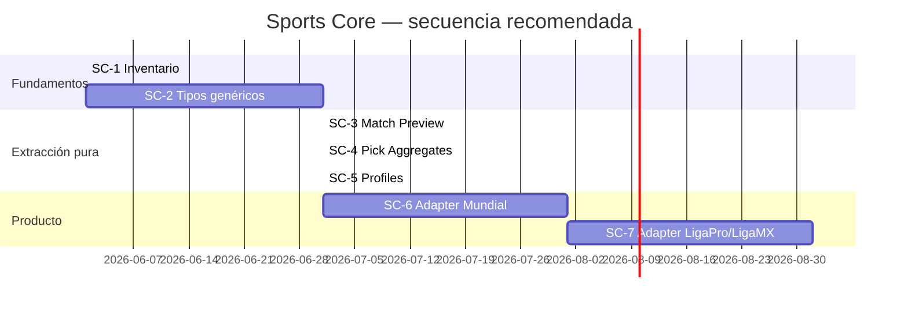

# SPORTS CORE — MASTERPLAN

> **Plan de extracción técnica** — de Mundial Compas hacia un núcleo reutilizable **Sports Core**.
>
> **Estado:** El Pitoniso v1 cerrado (PI-1…PI-4). Este documento define **cómo** extraer sin romper producción.
>
> **Fuentes complementarias:** `MUNDIAL_COMPAS_SPORTS_CORE_ANALYSIS.md` (auditoría read-only del repo), `PITONISO_REPORT.md`, `PREDICTION_ENGINE_DESIGN.md`.
>
> **Restricción:** NO contiene implementación, migraciones ni commits. Solo análisis y plan.

---

## Filosofía rectora

1. **Mundial Compas es el laboratorio; Sports Core es la librería.** La app sigue funcionando igual mientras movemos código puro.
2. **Extraer por capas, no por big-bang.** Primero TypeScript puro; después adapters; al final schema y productos hermanos.
3. **Zona congelada hasta validar otro producto:** scoring, triggers, webhooks live, RLS, UUID liga global, enum `fase_mundial`. Los adapters leen el mundo actual; no lo mutan.
4. **La arquitectura más simple que soporte crecimiento gana.** Un solo repo (`src/lib/sports-core/` o carpeta equivalente) antes que monorepo/packages.

---

## 1. Qué módulos actuales ya son Sports Core disfrazado

Estos archivos son **lógica deportiva/quiniela genérica** en TypeScript puro (o casi). Hoy viven bajo `src/lib/` con imports `@/` de Mundial Compas, pero **no dependen de FIFA, Supabase ni UI**.

| Módulo actual | Ruta | Rol Sports Core | Madurez |
|---------------|------|-----------------|---------|
| **Pick Aggregates** | `src/lib/insights/pick-aggregates.ts` | Distribución 1X2 y marcadores exactos sobre picks anónimos | ✅ Listo para extraer |
| **Pick Value Engine** | `src/lib/prediction-engine/pick-value.ts` | Interpretación de popularidad/riesgo de un marcador | ✅ Listo |
| **Match Preview (motor)** | `src/lib/prediction-engine/match-preview.ts` | Veredicto 1X2 rule-based (multitud + tabla + forma + contexto) | ✅ Listo — **sin marca** |
| **Señales / contradicción** | `src/lib/partidos/pitoniso-signals.ts` | Alineación crowd vs tabla vs forma | ✅ Listo |
| **Perfiles rule-based** | `src/lib/insights/profiles.ts` | Badges de pronosticador sobre métricas | ✅ Listo |
| **Cálculo tabla de grupo** | `src/lib/standings/calculate-group-standings.ts` | Standings round-robin desde filas de partidos | ✅ Mayormente genérico |
| **Tipos standings** | `src/lib/standings/types.ts` | `StandingTeamRow`, `StandingGroup` | ✅ Listo |
| **Outcome 1X2** | `outcomeOf` en pick-aggregates | Primitiva compartida | ✅ Listo |
| **Analytics wrapper** | `src/lib/analytics/track.ts` + `events.ts` (patrón) | Captura tipada sin PII | ⚠️ Patrón reutilizable; eventos son producto |

### Capas de marca vs núcleo (El Pitoniso)

| Capa | Archivo | ¿Sports Core? |
|------|---------|---------------|
| Motor | `match-preview.ts` | **Sí** |
| Señales | `pitoniso-signals.ts` | **Sí** (renombrar → `signal-contradiction` o similar) |
| Copy / disclaimers | `pitoniso-message.ts` | **No** — capa **narratives** de Mundial Compas |
| Orquestación server | `pitoniso-queries.ts` | **No** — adapter app |
| UI | `PitonisoCard.tsx` | **No** — producto |

### Semi-genéricos (requieren adapter, no mover tal cual)

| Módulo | Ruta | Por qué no es 100% core aún |
|--------|------|----------------------------|
| **Forma + mini-tabla** | `src/lib/prediction-engine/team-competition-form.ts` | Acoplado a tabla `partidos`, select FIFA, `isWorldCupGroupLetter` |
| **Métricas perfiles** | `src/lib/insights/profile-data.ts` | Fetch Supabase + scoring Mundial (3/1/0) |
| **Agregados pre-lock** | `src/lib/quiniela/pronosticos-agregados-action.ts` | Server action + RLS quiniela |
| **Standings FIFA** | `world-cup-*.ts`, `best-third-places.ts`, `build-knockout-bracket.ts` | Reglas específicas Mundial 2026 |



---

## 2. Qué está acoplado a Mundial / FIFA / quiniela

### 2.1 Base de datos y dominio

| Acoplamiento | Dónde | Impacto extracción |
|--------------|-------|-------------------|
| Tabla `partidos` | Todo el app | Shape FIFA: `fase`, `grupo`, códigos/nombres embebidos |
| Enum `fase_mundial` | Types, filtros quiniela | No generaliza a Liga MX / Champions sin mapping |
| `LIGA_GLOBAL_ID` UUID fijo | constants, triggers, scoring | Pool “Mundial Compas” hardcoded |
| `pronosticos` + scoring 3/1/0 | RPC, triggers | Tipo único: marcador exacto |
| `ligas_privadas` | Grupos sociales | Concepto “pool” mezclado con torneo amateur futuro |
| Sin `competitions` / `teams` | — | Equipos como strings, league 28 en env |

### 2.2 Integraciones externas

| Acoplamiento | Ruta | Nota |
|--------------|------|------|
| API-Football / apifootball | `src/lib/apifootball/*`, `api-football/*` | Provider Mundial; mappers a `partidos` |
| Webhook live | `webhook/process.ts` | Zona congelada; no es Sports Core |
| Relay / crons Railway | `scripts/*`, `railway.*.toml` | Infra Mundial, no librería |

### 2.3 UI y producto

| Acoplamiento | Ejemplos |
|--------------|----------|
| Rutas y copy | `/quiniela`, `/posiciones`, “dato mamalón”, disclaimers legales MX |
| Narrativa en vivo | `src/lib/narracion/comentaristas*.ts` — templates México/Mundial |
| Push / chat | Scopes partido/grupo; notificaciones VAR/goles FIFA |
| Analytics eventos | Nombres y props ligados a flujos Mundial Compas (`quiniela_selected`, etc.) |

### 2.4 Reglas de negocio quiniela

| Regla | Ubicación | Generalizable después |
|-------|-----------|----------------------|
| Lock 5 min antes kickoff | `quiniela/lock.ts` | Sí — `PoolRules.lockOffsetMs` |
| Solo exact score 0–20 | `quiniela/actions.ts` | Sí — `Prediction.entryType` |
| Leaderboard por jornada/fase | RPC Postgres | Sí — con `competition_id` |
| Pick-value post-partido con nombres | `PronosticosTodosPanel` | Adapter — agregados siguen siendo core |

---

## 3. Propuesta de carpetas futuras

Estructura objetivo **dentro del mismo repo** (fase intermedia antes de `packages/` en monorepo):

```
src/lib/sports-core/
├── matches/
│   ├── types.ts              # Match, MatchStatus, MatchPhase
│   ├── outcome.ts            # outcomeOf, Outcome 1X2
│   └── form.ts               # TeamCompetitionForm (puro, sin Supabase)
├── standings/
│   ├── types.ts              # StandingRow, StandingGroup
│   ├── calculate-group.ts    # desde calculate-group-standings.ts
│   └── mini-table.ts         # posición + pointsFromTop2 (genérico)
├── predictions/
│   ├── types.ts              # Prediction, PickInput, PoolScope
│   ├── aggregates.ts         # computePickAggregates
│   ├── pick-value.ts         # computePickValue
│   └── preview/
│       ├── match-preview.ts  # computeMatchPreviewVerdict
│       └── signals.ts        # contradicción crowd/table/form
├── profiles/
│   ├── types.ts              # PlayerProfile, ProfileMetrics
│   └── compute-profiles.ts   # desde profiles.ts
├── analytics/
│   ├── types.ts              # EventMap genérico (sin nombres producto)
│   └── validate-payload.ts   # guardrails anti-PII (opcional)
└── narratives/
    └── README.md             # Solo contrato: buildNarrative(input) — implementaciones en producto

src/lib/adapters/
├── mundial-compas/
│   ├── match-mapper.ts       # partidos row → Match
│   ├── prediction-fetch.ts   # pronosticos → PickInput[]
│   ├── standings-fetch.ts    # team-competition-form + Supabase
│   ├── pitoniso-message.ts   # marca El Pitoniso
│   └── profile-data.ts       # métricas desde pronosticos
└── ligapro/
    └── README.md             # SC-7 — vacío hasta validar producto
```

**Regla de imports:** código en `sports-core/` **nunca** importa `@/lib/supabase`, `@/components`, ni `@/app`. Solo otros módulos `sports-core/` o dependencias npm puras.

**Compatibilidad durante migración:** re-export desde rutas viejas (`insights/pick-aggregates.ts` → `export * from '@/lib/sports-core/predictions/aggregates'`) hasta eliminar aliases en SC-6.

---

## 4. Contratos genéricos necesarios

Tipos objetivo (nombres canónicos Sports Core). Los adapters mapean desde el schema actual.

### 4.1 `Team`

```typescript
interface Team {
  id: string;           // código estable (hoy: equipo_*_codigo)
  name: string;
  shortName?: string;
  crestUrl?: string;
  externalIds?: Record<string, string>; // apifootball, etc.
}
```

### 4.2 `Competition`

```typescript
interface Competition {
  id: string;
  slug: string;         // "world-cup-2026", "liga-mx-2025-26"
  name: string;
  format: "league" | "groups_knockout" | "knockout_only" | "custom";
  timezone?: string;
}
```

### 4.3 `Match`

```typescript
type MatchStatus = "scheduled" | "live" | "halftime" | "finished" | "postponed" | "cancelled";

interface Match {
  id: string;
  competitionId: string;
  seasonId?: string;
  round?: string | number;      // jornada
  phase?: string;               // grupos, octavos, etc.
  groupKey?: string;            // "A", null en liga
  home: Team;
  away: Team;
  kickoffAt: string;            // ISO
  status: MatchStatus;
  score?: { home: number; away: number };
}
```

**Mapping Mundial hoy:** `partidos.estatus` → `MatchStatus`; `fase`/`grupo`/`jornada` → phase/groupKey/round.

### 4.4 `Prediction`

```typescript
type PredictionEntryType = "exact_score"; // v1; luego "1x2", "survivor", …

interface Prediction {
  poolId: string;               // liga_id
  matchId: string;
  userId: string;                 // solo en adapter/server — no en agregados
  entryType: PredictionEntryType;
  payload: { homeScore: number; awayScore: number };
  lockedAt?: string;
  pointsAwarded?: number;
}
```

**Agregados (sin PII):**

```typescript
interface PickInput {
  homeScore: number;
  awayScore: number;
  isOwnPick?: boolean;
}
```

Alias temporal: `golesLocal`/`golesVisitante` → renombrar en SC-4 con adapter de compat.

### 4.5 `StandingRow`

```typescript
interface StandingRow {
  position: number;
  teamId: string;
  teamName: string;
  played: number;
  wins: number;
  draws: number;
  losses: number;
  goalsFor: number;
  goalsAgainst: number;
  goalDiff: number;
  points: number;
  /** Extensión opcional para fase de grupos con pase */
  pointsFromQualificationZone?: number;
}
```

Ya alineado con `StandingTeamRow` en `standings/types.ts`.

### 4.6 `PlayerProfile`

```typescript
interface ProfileMetrics {
  scoredPredictions: number;    // N
  totalPredictions: number;     // P
  exactHits: number;
  tendencyHits: number;
  exactRate: number;
  hitRate: number;
  precision: number;
  drawRate: number;
  minorityRate: number;
  exactStreak: number;
}

interface PlayerProfile {
  primary: ProfileBadge;
  secondary: ProfileBadge[];
  phrase: string;
  metrics: ProfileMetrics;
  sampleOk: boolean;
}
```

Renombrar `UserProfile` → `PlayerProfile` en core; “usuario” queda en capa auth/producto.

### 4.7 `MatchPreviewInput`

```typescript
interface MatchPreviewTeamInput {
  tablePosition: number | null;
  groupSize: number | null;
  formNorm: number | null;
  pointsFromTop2: number | null;
}

interface MatchPreviewInput {
  aggregates: PickAggregates;
  home: MatchPreviewTeamInput;
  away: MatchPreviewTeamInput;
  isKnockout?: boolean;
  isGroupPhase?: boolean;
  isLastGroupMatch?: boolean;
  minSample?: number;
}

interface MatchPreviewVerdict {
  favorite: Outcome;
  confidence: "indeciso" | "leve" | "bastante" | "presentimiento";
  margin: number;
  crowdSampleOk: boolean;
  scores: { home: number; draw: number; away: number };
}
```

**Estado actual:** `match-preview.ts` ya implementa este contrato; solo falta ubicación `sports-core/` y renombre `local`/`visitante` → `home`/`away` (opcional, SC-3).

### 4.8 Contratos adicionales (fase 2)

| Contrato | Cuándo |
|----------|--------|
| `Pool` / `PoolScope` | SC-6 — mapear `ligas_privadas` + global |
| `PickAggregates` | SC-4 — ya existe, mover |
| `PickValue` | SC-4 — ya existe |
| `AnalyticsEventMap` base | SC-6 — eventos genéricos + extensión producto |

---

## 5. Qué NO extraer todavía

| Área | Por qué esperar |
|------|-----------------|
| **Schema Supabase** (`partidos`, `pronosticos`, migraciones) | Riesgo producción; adapters primero |
| **Scoring RPC + triggers** | Zona congelada; 3/1/0 es contrato Mundial |
| **Webhooks live** (`apifootball/webhook/process.ts`) | Complejidad FIFA; no bloquea insights |
| **RLS y auth** | Compartido por productos; no es sports-core |
| **Chat, push, moderación** | Infra social, no predicción |
| **UI components** (`PitonisoCard`, quiniela panels) | Permanecen en app; consumen core |
| **Narrativas** (`narracion/`, frases gol) | Producto/marca por competencia |
| **Standings FIFA específicos** (mejores terceros, R32, bracket) | Reglas 2026; extraer `calculate-group` primero |
| **LigaPro tablas** (`ligapro_*`) | SC-7 después de validar un torneo amateur real |
| **Monorepo / npm package** | Prematuro hasta SC-6 estable en `src/lib/sports-core` |
| **Competition registry en BD** | Hasta segundo producto confirmado (Liga MX o LigaPro piloto) |
| **Tipos de quiniela nuevos** (1X2, survivor) | Cambia scoring; fuera de extracción v1 |

---

## 6. Plan por fases

### SC-1 — Inventario ✅ (este documento + auditoría)

| Entregable | Estado |
|------------|--------|
| Mapa módulos puros vs acoplados | ✅ §1–§2 |
| Lista archivos a mover | ✅ §3 |
| Contratos objetivo | ✅ §4 |
| Zona congelada documentada | ✅ §5 + análisis |

**Prueba de done:** tabla de rutas `src/lib/*` clasificada en {core, adapter, producto, congelado}.

---

### SC-2 — Tipos genéricos

**Objetivo:** Crear `sports-core/*/types.ts` con contratos §4 sin mover lógica aún.

| Tarea | Detalle |
|-------|---------|
| SC-2.1 | `matches/types.ts`, `standings/types.ts`, `predictions/types.ts`, `profiles/types.ts` |
| SC-2.2 | Type guards ligeros (`isMatchScheduled`, etc.) |
| SC-2.3 | Documentar mapping 1:1 desde `partidos` / `pronosticos` |
| SC-2.4 | `npx tsc --noEmit` — cero cambios de runtime |

**Criterio de done:** tipos importables desde adapters; app sigue usando tipos viejos en paralelo.

**Riesgo:** renombrar campos (`local`→`home`) demasiado pronto. **Mitigación:** aliases deprecated en SC-2, swap en SC-6.

---

### SC-3 — Match Preview sin marca Pitoniso

**Objetivo:** Mover motor puro a `sports-core/predictions/preview/`.

| Tarea | Detalle |
|-------|---------|
| SC-3.1 | Mover `match-preview.ts` → `sports-core/predictions/preview/match-preview.ts` |
| SC-3.2 | Mover `pitoniso-signals.ts` → `sports-core/predictions/preview/signals.ts` |
| SC-3.3 | Re-export en rutas antiguas (deprecation comment) |
| SC-3.4 | **No mover** `pitoniso-message.ts` — queda en `adapters/mundial-compas/` o ruta actual |
| SC-3.5 | Fixtures: `pitoniso-pi1.fixtures.ts` → tests preview genéricos |
| SC-3.6 | `verify-pitoniso-pi1.ts` sigue pasando vía re-exports |

**Criterio de done:** build + fixtures; Pitoniso UI sin cambios visibles.

---

### SC-4 — Pick Aggregates genérico

**Objetivo:** Unificar primitivas de predicción en `sports-core/predictions/`.

| Tarea | Detalle |
|-------|---------|
| SC-4.1 | Mover `pick-aggregates.ts` → `predictions/aggregates.ts` |
| SC-4.2 | Mover `pick-value.ts` → `predictions/pick-value.ts` |
| SC-4.3 | Evaluar alias `PickInput.golesLocal` vs `homeScore` (compat layer) |
| SC-4.4 | Actualizar imports en Pitoniso, PronosticosTodosPanel, perfiles |
| SC-4.5 | Script QA pick-value + aggregates |

**Criterio de done:** un solo origen de verdad; cero duplicación de `outcomeOf`.

---

### SC-5 — Profiles genérico

**Objetivo:** Separar **cálculo de perfil** (puro) de **fetch de métricas** (adapter).

| Tarea | Detalle |
|-------|---------|
| SC-5.1 | Mover `profiles.ts` → `sports-core/profiles/compute-profiles.ts` |
| SC-5.2 | Dejar `profile-data.ts` en adapter Mundial (Supabase + reglas 3/1/0) |
| SC-5.3 | Generalizar umbrales (`profileThresholds`) como config inyectable |
| SC-5.4 | Renombrar export `UserProfile` → `PlayerProfile` en core |

**Criterio de done:** perfiles en leaderboard/grupo idénticos a antes.

---

### SC-6 — Adapter Mundial Compas

**Objetivo:** Toda lectura/escritura Supabase y reglas FIFA viven en `adapters/mundial-compas/`.

| Tarea | Detalle |
|-------|---------|
| SC-6.1 | `match-mapper.ts` — row `partidos` → `Match` |
| SC-6.2 | `prediction-fetch.ts` — agregados + pronosticos → `PickInput[]` |
| SC-6.3 | Mover `team-competition-form.ts` lógica: queries Supabase en adapter; cálculo forma en core `matches/form.ts` |
| SC-6.4 | `pitoniso-queries.ts` → adapter (orquestación) |
| SC-6.5 | `pitoniso-message.ts` → adapter o `narratives/mundial-pitoniso.ts` |
| SC-6.6 | Eliminar re-exports deprecated de rutas viejas |
| SC-6.7 | Actualizar `docs/ANALYTICS.md` — eventos producto vs core |

**Criterio de done:** `src/lib/sports-core/` sin imports de Supabase; Mundial Compas en prod sin regresiones; QA Pitoniso + pick-value + perfiles.

---

### SC-7 — Adapter LigaPro

**Objetivo:** Segundo consumidor para **validar** abstracciones — no antes.

| Prerrequisitos | |
|----------------|--|
| Torneo amateur piloto con partidos en BD (`ligapro_*` o extensión) | |
| Definición mínima: exact score en pool LigaPro | |
| SC-6 estable | |

| Tarea | Detalle |
|-------|---------|
| SC-7.1 | `adapters/ligapro/match-mapper.ts` |
| SC-7.2 | Pool scope distinto a `LIGA_GLOBAL_ID` |
| SC-7.3 | Narrativa/copy propia (sin Pitoniso) |
| SC-7.4 | Feature flag `product=ligapro` |

**Criterio de done:** un flujo end-to-end (partido programado → preview o pick-value) en LigaPro usando **el mismo** `match-preview` y `aggregates`.

**Si LigaPro se retrasa:** SC-7 puede sustituirse por **adapter Liga MX** (misma competencia, menos tablas nuevas) — ver §8.

---

## 7. Riesgos

| Riesgo | Severidad | Mitigación |
|--------|-----------|------------|
| **Sobrearquitectura** | Alta | Solo carpetas + moves; sin DI framework, sin plugins. Un adapter por producto. |
| **Romper Mundial Compas** | Crítica | Re-exports, SC-6 al final, QA scripts existentes, deploy incremental. Zona congelada intacta. |
| **Abstraer antes de validar LigaPro** | Alta | SC-7 explícitamente **después** de SC-6; contratos mínimos derivados de código real, no de wishlist. |
| **Renombrar campos en cascada** | Media | Aliases `local`/`home` en SC-2; breaking rename opcional post-SC-6. |
| **Duplicar lógica standings** | Media | Un solo `calculate-group.ts`; FIFA bracket queda fuera del core. |
| **Analytics genérico inútil** | Baja | Mantener eventos en producto; core solo valida “no PII”. |
| **Monorepo prematuro** | Media | `src/lib/sports-core` hasta 2+ productos en prod; monorepo ene 2027 si aplica. |

---

## 8. Recomendación final — orden de ejecución



### Orden estricto (una frase por paso)

1. **SC-1** — Inventario (hecho con este doc).
2. **SC-2** — Tipos en `sports-core/` sin mover runtime.
3. **SC-3** — Match preview + signals (mayor valor post-Pitoniso; ya sin marca).
4. **SC-4** — Aggregates + pick-value (base de Pitoniso, pick-value panel, perfiles).
5. **SC-5** — Profiles puro vs profile-data adapter.
6. **SC-6** — Adapter Mundial; borrar re-exports; congelar API pública del core.
7. **SC-7** — Segundo producto (LigaPro **o** Liga MX piloto) para validar — **no invertir SC-7 antes de SC-6**.

### Qué hacer en la siguiente sesión de código

Prompt sugerido: *“Implementa SC-2: crea `src/lib/sports-core/` con tipos §4 de SPORTS_CORE_MASTERPLAN.md, sin cambiar behavior.”*

### Qué NO hacer aún

- Migraciones `competitions` / `teams`.
- Refactor webhook o scoring.
- Extraer narración/comentaristas.
- Publicar paquete npm `@mundial-compas/sports-core`.

---

## Apéndice A — Inventario rápido `src/lib/` → destino

| Ruta actual | Destino Sports Core | Fase |
|-------------|---------------------|------|
| `insights/pick-aggregates.ts` | `predictions/aggregates.ts` | SC-4 |
| `prediction-engine/pick-value.ts` | `predictions/pick-value.ts` | SC-4 |
| `prediction-engine/match-preview.ts` | `predictions/preview/match-preview.ts` | SC-3 |
| `partidos/pitoniso-signals.ts` | `predictions/preview/signals.ts` | SC-3 |
| `insights/profiles.ts` | `profiles/compute-profiles.ts` | SC-5 |
| `standings/calculate-group-standings.ts` | `standings/calculate-group.ts` | SC-4 o SC-6 |
| `standings/types.ts` | `standings/types.ts` | SC-2 |
| `prediction-engine/pitoniso-message.ts` | `adapters/mundial-compas/narratives/pitoniso.ts` | SC-6 |
| `partidos/pitoniso-queries.ts` | `adapters/mundial-compas/pitoniso-context.ts` | SC-6 |
| `prediction-engine/team-competition-form.ts` | split: core `matches/form.ts` + adapter fetch | SC-6 |
| `quiniela/pronosticos-agregados-action.ts` | `adapters/mundial-compas/predictions-fetch.ts` | SC-6 |
| `insights/profile-data.ts` | `adapters/mundial-compas/profile-metrics.ts` | SC-6 |
| `analytics/track.ts` | queda en app; patrón documentado | — |
| `standings/world-cup-*.ts` | **no core** — producto FIFA | — |
| `apifootball/*`, `narracion/*` | **no core** | — |

---

## Apéndice B — Productos objetivo y qué comparten

| Producto | Usa Sports Core | Marca / adapter propio |
|----------|-----------------|------------------------|
| **Mundial Compas** | aggregates, preview, profiles, standings grupo | Pitoniso, comentaristas, FIFA bracket |
| **Liga MX quiniela** | mismo core | copy MX, provider distinto, jornadas liga |
| **Champions / Premier** | mismo core | fases UEFA/PL, sin grupos FIFA |
| **LigaPro amateur** | aggregates, preview (opcional), standings | posts, roster, sin Pitoniso |

---

## Apéndice C — Definición of done global Sports Core v1

- [ ] Carpeta `src/lib/sports-core/` con módulos §3 poblados (SC-2…SC-5).
- [ ] Cero imports Supabase/React/Next dentro de `sports-core/`.
- [ ] Adapter Mundial Compas delgado (SC-6).
- [ ] Scripts verify: pick-aggregates, match-preview, profiles, pitoniso QA pasan.
- [ ] `npm run build` + Railway deploy verde.
- [ ] Segundo adapter iniciado (SC-7) **o** documento explícito de postponer con razón.

---

*Sports Core Masterplan · Extracción desde Mundial Compas · Jun 2026 · Sin implementación en este documento.*
