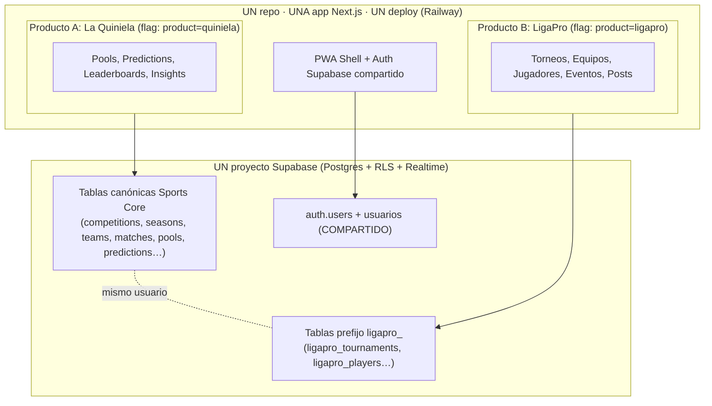
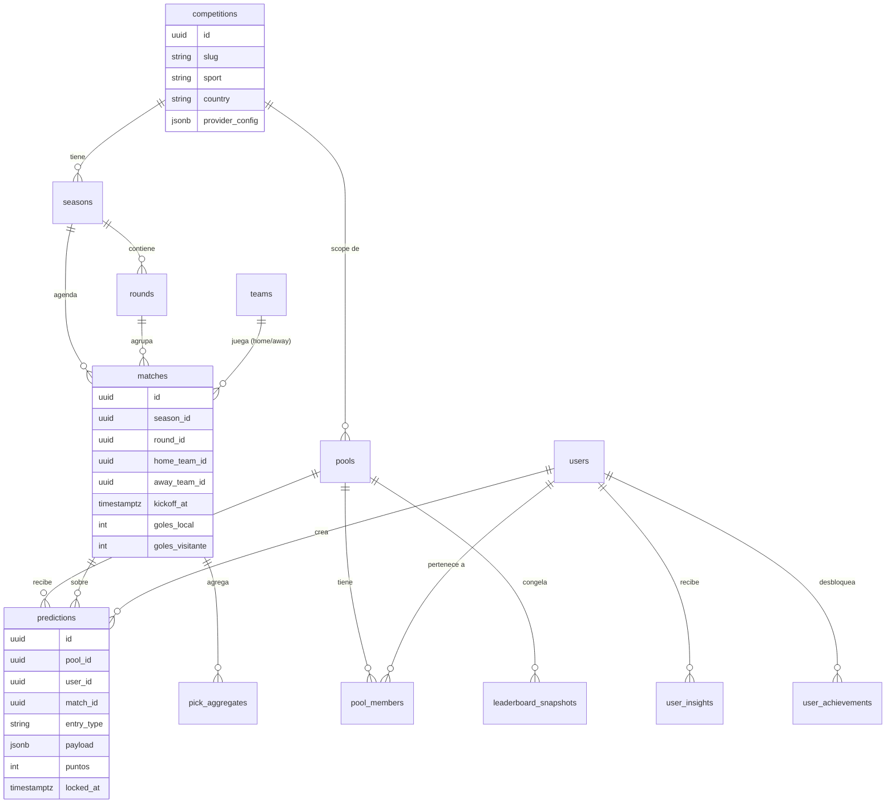
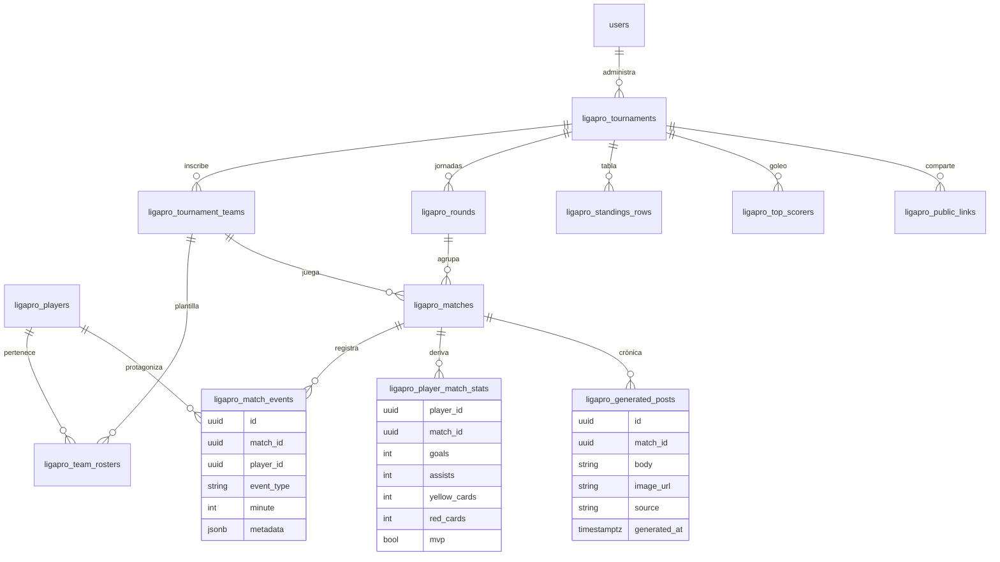
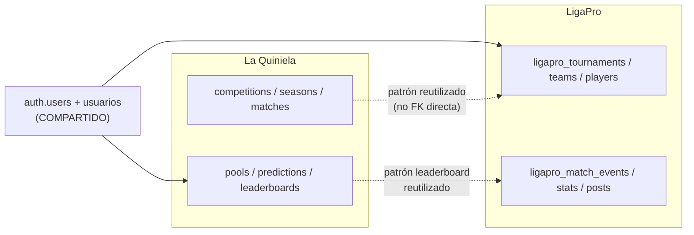
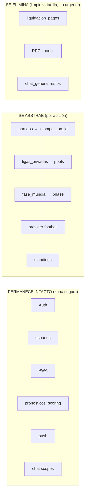
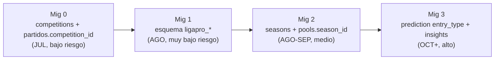
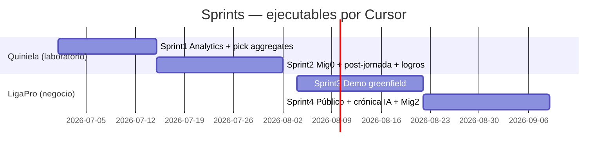

# SPORTS CORE — MASTERPLAN

> **Documento maestro de evolución técnica y de producto.**
> Fuentes oficiales de verdad: `MUNDIAL_COMPAS_SPORTS_CORE_ANALYSIS.md` (auditoría técnica) y `estrategia_sports_core.md` (estrategia ejecutiva).
> Este documento es el plan que **Cursor, ChatGPT y Claude** usarán para ejecutar el proyecto durante los próximos 6 meses.
>
> **Rol del autor:** Principal Software Architect · Product Architect · SaaS Systems Designer · Sports Platform Architect.
> **Restricción:** este documento NO contiene código, NO contiene migraciones, NO implementa nada. Es decisión y plan.

---

## Filosofía rectora (leer antes que todo)

Tres frases gobiernan cada decisión de este documento:

1. **El Mundial es el laboratorio. LigaPro es el negocio. La Quiniela multi-liga es el upside. No los confundas.**
2. **La arquitectura más simple que soporte crecimiento gana.** Nada de microservicios, nada de abstraer por abstraer, nada de sobreingeniería.
3. **Zona congelada hasta julio:** scoring, triggers de pronósticos, webhook live, UUID liga global, enum `fase_mundial`. Tocar eso durante el Mundial es riesgo **crítico**.

Regla de oro operativa: **toda evolución se hace por adición (columnas nullable, tablas nuevas, flags), nunca por mutación de lo que ya está en producción.**

---

# 1. DECISIÓN ARQUITECTÓNICA

No doy opciones. Doy decisiones.

| # | Pregunta | DECISIÓN | Cuándo | Por qué |
|---|----------|----------|--------|---------|
| **A** | ¿Seguir dentro del mismo repo? | **SÍ** | Ahora → ene 2027 | Máximo reuso, cero overhead, una sola pipeline de deploy. Bifurcar antes de tener clientes es riesgo alto sin retorno. |
| **B** | ¿Crear monorepo? | **NO ahora. SÍ en enero 2027.** | ene 2027 | Solo cuando LigaPro tenga clientes reales y exista lógica compartida real que duela duplicar. Antes es setup sin beneficio. |
| **C** | ¿Separar LigaPro (repo/app)? | **NO.** Vive en el mismo repo como **producto hermano bajo feature flag**. | — | LigaPro comparte auth, usuarios y PWA shell. Separarlo duplica infra y rompe el reuso que es justamente la ventaja. |
| **D** | ¿Crear packages compartidos? | **NO ahora.** Se extrae `packages/sports-core` desde `src/lib` cuando se haga el monorepo (ene 2027). | ene 2027 | Hoy `src/lib` ya es el "core" de facto. Extraerlo prematuramente solo añade fricción de imports. |
| **E** | ¿Mantener un solo Supabase? | **SÍ. Un único proyecto Supabase.** | Indefinido (hasta 50+ torneos LigaPro simultáneos) | Auth compartido = un usuario juega quiniela y administra su liga con la misma cuenta. Dos proyectos = costo doble y no se comparten usuarios. |
| **F** | ¿Separar esquemas? | **SÍ, lógicamente, por convención de prefijos.** LigaPro usa prefijo `ligapro_` en el schema `public`. Sports Core de quiniela mantiene nombres canónicos. | Agosto | Aislamiento mental y de RLS sin la complejidad de cross-schema joins. Migrar a schema dedicado `ligapro` solo si crece mucho. |
| **G** | ¿Separar bases de datos? | **NO.** | — | No hay ninguna razón técnica ni de escala. Un Postgres con RLS es suficiente para ambos productos en este horizonte. |

### Resumen de la decisión arquitectónica



**Marca:** branding separado a nivel UI/dominio (`La Quiniela` vs `LigaPro`), **mismo código y misma base de datos por debajo**. El dominio físico (`mundial-compas.up.railway.app`) no cambia hasta que haya razón comercial.

---

# 2. SPORTS CORE CANÓNICO

El modelo conceptual definitivo. Lo divido en tres anillos: **Núcleo deportivo** (compartido por ambos productos), **Quiniela** (Producto A) y **LigaPro** (Producto B). Las entidades compartidas son el verdadero "Sports Core".

### 2.1 Anillo 1 — Núcleo deportivo compartido

| Entidad | Qué representa | Existe hoy | Nota de evolución |
|---------|----------------|------------|-------------------|
| `competitions` | Mundial, Liga MX, Premier, Champions, o torneo amateur | ❌ | Tabla nueva. Mundial = fila 1. |
| `seasons` | Edición/temporada de una competencia (2026, 2025/26) | ❌ | FK a `competitions`. |
| `rounds` | Jornada / matchday / fase | parcial (jornada en `partidos`) | `phase` genérico reemplaza conceptualmente a `fase_mundial`. |
| `teams` | Equipo canónico (selección o club o equipo amateur) | ⚠️ (strings en `partidos`) | Registro real con `external_ids`. |
| `matches` | Partido | ✅ (`partidos`, Mundial-centric) | Se le añade `competition_id` / `season_id` nullable. |
| `users` | Usuario de plataforma | ✅ (`usuarios` + `auth.users`) | Intacto. Compartido entre productos. |

### 2.2 Anillo 2 — Producto A: La Quiniela

| Entidad | Qué representa | Existe hoy | Nota |
|---------|----------------|------------|------|
| `groups` / `pools` | Pool de pronóstico (global o privado) | ✅ (`ligas_privadas` + `liga_miembros`) | Se le añade `competition_season_id` para no mezclar competencias. |
| `predictions` | Pronóstico de un usuario | ✅ (`pronosticos`, solo exact_score) | Hoy intocable. Futuro: `entry_type` para ProGol/survivor/torneo. |
| `leaderboards` | Ranking segmentado | ✅ (RPC `tabla_liderato_quiniela`) | Patrón reutilizable; opcionalmente snapshots por jornada. |
| `leaderboard_snapshots` | Posición congelada por jornada | ❌ | Habilita delta de ranking e insights. |
| `pick_aggregates` | "% que eligió X" | ❌ | Materialización post-partido. Base de la IA falsa de mayor ROI. |
| `user_insights` | Insight generado por usuario/jornada | ❌ | `source: rule \| llm`. |
| `user_achievements` | Logros desbloqueados | ❌ | Reglas simples. |
| `notifications` | Cola in-app + push | ✅ (`notificaciones`) | Intacto. |

### 2.3 Anillo 3 — Producto B: LigaPro (prefijo `ligapro_`)

| Entidad | Qué representa | Existe hoy | Nota |
|---------|----------------|------------|------|
| `ligapro_tournaments` | Torneo amateur (categoría, edición) | ❌ | Equivalente a `competitions`+`seasons` para el mundo amateur. |
| `ligapro_tournament_teams` | Equipos inscritos | ❌ | |
| `ligapro_players` | Jugador con dorsal | ❌ | |
| `ligapro_team_rosters` | Plantilla por torneo | ❌ | |
| `ligapro_match_events` | Gol, tarjeta, MVP, sustitución | ❌ | **El dato que hace creíble a la IA.** Sin esto, la IA alucina. |
| `ligapro_player_match_stats` | Stats por jugador/partido | ❌ | Derivado de eventos. |
| `ligapro_standings_rows` | Tabla persistida | ❌ | LigaPro persiste tabla (la quiniela la calcula on-the-fly). |
| `ligapro_top_scorers` | Goleo agregado | ❌ | Derivado. |
| `ligapro_generated_posts` | Texto/imagen para Facebook | ❌ | Output del pipeline IA. |
| `ligapro_public_links` | URL pública read-only | ❌ | Tabla/ruta para compartir sin login. |

### 2.4 Diagrama — Núcleo compartido + Quiniela



### 2.5 Diagrama — LigaPro (Producto B)



### 2.6 Diagrama — Cómo se relacionan los dos productos sobre un solo core



**Relación clave:** La Quiniela y LigaPro **comparten usuarios y patrones de diseño**, pero **no comparten FKs de dominio**. El "core" reutilizable es conceptual (auth, leaderboard, scopes, chat, push, PWA) y de código (`src/lib`), no un acoplamiento de tablas. Esto evita que un cambio en LigaPro rompa la quiniela y viceversa.

---

# 3. REUTILIZACIÓN

Qué hace cada parte del Mundial Compas actual en la transición.

| Componente actual | Acción | Detalle |
|-------------------|--------|---------|
| Auth Supabase (`@supabase/ssr`, middleware) | **Permanece intacto** | Base compartida de ambos productos. |
| `usuarios` (perfil) | **Permanece intacto** | Compartido. Columnas legado (`quiniela_paga`, `terminos_honor_*`) se ignoran, no se borran. |
| PWA shell, manifest, sw.js | **Permanece intacto** | Reutilizado por LigaPro. |
| `pronosticos` + scoring RPC + triggers | **Permanece intacto (ZONA CONGELADA)** | No se toca hasta octubre. ProGol/survivor llegan por adición. |
| `tabla_liderato_quiniela` (RPC) | **Permanece + se reutiliza como patrón** | El patrón "RPC de ranking segmentado" se copia para LigaPro standings. |
| Chat scopes (`partido_global`, `grupo_privado`) | **Permanece + se reutiliza** | Nuevo scope `torneo`/`equipo` para LigaPro. |
| Push pipeline (`notificaciones`, web-push) | **Permanece + se reutiliza** | LigaPro lo usa opcional. |
| `ligas_privadas` + `liga_miembros` | **Se renombra conceptualmente a `pools`** + se le **añade** `competition_season_id` | NO rename físico de tabla durante el Mundial. El concepto evoluciona a "pool"; la tabla física mantiene su nombre hasta una migración segura post-octubre. |
| `partidos` | **Se abstrae** vía columna `competition_id`/`season_id` nullable + backfill | Sigue siendo la tabla de partidos; gana scope multi-competencia por adición. |
| `fase_mundial` (enum Postgres) | **Se abstrae conceptualmente a `phase`** | NO se migra el enum existente. Las tablas nuevas usan `phase` genérico (texto/lookup). |
| `standings/*` (cálculo en TS) | **Se abstrae** | Patrón reutilizable; LigaPro persiste tabla, la quiniela puede seguir calculando. |
| Provider football dual (apifootball + api-sports) | **Se abstrae** (registry por competencia) — pero **después** de julio | Hoy es deuda alta; parametrizar `league 28` a config DB. No urgente para LigaPro (captura manual). |
| Dual webhook (`/webhooks/football` + `/webhooks/api-football`) | **Se consolida (deuda)** post-Mundial | No tocar durante el torneo. |
| Cooperacha / liquidación (`liquidacion_pagos`, RPCs honor) | **Se elimina (futuro)** | Ya retirado en UI. Borrar tablas/RPCs solo en una migración de limpieza post-octubre. No es urgente. |
| Chat general (`/chat-general`) | **Ya eliminado** | Solo queda redirect. |
| `pilot-config.ts` (UCL, Concacaf) | **Se absorbe** en `competitions` | El concepto "pilot" se vuelve simplemente "otra competencia". |
| Analytics scaffold (`src/lib/analytics`) | **Se activa** (PostHog), no se reescribe | Conectar proveedor, mantener política sin PII. |
| Narración templates (`narracion/*`) | **Permanece + se reutiliza** como base determinística | Es el "borrador" que la IA LLM mejora. |
| `LIGA_GLOBAL_ID` hardcode | **Se parametriza con cuidado** | Solo cuando se toquen triggers (octubre). Antes, intocable. |

**Resumen visual:**



---

# 4. MIGRACIONES

Orden exacto. Cada migración es **aditiva y reversible**. Nada destructivo durante el Mundial.

> Recordatorio: este documento **no genera** las migraciones, solo define su secuencia, riesgo y rollback.

### Migración 0 — Fundación de competencias (segura, durante el Mundial)

| Atributo | Valor |
|----------|-------|
| **Qué hace** | Crea tabla `competitions` con una fila (Mundial). Añade `competition_id UUID NULL` a `partidos`. Backfill: todos los partidos actuales → UUID Mundial. |
| **Riesgo** | **Bajo** — columna nullable, no toca triggers, RLS ni scoring. |
| **Complejidad** | Baja. |
| **Rollback** | `DROP COLUMN competition_id` + `DROP TABLE competitions`. Sin pérdida de datos de producción. |
| **Cuándo** | Puede hacerse en julio sin riesgo (idealmente al final, baja actividad). |

### Migración 1 — Esquema LigaPro aislado (segura, paralela)

| Atributo | Valor |
|----------|-------|
| **Qué hace** | Crea TODAS las tablas `ligapro_*` (tournaments, teams, players, rosters, matches, match_events, player_match_stats, standings_rows, top_scorers, generated_posts, public_links) + RLS por administrador. |
| **Riesgo** | **Muy bajo** — tablas nuevas con prefijo, cero interacción con quiniela. |
| **Complejidad** | Media (es el grueso del modelo nuevo, pero greenfield). |
| **Rollback** | `DROP TABLE ligapro_*`. No afecta producción de la quiniela. |
| **Cuándo** | Agosto (inicio LigaPro). |

### Migración 2 — Seasons + scope de competencia en pools (semi-sensible)

| Atributo | Valor |
|----------|-------|
| **Qué hace** | Crea `seasons` (FK a `competitions`) y `rounds`. Añade `competition_season_id UUID NULL` a `ligas_privadas` (pools) y backfill al season del Mundial. Añade `season_id`/`round_id` nullable a `partidos`. |
| **Riesgo** | **Medio** — toca `ligas_privadas` (tiene RLS con historial de recursión). Mitigación: columnas nullable, no se cambian policies existentes. |
| **Complejidad** | Media. |
| **Rollback** | Drop de columnas nuevas + drop `seasons`/`rounds`. RLS sin cambios = sin riesgo de recursión. |
| **Cuándo** | Agosto–septiembre (post-Mundial). |

### Migración 3 — Abstracción de predicciones + insights (sensible, post-Mundial)

| Atributo | Valor |
|----------|-------|
| **Qué hace** | Añade `entry_type` (default `exact_score`) y `payload JSONB` a `pronosticos` SIN tocar el scoring existente. Crea `pick_aggregates`, `leaderboard_snapshots`, `user_insights`, `user_achievements`. RPC nuevo `calcular_puntos_entry` que delega a `calcular_puntos_pronostico` para `exact_score`. |
| **Riesgo** | **Alto** — toca el corazón del scoring. Mitigación: feature flag por pool; el RPC viejo sigue siendo el path por defecto; todo pronóstico histórico permanece `exact_score`. |
| **Complejidad** | Alta. |
| **Rollback** | Drop columnas/tablas nuevas; el RPC viejo nunca se modificó, así que la quiniela vuelve al estado previo intacta. |
| **Cuándo** | **Octubre en adelante.** Nunca antes. |



---

# 5. PLAN PARA JULIO (durante el Mundial)

**Objetivo del mes:** no romper nada + empezar a ver datos reales + sembrar LigaPro en papel.

### Qué SÍ se puede hacer

| Acción | Riesgo | Justificación |
|--------|--------|---------------|
| Activar **PostHog** (`NEXT_PUBLIC_ANALYTICS_ENABLED=true`) + `trackPageView` | Bajo | Dejar de operar a ciegas. El scaffold ya existe. |
| Estabilizar **webhook + push** (corregir enum notificaciones, lint crítico) | Bajo-medio | Solo fixes defensivos, no rediseño. |
| **Pick aggregates** (`% que eligió X`) — SQL puro, post-partido | Bajo | IA falsa de mayor ROI; lectura, no toca escritura de pronósticos. |
| **Migración 0** (competitions + `partidos.competition_id` nullable) | Bajo | Aditiva, reversible, sin tocar triggers. Hacer al final de julio. |
| **Diseñar en papel** el modelo LigaPro completo | Cero | Sin migraciones aún. Solo entidades y flujos. |

### Qué NO se debe tocar (ZONA CONGELADA)

- `calcular_puntos_pronostico` y `recalcular_puntos_partido`.
- Trigger `trg_partido_finalizado_puntos`.
- Pipeline webhook live + relay WS de partidos en curso.
- UUID `LIGA_GLOBAL_ID` en triggers.
- Enum `fase_mundial`.
- Shape de la tabla `pronosticos`.
- RLS de `liga_miembros`.

### Qué NO se debe construir todavía

- ProGol, survivor, quiniela mixta, quiniela por torneo.
- Multi-competencia activa en UI.
- Cualquier feature LLM.
- Admin de plataforma completo (Supabase Studio + PostHog son el admin).
- Graph API de Facebook.

---

# 6. PLAN PARA AGOSTO (inicio Sports Core)

**Objetivo del mes:** poner los cimientos del core multi-competencia + arrancar LigaPro, con cambios mínimos y aislados.

| Acción | Migración | Riesgo |
|--------|-----------|--------|
| Crear esquema `ligapro_*` completo | **Migración 1** | Muy bajo (greenfield) |
| Crear `seasons` + `rounds`; añadir `competition_season_id` a pools y `partidos` | **Migración 2** | Medio (columnas nullable) |
| Parametrizar `APIFOOTBALL_LEAGUE_ID` por competencia en **config DB** (no env global) | parte de Mig 2 | Bajo |
| Arrancar **LigaPro Demo** (ver sección 7) sobre el esquema nuevo | — | Bajo (producto aislado) |
| IA ligera de quiniela: **modal post-jornada** rule-based + **logros** | — | Bajo (lectura) |

### Cambios mínimos — principios de agosto

- **Cero cambios al scoring de la quiniela.** Sigue congelado hasta octubre.
- Todo lo nuevo de LigaPro es greenfield bajo prefijo → no puede romper la quiniela.
- `seasons` y `competition_season_id` se añaden nullable y con backfill; las queries actuales siguen funcionando sin filtrar por season.
- Feature flag `product=quiniela|ligapro` controla qué UI se monta. El Mundial sigue siendo el default.

---

# 7. PLAN PARA LIGAPRO (MVP Demo)

**No es producto final. Es una demo vendedora de 3 minutos.** Su único trabajo: hacer que un administrador de cancha diga *"así quiero que se vea mi liga"* y pregunte cuándo puede empezar.

### Las cinco preguntas que la demo debe responder

| Pregunta | Respuesta en la demo |
|----------|----------------------|
| **¿Qué ve un administrador?** | Dashboard de su liga: nombre, escudo, **tabla de posiciones actualizada**, **goleador de la semana**, jornada actual. Efecto WOW inmediato (0:00–0:30). |
| **¿Qué captura?** | Resultado de un partido en **3 taps**: partido → marcador → guardar. Eventos incrementales (+gol, +tarjeta, MVP) sin formulario largo (1:00–1:40). |
| **¿Qué publica?** | **Texto auto-generado para Facebook**: *"Jornada 5 \| Águilas FC 3–1 Leones \| Doblete de García min 23 y 67. Leones sigue líder con 14 pts."* (0:30–1:00). |
| **¿Qué comparte?** | **Link público read-only** (`/p/[slug]`) de la tabla, para papás y equipos, sin necesidad de app ni login (1:00–1:40). |
| **¿Qué le ahorra tiempo?** | La tabla se actualiza **sola** tras capturar; la crónica se escribe **sola**. Pregunta de cierre: *"¿Cuánto te tomaría escribir esto y actualizar la tabla a mano?"* (siempre: "un buen rato"). |

### Alcance MVP Demo (lo mínimo que impresiona)

| Incluye | NO incluye (V2+) |
|---------|------------------|
| 1 torneo simulado, 6–8 equipos, ~3 jornadas precargadas | Inscripciones públicas, pagos, multi-torneo |
| Captura de resultado + eventos (gol, tarjeta, MVP) | Captura offline-first |
| Tabla persistida (`ligapro_standings_rows`) + goleo | Stats avanzadas / heatmaps |
| Crónica template determinística + **copy text** a portapapeles | Graph API de Facebook (publicación directa) |
| Link público read-only | Roles/permisos finos por equipo |
| Dashboard admin mobile-first | Panel de plataforma multi-cliente |

### Guion técnico de la demo (orden = trabajo emocional)

```mermaid
journey
  title LigaPro Demo — 3 minutos
  section WOW (0:00-0:30)
    Dashboard tabla + goleador: 5: Admin
  section Deseo (0:30-1:00)
    Partido + crónica Facebook: 5: Admin
  section Confianza (1:00-1:40)
    Captura 3 taps + link público: 4: Admin
  section Intención (1:40-2:20)
    Plan, precio, primer mes gratis: 3: Admin
  section Cierre (2:20-3:00)
    "¿Cuándo empieza tu torneo?": 5: Admin
```

**Regla de la demo:** nunca mandar el link sin haberlo mostrado primero en videollamada/persona. La demo es la venta.

---

# 8. IA — Clasificación por tipo, costo, complejidad y ROI

Tres categorías:
- **A — IA falsa (reglas/SQL):** determinística, cero costo de modelo, alto control.
- **B — IA híbrida:** reglas generan hechos anclados; LLM solo mejora la prosa.
- **C — IA LLM real:** el modelo genera contenido con libertad (siempre con facts anclados + guardrails).

| Feature | Tipo | Producto | Costo | Complejidad | ROI | Veredicto |
|---------|------|----------|-------|-------------|-----|-----------|
| **Pick aggregates** ("solo 8% acertó") | **A** | Quiniela | ~0 | Baja | **Muy alto** | Construir primero. Engagement puro. |
| **Modal post-jornada** (delta ranking, mejores picks) | **A** | Quiniela | ~0 | Baja-media | **Muy alto** | Retención directa. Rule-based. |
| **Logros / badges** (racha, único, top 3) | **A** | Quiniela | ~0 | Baja | Alto | Retención + compartir. |
| **Perfil de jugador** (conservador/agresivo) | **A** | Quiniela | ~0 | Media | Medio | Cuidar no estigmatizar. Reglas. |
| **Push inteligente post-jornada** (1/jornada, dato personal) | **A** | Quiniela | ~0 | Baja | Alto | Sube open rate, baja opt-out. Solo a usuarios con logro/racha. |
| **Resumen de jornada compartible** | **B** | Quiniela | Bajo | Media | Medio-alto | Template + LLM opcional para top usuarios. |
| **Crónica de partido para Facebook** | **B** | LigaPro | Bajo (batch) | Media | **Muy alto** | *El feature que convierte demo en venta.* Hechos anclados → LLM pule. |
| **Resumen de jornada narrativo (LigaPro)** | **B** | LigaPro | Bajo-medio | Media | Alto | Tabla prev/post + resultados → prosa. |
| **Frase personalizada rica multi-variable** | **C** | Quiniela | Medio | Media | Medio | Solo top N usuarios o opt-in. Cache 24h. |
| **Explicación de ranking multi-factor** | **C** | Quiniela | Medio | Alta | Bajo-medio | Diferir. Solo si los datos lo justifican. |

### Guardrails de IA (aplican a B y C)

- Pasar **solo stats agregados** al LLM (sin PII).
- **Hechos anclados** en JSON: el LLM redacta, no inventa nombres/minutos/marcadores.
- **Batch nocturno** post-jornada, nunca por request.
- **Cache** por `(entity, jornada)` 24h; `llm_generation_log` para control de costo.
- **Reglas primero, LLM solo para el último 20% de pulido.**

> Sin `ligapro_match_events` estructurados, la IA de LigaPro **alucina**. El dato estructurado es prerequisito, no opcional.

---

# 9. BACKLOG PRIORIZADO

Ordenado de mayor a menor prioridad (ROI ajustado por riesgo). Escala: Impacto/Esfuerzo/Riesgo = Bajo·Medio·Alto.

| # | Feature | Impacto | Esfuerzo | Riesgo | ROI | Producto |
|---|---------|---------|----------|--------|-----|----------|
| 1 | Activar PostHog + page_view + funnel quiniela | Alto | Bajo | Bajo | **Muy alto** | Quiniela |
| 2 | Pick aggregates ("% acertó") | Alto | Bajo | Bajo | **Muy alto** | Quiniela |
| 3 | Estabilizar webhook + push + lint crítico | Alto | Medio | Bajo | Alto | Quiniela |
| 4 | Modal post-jornada (rule-based) | Alto | Medio | Bajo | **Muy alto** | Quiniela |
| 5 | Migración 0 (competitions + partidos.competition_id) | Medio | Bajo | Bajo | Alto | Core |
| 6 | LigaPro Demo: dashboard + tabla + goleo | **Muy alto** | Medio | Bajo | **Muy alto** | LigaPro |
| 7 | LigaPro: captura resultado/eventos (3 taps) | **Muy alto** | Medio | Bajo | **Muy alto** | LigaPro |
| 8 | LigaPro: crónica template + copy Facebook | **Muy alto** | Medio | Bajo | **Muy alto** | LigaPro |
| 9 | LigaPro: link público read-only `/p/[slug]` | Alto | Medio | Bajo | Alto | LigaPro |
| 10 | Logros / badges quiniela | Medio | Bajo | Bajo | Alto | Quiniela |
| 11 | Migración 1 (esquema ligapro_*) | Alto | Medio | Bajo | Alto | LigaPro |
| 12 | Migración 2 (seasons + pools.season_id) | Medio | Medio | Medio | Medio | Core |
| 13 | Crónica LigaPro con LLM (híbrida) | Alto | Medio | Medio | Alto | LigaPro |
| 14 | Leaderboard snapshots por jornada | Medio | Medio | Bajo | Medio | Quiniela |
| 15 | Provider registry (abstraer apifootball/league 28) | Medio | Alto | Medio | Medio | Core |
| 16 | Migración 3 (entry_type + insights) | Alto | Alto | **Alto** | Medio | Quiniela |
| 17 | ProGol / 1X2 (nuevo entry_type) | Medio | Alto | Alto | Medio | Quiniela |
| 18 | Survivor | Medio | Alto | Alto | Bajo-medio | Quiniela |
| 19 | Quiniela por torneo (outright) | Medio | Alto | Medio | Bajo-medio | Quiniela |
| 20 | Consolidar dual webhook (deuda) | Bajo | Alto | Medio | Bajo | Core |
| 21 | Limpieza cooperacha/liquidación legacy | Bajo | Bajo | Bajo | Bajo | Core |
| 22 | Facebook Graph API | Bajo | Alto | Alto | Bajo | LigaPro |
| 23 | Offline-first LigaPro | Bajo | Alto | Medio | Bajo | LigaPro |

**Línea de corte para los próximos 6 meses:** items **1–14** son el foco. **15–23 se difieren** salvo que un cliente pague por ellos.

---

# 10. SPRINTS

Cuatro sprints ejecutables por Cursor. Cada uno tiene objetivo, entregables, archivos afectados y riesgo. Duración sugerida: ~2 semanas cada uno.

### Sprint 1 — "Dejar de operar a ciegas + IA falsa #1" (Julio)

| Atributo | Detalle |
|----------|---------|
| **Objetivo** | Ver datos reales del Mundial y entregar el primer insight de alto ROI sin tocar zona congelada. |
| **Entregables** | (1) PostHog activo con `page_view` en layouts + funnel quiniela. (2) `pick_aggregates` (vista/materialización post-partido) + UI "solo X% acertó" en detalle de partido. (3) Fixes defensivos webhook/push + lint crítico. |
| **Archivos afectados** | `src/lib/analytics/track.ts`, `events.ts`; layouts client de `(app)`; `src/lib/quiniela/queries.ts` (lectura); nuevo `src/lib/insights/pick-aggregates.ts`; `src/components/partidos/*` (UI); fixes en `src/lib/apifootball/webhook/*`. |
| **Riesgo** | **Bajo.** Todo es lectura o aditivo. No toca scoring, triggers, ni shape de `pronosticos`. |

### Sprint 2 — "Cimiento del core + IA falsa #2" (Julio→Agosto)

| Atributo | Detalle |
|----------|---------|
| **Objetivo** | Sentar la base multi-competencia (Migración 0) y subir retención con el modal post-jornada. |
| **Entregables** | (1) Migración 0: `competitions` + `partidos.competition_id` nullable + backfill Mundial. (2) Modal post-jornada rule-based (delta ranking, mejores picks). (3) Logros/badges (5–10 reglas) + tabla `user_achievements`. (4) Push inteligente post-jornada (1/jornada, opt-out friendly). |
| **Archivos afectados** | `supabase/migrations/` (Mig 0); `src/lib/leaderboard/queries.ts`; nuevo `src/lib/insights/post-jornada.ts`, `achievements.ts`; `src/components/leaderboard/*`, nuevo modal; `src/lib/push/send.ts` (regla selectiva). |
| **Riesgo** | **Bajo-medio.** Mig 0 es aditiva/reversible. Push selectivo requiere cuidado para no spamear. |

### Sprint 3 — "LigaPro Demo greenfield" (Agosto)

| Atributo | Detalle |
|----------|---------|
| **Objetivo** | Tener una demo vendedora de LigaPro funcionando sobre esquema aislado. |
| **Entregables** | (1) Migración 1: esquema `ligapro_*` completo + RLS por admin. (2) Dashboard admin mobile-first (tabla + goleador). (3) Captura resultado/eventos en 3 taps. (4) Tabla persistida + goleo derivado. (5) Crónica template determinística + botón "copiar para Facebook". (6) Torneo simulado 6–8 equipos seedeado. |
| **Archivos afectados** | `supabase/migrations/` (Mig 1) + seed; nueva ruta `src/app/(ligapro)/*` bajo flag `product=ligapro`; `src/lib/ligapro/*` (actions, queries, standings, posts); `src/components/ligapro/*`. |
| **Riesgo** | **Bajo.** Greenfield aislado por prefijo; no puede romper la quiniela. Riesgo de scope creep → mantener alcance demo. |

### Sprint 4 — "Compartir + crónica IA híbrida" (Agosto→Septiembre)

| Atributo | Detalle |
|----------|---------|
| **Objetivo** | Cerrar el loop de venta de LigaPro (compartir público + crónica mágica) y preparar core para multi-competencia. |
| **Entregables** | (1) Link público read-only `/p/[slug]` (tabla + crónica). (2) Crónica LigaPro híbrida: facts JSON anclados → LLM pule prosa + cache + `llm_generation_log`. (3) Migración 2: `seasons` + `rounds` + `competition_season_id` en pools (nullable, backfill). (4) `APIFOOTBALL_LEAGUE_ID` movido a config DB. |
| **Archivos afectados** | nueva ruta pública `src/app/p/[slug]/*`; `src/lib/ligapro/posts.ts` (LLM híbrido); `supabase/migrations/` (Mig 2); `src/lib/standings/*` (scope season); config provider en DB. |
| **Riesgo** | **Medio.** Mig 2 toca `ligas_privadas` (RLS sensible) → solo columnas nullable, sin cambiar policies. LLM → guardrails de costo obligatorios. |



**Nota para octubre+ (fuera de los 4 sprints):** Migración 3 (entry_type + insights), ProGol/1X2, Liga MX piloto. No se planifican a detalle aquí porque dependen del aprendizaje del Mundial y de los primeros clientes de LigaPro.

---

## Anexo — Decisiones congeladas (one-liner para Cursor/ChatGPT/Claude)

| Tema | Decisión inamovible este semestre |
|------|-----------------------------------|
| Repo | Uno solo. Monorepo hasta enero 2027. |
| Supabase | Uno solo. Prefijo `ligapro_` para Producto B. |
| Scoring quiniela | Congelado hasta octubre. Evolución por adición. |
| Primer producto a construir | LigaPro Demo (es la venta). |
| Primer producto a monetizar | LigaPro (admin de cancha = pagador real). |
| IA | Reglas/SQL primero. LLM solo híbrido con facts anclados. |
| Facebook | Copy-text. NO Graph API. |
| Offline-first | NO hasta V2. |
| ProGol/survivor/mixta | NO hasta octubre mínimo. |
| Hardcodes a parametrizar | Solo `competition_id`, `LIGA_GLOBAL_ID` (en triggers, oct), `fase_mundial`→`phase`. El resto espera. |

> **El Mundial es tu laboratorio. LigaPro es tu negocio. No los confundas.**
