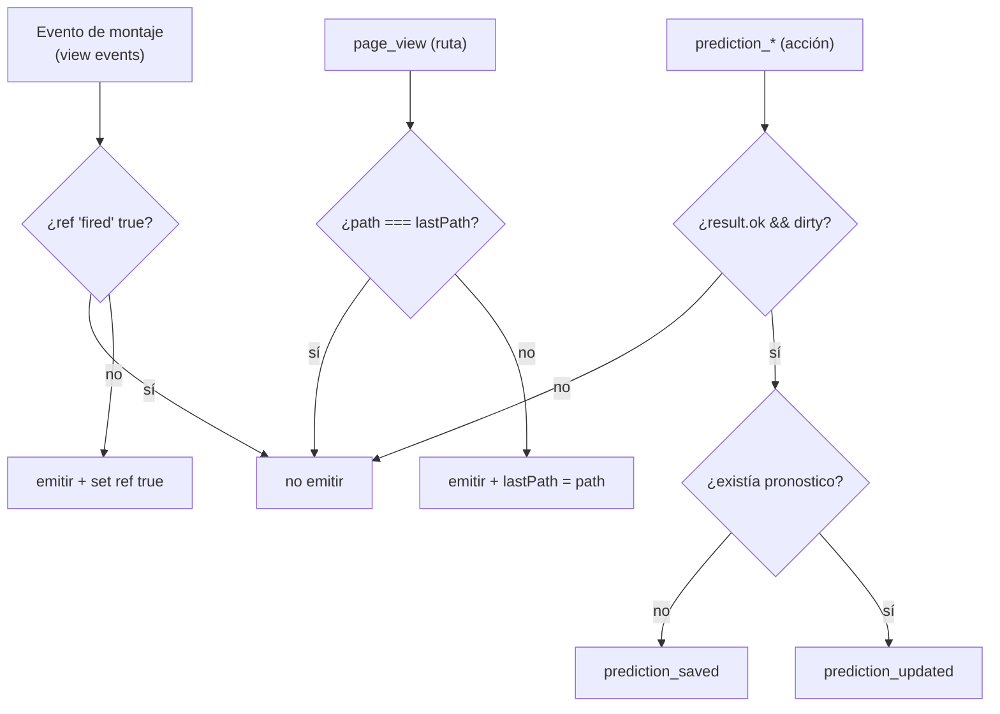

# SPRINT 1 — PLAN DE EJECUCIÓN

> **Objetivo del Sprint 1** (según `SPORTS_CORE_MASTERPLAN.md`): *"Dejar de operar a ciegas + IA falsa #1"*.
> Entregables: (1) PostHog activo + `page_view`, (2) `pick_aggregates` ("solo X% acertó"), (3) fixes defensivos webhook/push + lint crítico.
>
> **Este documento es solo un plan de ejecución.** No contiene código, no contiene migraciones, no modifica archivos. Es el resultado de una **auditoría read-only** del repositorio real contrastada contra el masterplan.
>
> **Regla heredada (zona congelada):** no tocar `calcular_puntos_pronostico`, `recalcular_puntos_partido`, `trg_partido_finalizado_puntos`, `partidos_after_update_puntos`, el shape de `pronosticos`, ni el `LIGA_GLOBAL_ID` en triggers. Todo lo de Sprint 1 es **lectura o aditivo**.

---

## Resumen de hallazgos (TL;DR de la auditoría)

| Área | Estado real en el repo | Riesgo de tocar |
|------|------------------------|-----------------|
| PostHog | **NO instalado.** Existe scaffold noop (`track.ts`, `events.ts`, `AnalyticsViewTracker.tsx`) pero **ningún provider, ninguna captura real, sin `trackPageView`, sin feature flags**. | Bajo (aditivo) |
| Pick aggregates | **No existe.** Los datos ya están disponibles: `fetchPronosticosPartidoTodos` ya devuelve todos los pronósticos + resultado real post-partido. | Muy bajo (puede calcularse en TS sin tocar BD) |
| Webhooks | **Dos stacks coexisten** (`/webhooks/football` primario + `/webhooks/api-football` legacy). Idempotencia presente. Relay WS externo obligatorio para live. | Alto si se rediseña; bajo si solo se añade logging |
| Push | **Funcional** (subscribe, dispatch, limpieza stale, mute). Posible gap: drenado de cola `notificaciones` acoplado al webhook. | Medio |
| Eventos analíticos | 22 eventos tipados existen; faltan `page_view`, `group_view`, `match_view`, y distinción `prediction_updated`. | Bajo (aditivo en `events.ts`) |

---

# 1. POSTHOG

### 1.1 Verificación punto por punto

| ¿Existe? | Estado | Evidencia |
|----------|--------|-----------|
| PostHog instalado | ❌ **No** | `package.json` no lista `posthog-js` ni `posthog-node`. Solo `@supabase/*`, `next`, `react`, `web-push`. |
| Configuración (env) | ⚠️ Parcial | Solo existe `NEXT_PUBLIC_ANALYTICS_ENABLED`. **Faltan** `NEXT_PUBLIC_POSTHOG_KEY` y `NEXT_PUBLIC_POSTHOG_HOST`. |
| Wrapper | ✅ Sí (pero noop) | `src/lib/analytics/track.ts` → `trackEvent` / `trackEventServer`. La captura real es un comentario: `// posthog.capture(name, properties)`. |
| Provider | ❌ **No** | `src/app/layout.tsx` no monta ningún `PostHogProvider`. Solo monta fuentes + `PendingHonorTermsApplier`. |
| `trackPageView` | ❌ **No existe** | Hay `AnalyticsViewTracker.tsx` que dispara **un evento al montar** (no es page_view por ruta). En App Router, la navegación cliente NO genera `$pageview` automático. |
| `trackEvent` | ✅ Existe, ⚠️ noop | Tipado y centralizado, pero no emite a ningún destino en prod. |
| Feature flags | ❌ **No existen** | No hay uso de `posthog.isFeatureEnabled` ni gating por flags. El masterplan los pide (flag `product=quiniela\|ligapro`) pero **no son objetivo de Sprint 1**. |

### 1.2 Qué falta exactamente

1. **Dependencia:** instalar `posthog-js` (cliente). `posthog-node` es **opcional** y solo si se quiere capturar desde server actions; recomendación: **diferir server-side**, capturar todo desde cliente en Sprint 1.
2. **Env vars:** `NEXT_PUBLIC_POSTHOG_KEY`, `NEXT_PUBLIC_POSTHOG_HOST` (ej. `https://us.i.posthog.com`). Documentar en `docs/ANALYTICS.md` y `.env.example`.
3. **Provider cliente:** componente `PostHogProvider` (`"use client"`) que inicializa el SDK una sola vez y se monta en `src/app/layout.tsx` envolviendo `{children}`. Debe respetar `NEXT_PUBLIC_ANALYTICS_ENABLED` (si está off → no inicializa).
4. **Captura real en el wrapper:** reemplazar el comentario en `trackEvent` por `posthog.capture(name, properties)` (guardado tras el check `isAnalyticsEnabled`). Mantener la política sin PII intacta.
5. **`trackPageView` por ruta:** un `PageViewTracker` cliente que use `usePathname()`/`useSearchParams()` y dispare `page_view` en cada cambio de ruta (App Router no lo hace solo). Montar en `(app)/layout.tsx`.
6. **Identificación de usuario (opcional, recomendado):** `posthog.identify(user.id)` tras login, sin email ni nombre (solo UUID). Puede hacerse en el provider leyendo sesión, o diferirse.

### 1.3 Archivos involucrados

| Archivo | Acción |
|---------|--------|
| `package.json` | Añadir `posthog-js`. |
| `src/lib/analytics/track.ts` | Conectar `posthog.capture` real (cliente). |
| `src/lib/analytics/events.ts` | Añadir nuevos eventos (ver §5). |
| `src/app/layout.tsx` | Montar `PostHogProvider`. |
| `src/components/analytics/PostHogProvider.tsx` | **Nuevo** (provider + init). |
| `src/components/analytics/PageViewTracker.tsx` | **Nuevo** (`trackPageView` por ruta). |
| `src/app/(app)/layout.tsx` | Montar `PageViewTracker`. |
| `docs/ANALYTICS.md`, `.env.example` | Documentar env + activación. |

### 1.4 Riesgos

- **Bajo, todo aditivo.** El wrapper ya está gateado por `NEXT_PUBLIC_ANALYTICS_ENABLED`: si la env no está, queda noop como hoy.
- **Doble disparo en React StrictMode/dev:** el `PageViewTracker` debe deduplicar por ruta (ver §5.7).
- **PII:** riesgo real si se captura email/nombre. Mitigación: `identify` solo con UUID; nunca pasar `nombre_visible`, contenido de chat ni motivos.
- **Bundle size / consent:** PostHog añade peso al cliente; configurar `autocapture` con criterio (recomendado `capture_pageview: false` porque lo haremos manual con App Router).
- **Next 16:** confirmar que el provider sea client component puro; no usar APIs deprecadas del middleware.

---

# 2. PICK AGGREGATES

### 2.1 Tablas y datos involucrados (ya existen)

| Dato | Fuente | Detalle |
|------|--------|---------|
| Pronósticos | `pronosticos` | `(liga_id, usuario_id, partido_id, goles_local, goles_visitante, puntos)`. `UNIQUE(liga_id, usuario_id, partido_id)`. |
| Resultado real | `partidos` | `marcador_local`, `marcador_visitante`, `estatus`, `puntos_calculados`. |
| Scoring | `calcular_puntos_pronostico` (3/1/0) | **NO se toca.** Solo se lee `pronosticos.puntos`. |
| Índice clave | `idx_pronosticos_tabla (liga_id, partido_id, puntos DESC)` | Cubre el `GROUP BY partido_id` eficientemente. |

**Hallazgo crítico (quick win):** la server action `fetchPronosticosPartidoTodos` (`src/lib/quiniela/pronosticos-partido-action.ts`) **ya devuelve todos los pronósticos del partido + el resultado real**, y solo se habilita cuando `partido.estatus === 'finalizado'`. Los datos para "solo X% acertó" **ya están en memoria** en el panel post-partido.

### 2.2 Cómo calcular el porcentaje de picks

Dos agregaciones, ambas derivables del set de participantes:

1. **Por marcador exacto:** `% = count(picks con (gl, gv)) / total_picks` → "Solo el 8% acertó 2–1".
2. **Por tendencia 1X2:** normalizar cada pick a `local` / `empate` / `visitante` (signo de `gl - gv`) → "El 62% pensó que ganaba local".

El "acierto" se cruza contra `resultadoReal` (ya disponible). El marcador más popular y el del usuario se resaltan.

### 2.3 Dónde almacenar — DECISIÓN

| Opción | Veredicto Sprint 1 | Razón |
|--------|--------------------|-------|
| **Query dinámica en TS (cálculo en cliente/servidor desde datos ya cargados)** | ✅ **ELEGIDA** | Cero cambios de BD, cero migración, cero riesgo en plena ventana de Mundial. Escala perfecta a la cardinalidad de un partido (cientos/miles de picks). |
| Vista SQL (`VIEW`) | ⚠️ Opcional (Fase C) | Útil si se quiere consumir desde varios lugares; sigue siendo read-only y reversible (`DROP VIEW`). |
| Tabla materializada / tabla `pick_aggregates` | ❌ **NO en Sprint 1** | Requiere disparador de refresh. El disparo natural es "al finalizar partido" = `trg_partido_finalizado_puntos` → **zona congelada**. Diferir a post-octubre (Migración 3 del masterplan). |

**Conclusión:** Sprint 1 calcula pick aggregates **dinámicamente en TS** a partir de lo que `fetchPronosticosPartidoTodos` ya trae. **No se crea ninguna tabla ni migración.** La materialización queda documentada como evolución futura, no como tarea de este sprint.

### 2.4 Dónde se muestra

- `src/components/quiniela/PronosticosTodosPanel.tsx` (panel "pronósticos de todos", visible post-cierre).
- Superficie: detalle de partido (`/partidos/[id]`) y dentro de la quiniela.
- Copy: badge tipo *"Solo el 8% acertó este marcador"* / *"El marcador más elegido fue 1–1 (23%)"*.

### 2.5 Archivos involucrados (sin migración)

| Archivo | Acción |
|---------|--------|
| `src/lib/insights/pick-aggregates.ts` | **Nuevo** — función pura `computePickAggregates(participantes, resultadoReal)`. |
| `src/components/quiniela/PronosticosTodosPanel.tsx` | Consumir y renderizar el agregado. |
| `src/lib/quiniela/pronosticos-partido-action.ts` | (Opcional) devolver el agregado ya calculado para evitar recomputo. |

### 2.6 Riesgo

**Muy bajo.** Solo lectura, sin tocar scoring ni schema. Único cuidado: privacidad — mostrar **porcentajes agregados**, nunca asociar un pick raro a un usuario sin su consentimiento (el panel ya muestra nombres post-partido, así que el agregado no añade exposición nueva).

---

# 3. WEBHOOKS

### 3.1 Inventario real

| Componente | Ruta / archivo | Rol |
|------------|----------------|-----|
| Webhook principal | `src/app/api/webhooks/football/route.ts` → `processFootballWebhook` (`src/lib/apifootball/webhook/process.ts`) | apifootball.com (live/relay HTTP). Auth: Bearer `API_FOOTBALL_WEBHOOK_SECRET` o header firma. |
| Webhook alterno (legacy) | `src/app/api/webhooks/api-football/route.ts` → `dispatchWebhookEvent` (`src/lib/api-football/handlers`) | api-sports.io. Idempotencia explícita vía `webhook_eventos (proveedor, evento_externo_id)`. |
| Cron sync-live | `scripts/sync-live-cron.mjs` → `POST /api/admin/sync-live?pilot=1` | Polling fallback de marcador. **`pilot=1` hardcoded.** |
| Cron lineups | `scripts/sync-lineups-cron.mjs` | Alineaciones. |
| Cron calendar | `scripts/sync-calendar-cron.mjs` | Fixtures/calendario. |
| Relay WS | `scripts/apifootball-livescore-relay.mjs` | **Relay externo obligatorio** para convertir WS apifootball → HTTP webhook. |
| Realtime | Supabase Realtime (mig. `realtime_chat_partidos`) | Chat en vivo (no marcadores). |

### 3.2 Riesgos actuales

- **Dual stack** (`football` + `api-football`): dos rutas, dos verificaciones de auth, dos formatos de payload. Mantenimiento duplicado y confusión de "cuál es el canónico" (el canónico es `football`/apifootball).
- **Dependencia del relay WS externo:** si el relay cae, no hay live por webhook; solo queda el cron de polling. Punto único de fallo operativo.
- **Acoplamiento secreto:** `API_FOOTBALL_WEBHOOK_SECRET` reutilizado en ambos stacks; `ADMIN_CARGAR_PARTIDOS_SECRET` para crons.

### 3.3 Deuda técnica

- `buildEventId` (ruta api-football) usa un **hash no criptográfico de 32 bits** (`hashBody`) para idempotencia. Riesgo de colisión bajo pero no nulo; suficiente para hoy.
- `sync-live-cron.mjs` con `?pilot=1` fijo: si el flujo cambia de "pilot" a Mundial general, el cron puede quedar apuntando al scope equivocado.
- Idempotencia visible en la ruta `api-football` pero **encapsulada en `process.ts`** para `football` → menor observabilidad desde la ruta.

### 3.4 Bugs potenciales

- **Enum `tipo_notificacion` incompleto:** históricamente causó fallos silenciosos (fix en mig. `20260530200000_fix_tipo_notificacion_fases`). Cualquier evento nuevo de webhook que genere un tipo no presente en el enum **falla en silencio**. Verificar cobertura del enum antes de la ventana de fases eliminatorias.
- **`dieciseisavos`** mezcla semántica R32/R16 en el mapeo API (documentado en el análisis). No romper, solo vigilar.

### 3.5 Quick wins (objetivo Sprint 1, defensivos)

1. **Logging estructurado** en ambas rutas (prefijo, `fixtureId`, resultado) para dejar de operar a ciegas en la ventana del Mundial.
2. **Verificar y completar el enum `tipo_notificacion`** contra todos los `tipo_evento` que el webhook puede emitir (revisión, no rediseño).
3. **Documentar** en una línea cuál webhook es canónico y cuál es legacy (evita tocar el equivocado).
4. **NO** consolidar los dos stacks en Sprint 1 (es deuda de post-Mundial, riesgo alto).

---

# 4. PUSH NOTIFICATIONS

### 4.1 Sistema actual

| Pieza | Archivo / tabla | Estado |
|-------|-----------------|--------|
| Envío | `src/lib/push/send.ts` (`sendPushToUser`, `dispatchPushForNotifications`) | ✅ Funcional |
| VAPID | `src/lib/push/vapid.ts` (`getPushEnv`) | ✅ Gateado por env; si falta, noop limpio |
| Suscripción | `POST/DELETE /api/push/subscribe` | ✅ Upsert por `endpoint`, marca `usuarios.push_habilitado` |
| Mute por partido | `POST/GET/DELETE /api/push/partidos/[partidoId]/silenciar` | ✅ |
| Clave pública | `GET /api/push/vapid-public-key` | ✅ |
| Cliente | `src/lib/push/client.ts`, `src/components/push/*` | ✅ |

### 4.2 Tablas / tokens

| Tabla | Rol |
|-------|-----|
| `push_subscriptions` | `(usuario_id, endpoint UNIQUE, p256dh, auth, user_agent)`. |
| `push_partidos_silenciados` | Mute por partido. |
| `notificaciones` | Cola in-app + push. `enviada`/`enviada_at`. Índice parcial `WHERE enviada = FALSE`. |

Tokens: VAPID `subject/publicKey/privateKey` vía env. **No** hay tokens de terceros (FCM/APNs directo) — todo Web Push estándar.

### 4.3 Qué funciona

- Alta/baja de suscripción con limpieza de `push_habilitado`.
- **Auto-limpieza de endpoints muertos** (404/410 → `delete`). Buen detalle.
- Dispatch con `tag` por partido (colapsa notificaciones repetidas).
- Mute por partido respetado en el pipeline de notificaciones.

### 4.4 Qué está incompleto / a vigilar

- **Drenado de la cola `notificaciones`:** `dispatchPushForNotifications` recibe filas y las marca `enviada`, pero **el disparo parece acoplado al flujo de webhook**. No se encontró un worker/cron dedicado que drene `notificaciones WHERE enviada = FALSE` de forma independiente. **Riesgo:** una notificación encolada fuera del webhook (p. ej. insight post-jornada futuro) podría no enviarse nunca sin un drenador. **Confirmar** si existe ese drainer; si no, es el primer arreglo real.
- **Enum `tipo_notificacion`** (mismo riesgo que §3.4): un tipo nuevo no enumerado rompe el insert de la notificación → no se envía push.
- **iOS/PWA:** dependiente de instalación PWA + permisos; frágil por plataforma (documentado como "Parcial" en el análisis).

### 4.5 Qué arreglar primero

1. **Confirmar/instaurar el drenado** de `notificaciones` (¿webhook-only o hay cron?). Es la base para el "push inteligente post-jornada" del Sprint 2.
2. **Auditar cobertura del enum `tipo_notificacion`** (compartido con webhooks).
3. **NO** rediseñar el pipeline en Sprint 1; solo cerrar el gap de drenado si se confirma ausente.

---

# 5. EVENTOS ANALÍTICOS

Diseño exacto de los 6 eventos. Convención: reutilizar nombres existentes donde ya hay instrumentación; añadir los nuevos a `src/lib/analytics/events.ts` (`AnalyticsEventMap`). **Sin PII.**

> Nota de nomenclatura: el repo ya usa `pronostico_saved` y `leaderboard_viewed`. Para no romper instrumentación existente, **mantengo esos nombres** y mapeo los solicitados. Los nuevos (`page_view`, `group_view`, `match_view`, `prediction_updated`) se añaden.

### 5.1 `page_view`

| Campo | Valor |
|-------|-------|
| **Payload** | `{ path: string }` (pathname normalizado, sin query con IDs sensibles; los UUID de ruta se mantienen para funnels técnicos). |
| **Dónde** | `PageViewTracker` (nuevo, cliente) montado en `src/app/(app)/layout.tsx`, usando `usePathname()`. |
| **Evitar duplicados** | `useRef` con el último `path` disparado; solo emitir si cambió. Resuelve el doble render de StrictMode y las re-renderizaciones. |

### 5.2 `leaderboard_view` (= `leaderboard_viewed` existente)

| Campo | Valor |
|-------|-------|
| **Payload** | `{ liga_scope: "global" \| "grupo" }` (ya definido). |
| **Dónde** | Ya instrumentado vía `AnalyticsViewTracker` en la página de leaderboard. **No requiere trabajo nuevo**, solo verificar que PostHog reciba el evento una vez activo. |
| **Evitar duplicados** | `AnalyticsViewTracker` ya usa `fired` ref (dispara una vez por montaje). |

### 5.3 `group_view` (NUEVO)

| Campo | Valor |
|-------|-------|
| **Payload** | `{ liga_scope: "grupo"; tab?: string }` (tab opcional del dashboard de grupo). |
| **Dónde** | `AnalyticsViewTracker` en `src/app/(app)/grupos/[slug]/page.tsx`. |
| **Evitar duplicados** | `fired` ref del `AnalyticsViewTracker`. Añadir clave por `slug` si se quiere uno por grupo/sesión. |

### 5.4 `match_view` (NUEVO)

| Campo | Valor |
|-------|-------|
| **Payload** | `{ partido_id: string; estatus: string }` (estatus = programado/en_vivo/finalizado; útil para medir engagement live). |
| **Dónde** | `AnalyticsViewTracker` en `src/app/(app)/partidos/[id]/page.tsx` (montado en cliente; pasar `estatus` desde el server component). |
| **Evitar duplicados** | `fired` ref. Para evitar recuento al re-entrar al mismo partido en la sesión, opcional: guardar set de `partido_id` vistos en `sessionStorage`. |

### 5.5 `prediction_saved` (= `pronostico_saved` existente, CREACIÓN)

| Campo | Valor |
|-------|-------|
| **Payload** | `{ liga_scope: "global" \| "grupo"; partido_id: string }` (ya definido). |
| **Dónde** | `PronosticoRow.handleSave`, **solo cuando `result.ok` y NO existía pronóstico previo** (`pronostico` prop ausente). Ya está disparándose en éxito; falta distinguir creación de actualización. |
| **Evitar duplicados** | Solo se emite tras `result.ok`. El botón se deshabilita con `!dirty` e `isPending`, evitando reenvíos. |

### 5.6 `prediction_updated` (NUEVO — distinguir de saved)

| Campo | Valor |
|-------|-------|
| **Payload** | `{ liga_scope: "global" \| "grupo"; partido_id: string }`. |
| **Dónde** | `PronosticoRow.handleSave`, **cuando `result.ok` y YA existía `pronostico`** (era edición). Hoy `savePronostico` hace insert-or-update; el cliente ya sabe si había `pronostico` previo, así que la distinción se hace en el componente **sin tocar la server action**. |
| **Evitar duplicados** | Solo tras `result.ok`; gate por `dirty` (no emite si no cambió el marcador). |

### 5.7 Patrón anti-duplicados (transversal)

### 5.8 Cambios en `events.ts`

Añadir al `AnalyticsEventMap`: `page_view`, `group_view`, `match_view`, `prediction_updated`. Mantener `pronostico_saved` y `leaderboard_viewed`. (Decisión de naming: conservar español existente para no romper; documentar el alias en `docs/ANALYTICS.md`.)

---

# 6. CHECKLIST DE IMPLEMENTACIÓN

> Orden pensado para minimizar riesgo: primero observabilidad (analytics), luego el insight de ROI (pick aggregates), al final lo defensivo (webhook/push). Cada fase es entregable y reversible.

### Fase A — PostHog + page_view (observabilidad)

- [ ] A1. Añadir `posthog-js` a `package.json` e instalar.
- [ ] A2. Definir env `NEXT_PUBLIC_POSTHOG_KEY` y `NEXT_PUBLIC_POSTHOG_HOST`; documentar en `docs/ANALYTICS.md` y `.env.example`.
- [ ] A3. Crear `src/components/analytics/PostHogProvider.tsx` (init único, gateado por `NEXT_PUBLIC_ANALYTICS_ENABLED`, `capture_pageview: false`).
- [ ] A4. Montar el provider en `src/app/layout.tsx`.
- [ ] A5. Conectar `posthog.capture` real dentro de `trackEvent` en `src/lib/analytics/track.ts` (mantener política sin PII).
- [ ] A6. Crear `PageViewTracker` (`usePathname`) y montarlo en `src/app/(app)/layout.tsx`.
- [ ] A7. Añadir eventos nuevos a `src/lib/analytics/events.ts` (`page_view`, `group_view`, `match_view`, `prediction_updated`).
- [ ] A8. Instrumentar `group_view` (grupos/[slug]) y `match_view` (partidos/[id]) con `AnalyticsViewTracker`.
- [ ] A9. Distinguir `prediction_saved` vs `prediction_updated` en `PronosticoRow.handleSave`.
- [ ] A10. (Opcional) `posthog.identify(user.id)` solo con UUID.
- [ ] A11. Verificar en PostHog: llegan `page_view`, `leaderboard_viewed`, `pronostico_saved`, etc.

### Fase B — Pick aggregates (IA falsa #1)

- [ ] B1. Crear `src/lib/insights/pick-aggregates.ts` con función pura (% por marcador exacto + % por tendencia 1X2), sin BD.
- [ ] B2. Conectarla en `PronosticosTodosPanel.tsx` usando los datos que ya entrega `fetchPronosticosPartidoTodos`.
- [ ] B3. Renderizar badges ("solo X% acertó", "marcador más elegido"), resaltando el pick del usuario.
- [ ] B4. Añadir evento `insight_viewed` (opcional) para medir engagement del insight.
- [ ] B5. Verificar privacidad: solo agregados; sin exponer picks individuales nuevos.

### Fase C — Defensivo webhook/push + lint

- [ ] C1. Añadir logging estructurado en `/api/webhooks/football` y `/api/webhooks/api-football`.
- [ ] C2. Auditar cobertura del enum `tipo_notificacion` vs eventos emitidos (revisión, sin migración salvo gap real → si falta un valor, es la única micro-migración aditiva justificable).
- [ ] C3. Confirmar el drenado de la cola `notificaciones` (webhook-only vs cron). Documentar; si no existe drainer, abrir tarea para Sprint 2.
- [ ] C4. Documentar webhook canónico vs legacy (una línea en `docs/`).
- [ ] C5. Resolver los errores ESLint críticos (`CURRENT_ERRORS.md`: ~19 errores) que bloqueen build limpio.
- [ ] C6. (No-objetivo) NO consolidar stacks, NO rediseñar push.

---

# 7. ESTIMACIÓN

### 7.1 Tiempo estimado

| Fase | Alcance | Estimación |
|------|---------|------------|
| Fase A | PostHog + provider + page_view + eventos nuevos | **1.5–2.5 días** |
| Fase B | Pick aggregates (TS puro + UI) | **0.5–1 día** |
| Fase C | Logging webhook + enum audit + drainer check + lint | **1–2 días** |
| **Total Sprint 1** | | **3–5.5 días** (alineado con la ventana ~2 semanas del masterplan, con holgura) |

### 7.2 Archivos afectados (consolidado)

**Nuevos (4):**
- `src/components/analytics/PostHogProvider.tsx`
- `src/components/analytics/PageViewTracker.tsx`
- `src/lib/insights/pick-aggregates.ts`
- (doc) actualización de `.env.example`

**Modificados (~9):**
- `package.json`
- `src/lib/analytics/track.ts`
- `src/lib/analytics/events.ts`
- `src/app/layout.tsx`
- `src/app/(app)/layout.tsx`
- `src/app/(app)/grupos/[slug]/page.tsx`
- `src/app/(app)/partidos/[id]/page.tsx`
- `src/components/quiniela/PronosticoRow.tsx`
- `src/components/quiniela/PronosticosTodosPanel.tsx`
- `docs/ANALYTICS.md`
- (revisión, posible micro-migración aditiva) enum `tipo_notificacion` + rutas webhook (logging)

**NO se tocan (zona congelada):**
- `calcular_puntos_pronostico`, `recalcular_puntos_partido`, `trg_partido_finalizado_puntos`, `partidos_after_update_puntos`
- shape de `pronosticos` y `partidos`
- `LIGA_GLOBAL_ID` en triggers
- pipeline de scoring y relay WS

### 7.3 Nivel de riesgo

| Fase | Riesgo | Justificación |
|------|--------|---------------|
| A — PostHog | **Bajo** | Aditivo, gateado por env (off = noop como hoy). Único cuidado: PII e idempotencia de page_view. |
| B — Pick aggregates | **Muy bajo** | Lectura pura en TS; cero cambios de BD; datos ya disponibles. |
| C — Webhook/push/lint | **Bajo-medio** | Logging y lint son seguros; el único punto sensible es si C2 revela un valor de enum faltante (micro-migración aditiva) o C3 revela ausencia de drainer (se difiere a Sprint 2, no se improvisa en plena ventana de Mundial). |

**Riesgo global del Sprint 1: BAJO.** No hay nada destructivo ni en la zona congelada. Todo es observabilidad + un insight de lectura + endurecimiento defensivo.

---

## Apéndice — Mapa de evidencia (archivos auditados)

| Tema | Archivos verificados |
|------|----------------------|
| PostHog/analytics | `package.json`, `src/lib/analytics/track.ts`, `events.ts`, `src/components/analytics/AnalyticsViewTracker.tsx`, `src/app/layout.tsx`, `docs/ANALYTICS.md` |
| Pick aggregates | `src/lib/quiniela/queries.ts`, `actions.ts`, `pronosticos-partido-action.ts`, `supabase/migrations/20260518000001_initial_schema.sql` (tablas `pronosticos`/`partidos` + scoring), `20260606120000_tabla_liderato_segmentado.sql` |
| Webhooks | `src/app/api/webhooks/football/route.ts`, `api-football/route.ts`, `scripts/sync-live-cron.mjs`, `package.json` (scripts relay/cron) |
| Push | `src/lib/push/send.ts`, `src/app/api/push/subscribe/route.ts`, `initial_schema.sql` (tablas push/notificaciones) |
| Eventos | `src/components/quiniela/PronosticoRow.tsx`, `src/app/(app)/partidos/[id]/page.tsx`, `events.ts` |

*Plan de ejecución generado por auditoría read-only del repositorio. No se modificó código, no se generaron migraciones.*
