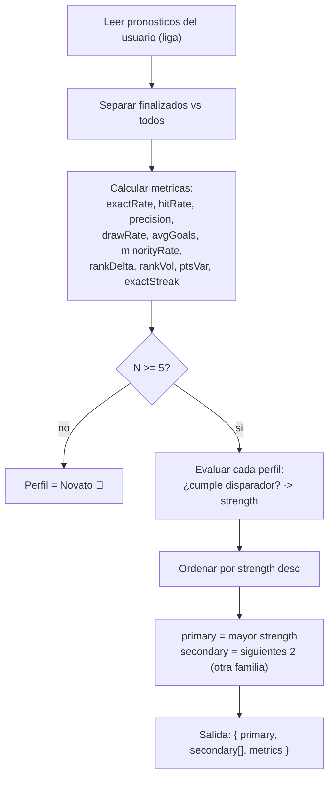

# SPRINT 1 — FASE C — DISEÑO: PERFILES DE PRONOSTICADOR

> **Documento de diseño. No es implementación.** Primero se presenta el diseño; la construcción se hará en una sesión posterior.
>
> **Objetivo:** diseñar "perfiles de pronosticador" (estilo/personalidad del usuario) basados **exclusivamente en reglas y datos ya existentes**.
>
> **Restricciones duras:** sin IA · sin LLM · sin tablas nuevas · sin migraciones · sin vistas/materialized views. Solo lectura sobre datos existentes, cálculo determinístico en TypeScript (mismo patrón que Fase B). Reversible.

---

## 0. Resumen ejecutivo

Un perfil es una **etiqueta de estilo positiva** (p. ej. *Francotirador 🎯*, *Brújula 🧭*) derivada de métricas calculadas sobre los pronósticos del usuario. Se calcula **al leer** (post-jornada los datos cambian; entre jornadas son estables), sin persistir nada nuevo. Se muestra como badge en el leaderboard y como tarjeta "Tu estilo". Cada usuario recibe **1 perfil primario + hasta 2 secundarios**. Todos los perfiles están redactados en positivo para **no estigmatizar** a nadie.

---

## 1. Datos disponibles (inventario, todo existente)

Ninguna fuente nueva. Todo sale de tablas y RPC ya presentes.

| Fuente | Campos usados | Para qué |
|--------|---------------|----------|
| `pronosticos` | `usuario_id`, `liga_id`, `partido_id`, `goles_local`, `goles_visitante`, `puntos` (0–3), `puntos_calculados_at`, `created_at`, `updated_at` | Precisión, estilo de marcador, empates, exactos |
| `partidos` | `id`, `fase`, `jornada`, `fecha_kickoff`, `estatus`, `marcador_local`, `marcador_visitante` | Filtrar finalizados, orden temporal, agrupar por jornada |
| `tabla_liderato_quiniela(p_liga_id, p_jornada, p_fase, p_date_from, p_date_to)` (RPC existente) | `posicion`, `usuario_id`, `puntos_totales`, `exactos`, `tendencias` | Cambios de ranking por jornada (deltas on-the-fly) |
| Helper Fase B `computePickAggregates` (ya creado) | distribución por partido | Detección de picks minoritarios |

> El scoring (`calcular_puntos_pronostico`, trigger `trg_partido_finalizado_puntos`) **no se toca**: solo se **lee** `pronosticos.puntos`.

---

## 2. Señales / métricas a analizar (definiciones exactas)

Todas por usuario y por liga (`liga_id`). Distinguimos:
- **Métricas de precisión** → solo sobre picks **finalizados y puntuados** (`puntos_calculados_at IS NOT NULL`).
- **Métricas de estilo** → sobre **todos** los picks (incluye no finalizados; el estilo no depende del resultado).

| Métrica | Símbolo | Fórmula | Datos |
|---------|---------|---------|-------|
| Picks puntuados | `N` | count(picks finalizados) | `pronosticos` ⋈ `partidos.estatus='finalizado'` |
| Exactos | `E` | count(`puntos = 3`) | `pronosticos.puntos` |
| Tendencias | `T` | count(`puntos = 1`) | `pronosticos.puntos` |
| Fallos | `F` | count(`puntos = 0`) | `pronosticos.puntos` |
| Tasa de exactos | `exactRate` | `E / N` | — |
| Tasa de acierto | `hitRate` | `(E + T) / N` | — |
| Puntos por pick | `ppp` | `Σpuntos / N` | — |
| **Precisión histórica** | `precision` | `ppp / 3` (0–1, normalizado al máximo 3 pts) | — |
| Picks totales | `P` | count(todos los picks) | `pronosticos` |
| **Frecuencia de empates** | `drawRate` | count(`goles_local = goles_visitante`) `/ P` | `pronosticos` |
| Goles promedio predichos | `avgGoals` | `mean(goles_local + goles_visitante)` | `pronosticos` |
| **Índice minoritario** | `minorityRate` | fracción de picks finalizados cuyo `sharePct < 15%` en su partido | helper Fase B por partido |
| **Delta de ranking** | `rankDelta` | `posicion(J−1) − posicion(J)` (positivo = subió) | RPC por jornada |
| Volatilidad de ranking | `rankVol` | desviación estándar de `posicion` en las últimas K jornadas | RPC por jornada |
| Varianza de puntos/jornada | `ptsVar` | varianza de `puntos_totales` por jornada (consistencia) | RPC por jornada |
| Racha de exactos | `exactStreak` | nº de exactos consecutivos más recientes (orden por `fecha_kickoff`) | `pronosticos` ⋈ `partidos` |

**Tamaño mínimo de muestra:** `N_min = 5` picks puntuados. Por debajo de eso, perfil = *Novato* (sin estigma) y no se calcula precisión.

---

## 3. Catálogo de perfiles (8–10)

Cada perfil tiene: nombre, emoji, *trigger* (regla), y una **fuerza** `strength ∈ [0,1]` para resolver empates. Todos en tono positivo.

| # | Perfil | Emoji | Disparador (regla) | Fuerza (para ordenar) | Familia |
|---|--------|-------|--------------------|------------------------|---------|
| 1 | **Francotirador** | 🎯 | `N ≥ 5` y `exactRate ≥ 0.25` | `exactRate` | Precisión |
| 2 | **Brújula** (lee la dirección) | 🧭 | `hitRate ≥ 0.6` y `exactRate < 0.15` | `hitRate − exactRate` | Precisión |
| 3 | **Apostador Diferencial** | 🃏 | `minorityRate ≥ 0.4` | `minorityRate` | Estilo |
| 4 | **Amante del Empate** | 🤝 | `drawRate ≥ 0.30` | `drawRate` | Estilo |
| 5 | **Cañonero** (predice goles) | 💥 | `avgGoals ≥ 3.5` | `(avgGoals − 3.5)/3` acotado | Estilo |
| 6 | **Cerrojo** (predice pocos goles) | 🔒 | `avgGoals ≤ 1.5` | `(1.5 − avgGoals)/1.5` acotado | Estilo |
| 7 | **Escalador** (en ascenso) | 📈 | `rankDelta ≥ +3` sostenido últimas 2 jornadas | `rankDelta / posicionesTotales` | Momentum |
| 8 | **Montaña Rusa** | 🎢 | `rankVol` en el tercil alto de la liga | `rankVol` normalizado | Momentum |
| 9 | **La Roca** (consistente) | 🪨 | `ptsVar` en el tercil bajo y `hitRate ≥ 0.4` | `1 − ptsVarNorm` | Momentum |
| 10 | **En Racha** | 🔥 | `exactStreak ≥ 2` | `exactStreak / N` | Momentum |
| — | **Novato** (fallback) | 🌱 | `N < 5` | — | Fallback |

> Umbrales **iniciales y configurables** (constantes en código). Se calibrarán con datos reales del Mundial (PostHog + distribución observada). No son definitivos.

### 3.1 Por qué estos perfiles
- Cubren las cinco señales pedidas: **precisión histórica** (1,2), **picks minoritarios** (3), **frecuencia de empates** (4), **cambios de ranking** (7,8,9), **marcadores exactos** (1,10).
- Mezclan precisión + estilo + momentum → casi todo usuario activo recibe al menos un perfil interesante.
- Todos celebran algo: incluso *Montaña Rusa* es "emocionante", no "malo".

---

## 4. Fórmula de cálculo (algoritmo, sin código)



**Resolución de múltiples perfiles:**
1. Calcular `strength` de cada perfil cuyo disparador se cumpla.
2. `primary` = el de mayor `strength`.
3. `secondary` = hasta 2 perfiles adicionales **de familias distintas** a la primaria (para variedad: no dar *Francotirador* + *Brújula* juntos, que se contradicen).
4. Si nada se dispara (usuario "promedio") → perfil neutral **El Estratega ♟️** (placeholder positivo) o simplemente mostrar solo métricas sin etiqueta. *Decisión recomendada: mostrar "El Equilibrado ⚖️" para que nadie quede sin badge.*

**Suavizado (anti-volatilidad):** los perfiles de momentum (7–10) usan ventana de **2 jornadas** mínimo para no cambiar la etiqueta cada partido. Los de precisión/estilo usan acumulado de la temporada.

**Salida (forma conceptual del objeto):**
```jsonc
{
  "profile": {
    "primary":   { "id": "francotirador", "label": "Francotirador", "emoji": "🎯", "strength": 0.31 },
    "secondary": [ { "id": "diferencial", "emoji": "🃏", "strength": 0.44 } ]
  },
  "metrics": { "N": 18, "exactRate": 0.31, "hitRate": 0.72, "precision": 0.41,
               "drawRate": 0.12, "avgGoals": 2.4, "minorityRate": 0.44,
               "rankDelta": 2, "exactStreak": 1 },
  "sampleOk": true
}
```

---

## 5. Estrategia de acceso a datos (honrando "sin tablas / sin migraciones")

| Métrica | Cómo obtenerla sin objetos nuevos | Costo |
|---------|-----------------------------------|-------|
| Precisión, exactos, empates, avgGoals, racha | 1 query a `pronosticos` del usuario (⋈ `partidos` para estatus/fecha) | Bajo (acotado a 1 usuario) |
| `minorityRate` | Reutilizar `computePickAggregates` (Fase B) por cada partido del usuario; o un fetch acotado de pronósticos por esos `partido_id` y agregar en TS | **Medio** (depende del nº de partidos × usuarios de la liga) |
| `rankDelta`, `rankVol`, `ptsVar` | Llamar `tabla_liderato_quiniela` por jornada (J y J−1, o últimas K) y diferenciar en TS | Medio (varias llamadas RPC) |

**Decisión de diseño:** computar **bajo demanda** al abrir la superficie de perfil, con **memoization por request** (igual que Fase B). No se persiste.

**Caveat de rendimiento (honesto):** `minorityRate` a nivel liga y los deltas por jornada son las partes caras. Para la liga global del Mundial (potencialmente miles de usuarios) conviene:
- acotar `minorityRate` a las **últimas K jornadas** (p. ej. K=3), no toda la historia;
- cachear en memoria del proceso por `(liga_id, jornada)` durante el request.
- Si en el futuro escala mal, la optimización natural sería un **read-only RPC o VIEW** — pero eso **queda fuera de las restricciones de Fase C** y se documenta como deuda opcional para Sprint 2+.

---

## 6. Frecuencia de actualización

| Aspecto | Decisión |
|---------|----------|
| Cuándo cambian los datos | Solo cuando un partido finaliza (los `puntos` se recalculan por el trigger existente). Entre jornadas, los perfiles son estables. |
| Cuándo se recalcula | **On-read**, al abrir la tarjeta/insight (no hay job ni trigger nuevo). |
| Cache | Memoization por request; opcional `revalidate` de la página de leaderboard ya existente. |
| Coherencia con masterplan | El masterplan reserva `leaderboard_snapshots` para Sprint 2; **Fase C no lo requiere** (deltas on-the-fly). Si Sprint 2 añade snapshots, los perfiles de momentum podrán leerlos y abaratar el cálculo. |

---

## 7. Dónde mostrarlo en la UI

Sin pantallas nuevas obligatorias; reutilizar superficies existentes.

| Superficie | Qué se muestra | Prioridad |
|------------|----------------|-----------|
| **Leaderboard** (`/leaderboard` y grupo) — tarjeta "Tu posición" | Tarjeta **"Tu estilo"**: emoji + nombre del perfil primario + 1 frase ("Aciertas el marcador exacto más que la mayoría"). | **Alta** (P0) |
| **Leaderboard** — filas | Badge emoji del perfil primario junto al nombre (tooltip con el nombre). | Media (P1) |
| **Modal post-jornada** (Sprint 2) | Refuerzo: "Esta jornada fuiste 🔥 En Racha". | Media (depende de Sprint 2) |
| **Detalle de partido** | Opcional: combinar con pick aggregates de Fase B ("tu pick fue diferencial 🃏"). | Baja (P2) |
| Futura pantalla `/perfil` | Vista completa: perfil primario + secundarios + métricas + historial. | Futuro |

**Principio anti-estigma (crítico):** ningún perfil describe al usuario como malo. No existe "El Perdedor". El usuario con baja precisión cae en *Apostador Diferencial 🃏*, *Cañonero 💥* o *El Equilibrado ⚖️* — siempre algo con lo que identificarse positivamente. Las métricas crudas (precisión %) se muestran solo en superficies opt-in (futura `/perfil`), no en el feed público.

---

## 8. Eventos de analytics asociados (a añadir cuando se implemente)

Se sumarían al `AnalyticsEventMap` (Fase A) y se dispararían con el `trackEvent` ya conectado a PostHog. **Sin PII** (solo `liga_scope`, IDs de perfil, UUID).

| Evento | Payload | Dónde | Para medir |
|--------|---------|-------|------------|
| `profile_card_viewed` | `{ liga_scope, profile_primary }` | Al renderizar la tarjeta "Tu estilo" | Alcance del feature |
| `profile_badge_shown` | `{ liga_scope, profile_primary }` | Al pintar el badge en la fila propia | Exposición |
| `profile_detail_opened` | `{ profile_primary }` | Al abrir detalle/tooltip o `/perfil` | Interés |
| `profile_shared` | `{ channel: "native" \| "whatsapp", profile_primary }` | Botón compartir "soy 🎯 Francotirador" | Viralidad |

Funnel sugerido: `match_view`/`leaderboard_viewed` (ya existen) → `profile_card_viewed` → `profile_shared`.

---

## 9. Riesgos y mitigaciones

| Riesgo | Severidad | Mitigación de diseño |
|--------|-----------|----------------------|
| Muestras pequeñas → perfiles ruidosos | Alta | `N_min = 5`; perfil *Novato* por debajo; suavizado de momentum a 2 jornadas. |
| Estigmatización | Alta | Todos los perfiles en positivo; sin "perdedor"; métricas crudas solo opt-in. |
| Costo de `minorityRate` y deltas a escala liga global | Media | Acotar a últimas K jornadas + memoization; deuda opcional de RPC/VIEW documentada. |
| Inestabilidad jornada a jornada | Media | Ventanas mínimas + histéresis (no cambiar primary salvo que otro supere por margen). |
| Contradicción entre perfiles (Francotirador + Brújula) | Baja | `secondary` solo de familias distintas a la primaria. |
| Umbrales arbitrarios | Media | Marcar como configurables; calibrar con distribución real observada antes de fijar. |
| Doble conteo de picks editados | Baja | Un pick = una fila `(liga,usuario,partido)`; `updated_at` no afecta el conteo. |

---

## 10. Qué NO incluye este diseño (límites explícitos)

- ❌ No usa IA ni LLM (todo reglas).
- ❌ No crea tablas, migraciones, vistas ni materialized views.
- ❌ No toca scoring ni `pronosticos` (solo lectura).
- ❌ No implementa nada todavía: este documento es **solo diseño**.
- ❌ No añade `leaderboard_snapshots` (eso es Sprint 2); los deltas se calculan on-the-fly.

---

## 11. Propuesta de alcance para la implementación (cuando se apruebe)

Orden sugerido, todo lectura/TS puro (consistente con Fase B):

1. `src/lib/insights/profiles.ts` — métricas + reglas + `computeUserProfile()` (función pura, con thresholds configurables).
2. `src/lib/insights/profile-data.ts` — capa de lectura (queries acotadas a `pronosticos`/`partidos` + reutilización de `computePickAggregates` y del RPC de leaderboard).
3. Tarjeta "Tu estilo" en el leaderboard (P0) + badge en fila propia (P1).
4. Eventos de §8 en `events.ts` + disparo con `trackEvent`.
5. Lint + typecheck + reporte `SPRINT1_PHASE_C_REPORT.md`.

**Estimación preliminar:** 2–3.5 días (la mayor incertidumbre es el costo de `minorityRate`/deltas a escala; mitigable acotando ventana).

---

*Documento de diseño de Sprint 1 · Fase C. Reglas + datos existentes, sin IA, sin tablas, sin migraciones. Pendiente de aprobación antes de implementar.*
