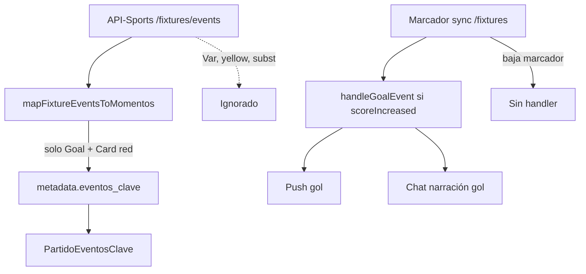

# VAR-EVENTS-AUDIT-1 — Auditoría

**Fecha:** 2026-05-18  
**Alcance:** Solo lectura. Sin fixes ni commits de código.

**Fuentes:** `sync-live-scores-api-sports.ts`, `match-events.ts`, handlers push/chat, API-Sports `/fixtures/events` (46 partidos finalizados WC 2026 en prod), `metadata.eventos_clave` en Supabase.

---

## Resumen ejecutivo

API-Sports **sí devuelve eventos `Var`** con detalles como `Goal cancelled`, `Penalty confirmed`, `Card upgrade`. Mundial Compas **no los persiste ni notifica**. Solo persistimos goles (`type: Goal`) y rojas (`type: Card` + red). Los goles de penal se guardan como gol con `detail: Penalty`; el penal fallado se guarda **incorrectamente como gol** (`Missed Penalty` → `tipo: gol` + icono ⚽). Existen plantillas y tipos push para `gol_anulado` y `penal_fallado`, pero **ningún handler en producción los invoca**.

---

## 1. ¿Qué tipos de eventos devuelve API-Sports?

Escaneo real de **46 fixtures finalizados** (Mundial 2026, prod):

### Por `type`

| type | Count | Notas |
|------|------:|-------|
| `Goal` | 141 | Incluye Normal, Own, Penalty, **Missed Penalty** |
| `subst` | 439 | Sustituciones 1–6 |
| `Card` | 116 | Yellow / Red |
| `Var` | **16** | Revisiones VAR |

### Por `type` + `detail` (relevantes)

| type:detail | Count |
|-------------|------:|
| Goal:Normal Goal | 125 |
| Goal:Own Goal | 9 |
| Goal:Penalty | 6 |
| Goal:Missed Penalty | **1** |
| Card:Yellow Card | 108 |
| Card:Red Card | 8 |
| Var:Goal cancelled | **5** |
| Var:Goal Disallowed - Foul | 1 |
| Var:Goal confirmed | 2 |
| Var:Penalty confirmed | 2 |
| Var:Penalty cancelled | 2 |
| Var:Card upgrade | **3** |
| Var:Card reviewed | 1 |

Otros campos API: `time.elapsed`, `time.extra`, `player`, `assist`, `comments` (casi siempre `null` en muestra).

---

## 2. ¿Cuáles persistimos hoy?

### Pipeline

```
GET /fixtures/events
  → mapFixtureEventsToMomentos()   [filtro estricto]
  → metadata.eventos_clave         [reemplazo completo en sync]
  → PartidoEventosClave UI         [gol / roja]
  → buildMatchSummaryInput timeline  [gol, penalty_goal*, own_goal*, roja]
```

\* `penalty_goal` / `own_goal` se infieren del campo `detail` en builder IA, no del `tipo` en DB.

### Persistido en `metadata.eventos_clave`

| API | Persistido | Campo `tipo` | Campo `detail` |
|-----|------------|--------------|----------------|
| Goal + Normal Goal | ✅ | `gol` | `Normal Goal` |
| Goal + Own Goal | ✅ | `gol` | `Own Goal` |
| Goal + Penalty | ✅ | `gol` | `Penalty` |
| Goal + **Missed Penalty** | ⚠️ | `gol` (incorrecto) | `Missed Penalty` |
| Card + Red Card | ✅ | `tarjeta_roja` | `Red Card` |
| Card + Yellow Card | ❌ | — | — |
| **Var** (todos) | ❌ | — | — |
| subst | ❌ | — | — |

### Conteo real en DB (46 FT)

| detail | tipo | n |
|--------|------|--:|
| Normal Goal | gol | 60 |
| Red Card | tarjeta_roja | 8 |
| Own Goal | gol | 4 |
| Penalty | gol | 2 |
| Missed Penalty | gol | 1 |

**Cero** eventos VAR en `eventos_clave`.

### Otros datos relacionados

| Dato | Persistido |
|------|------------|
| Marcador final | ✅ columnas + sync |
| Marcador penales (shootout) | ✅ `metadata` / reloj / payload |
| `gol_notify_score` | ✅ dedup push gol |
| `notified_red_cards` | ✅ dedup rojas |

---

## 3. ¿Cuáles ignoramos?

| Categoría | Ignorado en |
|-----------|-------------|
| `type: Var` (todos los detail) | `mapFixtureEventsToMomentos` — no entra al loop |
| Yellow Card | mismo filtro |
| subst | mismo filtro |
| Goal cancelled (como evento) | no hay tipo; solo efecto indirecto si API quita el Goal del listado final |
| Penalty awarded (sin gol aún) | Var `Penalty confirmed` ignorado |
| Penalty missed (semántica) | se trata como gol en timeline |
| Card upgrade (VAR) | ignorado; roja solo si viene `Card` red separado |
| `comments` en eventos | no leído |

---

## 4. Eventos específicos — ¿existe en API y qué hacemos?

| Evento | API-Sports | Persistimos | Push | Chat live |
|--------|------------|-------------|------|-----------|
| **VAR review** (genérico) | `type: Var` | ❌ | ❌ | ❌ |
| **Goal cancelled** | `Var` + `Goal cancelled` / `Goal Disallowed - Foul` | ❌ | Tipo `gol_anulado` **sin handler** | Plantilla `generarNarracionGolAnulado` **sin uso** |
| **Penalty awarded** | `Var` + `Penalty confirmed` | ❌ | ❌ | ❌ |
| **Penalty missed** | `Goal` + `Missed Penalty` | ⚠️ como `gol` | ❌ (`penal_fallado` sin handler) | ❌ |
| **Penalty saved** | No aparece como detail en WC 2026 | — | ❌ | ❌ |
| **Penalty scored** | `Goal` + `Penalty` | ✅ `gol` | ✅ `gol` + `isPenalty` narración | ✅ |
| **Red overturned** | No visto en muestra | ❌ | ❌ | ❌ |
| **Yellow → red (VAR)** | `Var` + `Card upgrade` (3 en WC) | ❌ | ❌ | ❌ (roja solo si API manda `Card` red aparte) |
| **Goal confirmed** | `Var` + `Goal confirmed` | ❌ | ❌ | ❌ |

---

## 5. ¿Qué llega al timeline?

### UI `PartidoEventosClave` (header partido, en_vivo / finalizado)

- Fuente: `metadata.eventos_clave` vía `parseMomentosFromMetadata`
- Muestra: jugador, minuto, icono ⚽ (gol) o 🟥 (roja)
- **No muestra** `detail` (Penalty, Own Goal, Missed Penalty invisible para el usuario)
- **No muestra** eventos VAR

### Chat del partido (`mensajes_chat`)

| Origen | Contenido | ¿VAR real? |
|--------|-----------|------------|
| `handleGoalEvent` | Narración gol / autogol / penal anotado | No |
| `handleRedCardEvent` | Narración expulsión | No |
| `notifyPhaseTransitions` | Fases (medio tiempo, penales, FT) + trivia mamalón | Trivia usa prefijo "🤖 VAR ·" — **no es VAR del partido** |
| `dato_mamalón` | Trivia histórica | No |

**Ningún mensaje de chat en prod** corresponde a `Goal cancelled` o `Var` del fixture en curso.

### Resumen IA (`eventos_clave` → timeline)

- Mismos datos que timeline UI
- Prompt prohíbe inventar VAR; sin eventos VAR en input, el modelo no debe mencionarlos
- `Missed Penalty` en input se clasifica como `penalty_goal` en builder (por `detail` con "penalty") — **riesgo de narrar gol que no subió al marcador**

---

## 6. ¿Qué llega a push notifications?

### Tipos usados en producción (`queuePartidoPushNotifications`)

| tipo | Handler |
|------|---------|
| `gol` | `on-goal.ts` / sync-live goal detection |
| `tarjeta_roja` | `on-red-card.ts` |
| Fases (`inicio_partido`, `medio_tiempo`, `fin_partido`, `inicio_penales`, …) | `phase-sync.ts` |
| `alineaciones` | `sync-lineups.ts` |

### Tipos declarados pero **nunca encolados**

- `gol_anulado`
- `penal_fallado`

### Detección de gol en sync-live

```typescript
goalDetected = scoreIncreased(notifyScore, marcador_nuevo)
```

- Solo dispara si el marcador **sube**
- **No hay** rama para marcador que **baja** (gol anulado)
- `eventos_clave` se **reescribe** en cada sync con lista actual de goles/rojas de API — si API elimina un Goal anulado del feed, el timeline final puede quedar coherente **sin explicar el VAR**

---

## 7. Inconsistencias y riesgos

| # | Inconsistencia | Severidad | Ejemplo real WC 2026 |
|---|----------------|-----------|----------------------|
| 1 | VAR ignorado por completo | Alta | 16 eventos Var en API, 0 en DB |
| 2 | Gol anulado sin push/chat | Alta | Belgium 0-0 Iran — Var `Goal cancelled` min 27 (Taremi); timeline solo 1 roja, marcador 0-0 OK pero sin narrativa VAR |
| 3 | Missed Penalty = gol en timeline | Media | Argentina vs Austria — Messi min 9 `Missed Penalty` aparece como ⚽ gol |
| 4 | Penales anotados indistinguibles en UI | Baja | `detail: Penalty` guardado pero UI no lo muestra |
| 5 | Card upgrade VAR sin roja si API no manda Card red | Media | 3 `Card upgrade` en API; rojas en DB = 8 (puede cuadrar o no según fixture) |
| 6 | Push `gol_anulado` / `penal_fallado` muertos | Media | Código narración existe, nunca wired |
| 7 | Marca "🤖 VAR" en trivia mamalón | Baja | Confunde auditoría y usuarios ("VAR" no es review del partido) |
| 8 | Gol fantasma en vivo si API lista Goal antes de Var cancel | Media | Usuario podría recibir push de gol que luego baja — sin push de corrección |
| 9 | `findLatestGoalForScore` en sync | Baja | Heurística para atribuir goleador; falla si nº goles en API ≠ marcador |
| 10 | IA match summary | Baja | Sin VAR en input = correcto por guardrails; missed penalty mal tipado |

---

## 8. Ejemplos reales — Mundial 2026

### VAR `Goal cancelled` (API sí, DB no)

| Fixture | Partido | Jugador | Min | detail |
|---------|---------|---------|-----|--------|
| 1489395 | Belgium vs Iran | Mehdi Taremi | 27 | Goal cancelled |
| 1489381 | Argentina vs Algeria | Farès Chaïbi | 9 | Goal cancelled |
| 1489398 | Uruguay vs Cape Verde | Maximiliano Araújo | 69 | Goal cancelled |
| 1489382 | Austria vs Jordan | Marko Arnautović | 70 | Goal cancelled |
| 1489397 | Spain vs Saudi Arabia | Ferran Torres | 90 | Goal cancelled |
| 1489404 | Portugal vs Uzbekistan | A. Ganiev | 29 | Goal Disallowed - Foul |

### VAR penales

| Fixture | Partido | Jugador | detail |
|---------|---------|---------|--------|
| 1489373 | Qatar vs Switzerland | Remo Freuler | Penalty confirmed |
| 1489382 | Austria vs Jordan | Marko Arnautović | Penalty confirmed |
| 1489383 | France vs Senegal | Kylian Mbappé | Penalty cancelled |
| 1489387 | Canada vs Qatar | Tajon Buchanan | Penalty cancelled |

### Penales en juego

| Partido | Jugador | Min | detail en DB |
|---------|---------|-----|--------------|
| Czechia vs South Africa | T. Mokoena | 83 | Penalty (gol) |
| Switzerland vs Bosnia | G. Xhaka | 90 | Penalty (gol) |
| Argentina vs Austria | L. Messi | 9 | **Missed Penalty (como gol)** |

### Autogoles (bien persistidos, narración `isOwnGoal`)

Canada vs Qatar (Al Mannai 75'), USA vs Australia (Burgess 11'), Spain vs Saudi Arabia (Tambakti 49'), Portugal vs Uzbekistan (Nematov 60').

---

## 9. Flujo actual (diagrama)



---

## 10. Eventos soportados vs ignorados (checklist)

### Soportados end-to-end (timeline + live notify donde aplica)

- Gol normal
- Autogol (detail + narración)
- Penal **anotado**
- Tarjeta roja directa
- Fases de partido / penales shootout (chat+push, no `eventos_clave`)

### Parcialmente soportados

- Penal anotado (persistido; UI no distingue de gol normal)
- Missed Penalty (persistido mal como gol)

### Ignorados

- Todos `type: Var`
- Amarillas
- Sustituciones
- Goal cancelled como evento explícito
- Penalty awarded / cancelled (VAR)
- Card upgrade / reviewed
- Goal confirmed (VAR)

---

## 11. Recomendación (sin implementar aún)

### Prioridad P0 — Integridad marcador / UX

1. **`mapFixtureEventsToMomentos`:** excluir `Goal` + `Missed Penalty` del tipo `gol`; nuevo tipo `penal_fallado` o no persistir como gol.
2. **Detectar bajada de marcador** en sync-live → handler `gol_anulado` (chat + push + actualizar `gol_notify_score`).
3. **Persistir `type: Var`** en `eventos_clave` o `metadata.var_events[]` con `detail` original.

### Prioridad P1 — Timeline completo

4. Nuevos tipos UI: `var`, `gol_anulado`, `penal_fallado`, `penal_confirmado`.
5. Mostrar `detail` en chips (Penalty, Own Goal).
6. Wire `generarNarracionGolAnulado` + push `gol_anulado`.

### Prioridad P2 — IA y producto

7. Match summary input: timeline VAR explícito; no clasificar missed penalty como `penalty_goal`.
8. Renombrar trivia mamalón ("🤖 VAR") a "Dato histórico" para evitar confusión.

### Prioridad P3 — Amarillas / sustituciones

9. Fuera de scope VAR; evaluar por separado.

### Diseño sugerido `eventos_clave` v2

```typescript
tipo: "gol" | "tarjeta_roja" | "var" | "penal_fallado" | "gol_anulado"
detail: string  // API detail verbatim
api_type: "Goal" | "Card" | "Var"
```

---

## 12. Archivos revisados

| Archivo | Rol |
|---------|-----|
| `src/lib/partidos/sync-live-scores-api-sports.ts` | Sync marcador + eventos + gol/roja live |
| `src/lib/api-football/match-events.ts` | Filtro → `eventos_clave` |
| `src/lib/api-football/fetch-events.ts` | Cliente API |
| `src/lib/api-football/handlers/on-goal.ts` | Push/chat gol |
| `src/lib/api-football/handlers/on-red-card.ts` | Push/chat roja |
| `src/lib/api-football/handlers/phase-sync.ts` | Fases + trivia |
| `src/lib/api-football/goal-notify-state.ts` | Solo `scoreIncreased` |
| `src/lib/api-football/push/types.ts` | Enum incluye tipos no usados |
| `src/lib/narracion/comentaristas.ts` | Plantillas VAR/gol anulado sin wire |
| `src/components/partidos/PartidoEventosClave.tsx` | Timeline UI |
| `src/lib/ai/match-summary/build-match-summary-input.ts` | Timeline IA |

---

**Conclusión:** El sistema trata el fútbol como **goles + rojas + marcador**. VAR existe en API-Sports (16 eventos en el Mundial simulado) pero **no existe en nuestro modelo de datos ni en notificaciones**. Los goles anulados solo se reflejan si el marcador baja y la API depura goals del feed — **sin explicación al usuario**. El siguiente sprint natural es **VAR-EVENTS-1**: modelo + sync + handlers `gol_anulado` / `penal_fallado` / `var_review`.
