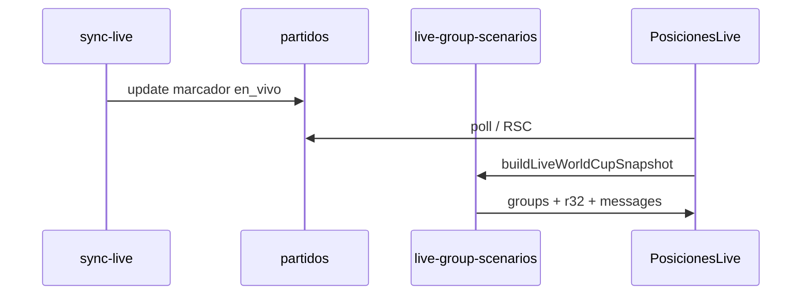

# World Cup Live Scenarios Plan — PARTE 4

**Objetivo:** Última jornada viva — tabla dinámica, mejores terceros, rival provisional en 32avos.

**Estado:** Helpers puros en `src/lib/world-cup/`. Sin UI pública.

---

## Reglamento FIFA 2026 (resumen)

- **12 grupos** (A–L), 4 equipos, 6 partidos por grupo.
- Clasifican **1.º y 2.º** de cada grupo → 24 plazas.
- Clasifican **8 mejores terceros** → 8 plazas.
- Total **32** a dieciseisavos (ronda de 32).
- Última jornada: partidos simultáneos por grupo.
- Cruces de 3.º vs 1.º según **Anexo C** (495 combinaciones).

---

## Lo que ya existe en el repo

| Módulo | Rol |
|--------|-----|
| `calculate-group-standings.ts` | Tabla con partidos FT + **en_vivo** |
| `best-third-places.ts` | Ranking 8/12 terceros |
| `world-cup-third-place-scenarios.ts` | **Annex C completo** (495 keys) |
| `world-cup-r32-fixtures.ts` | 16 cruces R32 fijos |
| `build-knockout-bracket.ts` | Árbol completo R32→final |
| `posiciones/page.tsx` | UI estática tabla (no live ticker) |

**Gap cerrado en diseño:** Annex C **sí está cargado** — no inventar asignación.

**Gap abierto:** UI live ticker, mensajes en chat, integración con sync.

---

## Helpers nuevos

### `src/lib/world-cup/live-group-scenarios.ts`

| Función | Descripción |
|---------|-------------|
| `computeLiveGroupTable(partidos)` | Wrapper standings |
| `computeBestThirdsSnapshot(groups)` | Top 8 terceros |
| `buildLiveWorldCupSnapshot(partidos)` | Snapshot completo |
| `describeTeamPosition(groups, teamId)` | "Sería 1.º del Grupo X" |
| `describeProvisionalKnockoutOpponent(teamId, snap)` | Rival R32 |
| `describeBestThirdDependency(snap)` | Mensaje grupos pendientes |
| `diffLiveSnapshots(before, after)` | Mensajes de movimiento |

### `src/lib/world-cup/knockout-slots.ts`

| Función | Descripción |
|---------|-------------|
| `computeRoundOf32Slots(...)` | Wrapper `buildKnockoutBracket` |
| `getProvisionalOpponent(teamId, bracket)` | Cruce R32 |
| `resolveAnnexCAssignments(groups)` | Lookup Annex C |
| `thirdPlaceSlotPlaceholder(host)` | Si <8 terceros definidos |

---

## Mensajes tipo (generados por helpers)

```
Con este marcador, México sería 1.º del Grupo A.
México pasa del 1.º al 2.º en el Grupo A.
Ahora enfrentaría provisionalmente a 1.º Grupo B.
Esto depende de que se definan los 8 mejores terceros según combinación FIFA (Anexo C).
```

Cuando `scenarioKey` existe pero grupos abiertos:

```
La asignación exacta de algunos terceros puede cambiar según cierren los grupos C/E/F/...
```

---

## Flujo propuesto (UI futura)



**No implementar UI en este sprint.**

---

## Placeholder Annex C

Solo aplica si `qualifyingThirdGroups.length < 8`:

```
3º clasificado vs 1.º Grupo {A|B|D|E|G|I|K|L} (combinación FIFA por definir)
```

Con 12 terceros rankeados siempre hay 8 `qualifies=true` — el placeholder es borde de datos incompletos, no caso normal.

---

## Tests

`src/lib/world-cup/live-group-scenarios.test.ts`:

- Gol cambia 1º/2º
- Empate altera mejores terceros
- México 1º→2º
- Tercero provisional
- Placeholder rival (<8 terceros para Annex C)

---

## Dependencias de datos

| Requisito | Fuente |
|-----------|--------|
| Marcador live | sync-live ✅ |
| Grupo/jornada | columnas partidos ✅ |
| Annex C | `THIRD_PLACE_SCENARIOS` ✅ |
| Nombres equipos | columnas ✅ |
| Simultaneidad jornada 3 | No modelado — asumir todos los partidos del snapshot |

---

## Riesgos

| Riesgo | Nota |
|--------|------|
| Tabla live con partido no iniciado en jornada 3 | Mostrar bandera `isProvisional` |
| Desempate FIFA incompleto (fair play) | Ya documentado en tiebreakers |
| Mensajes cada poll | Debounce + diff snapshots |
